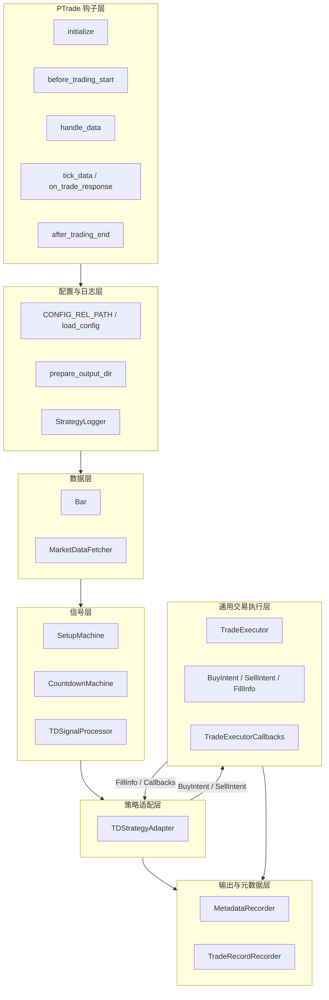
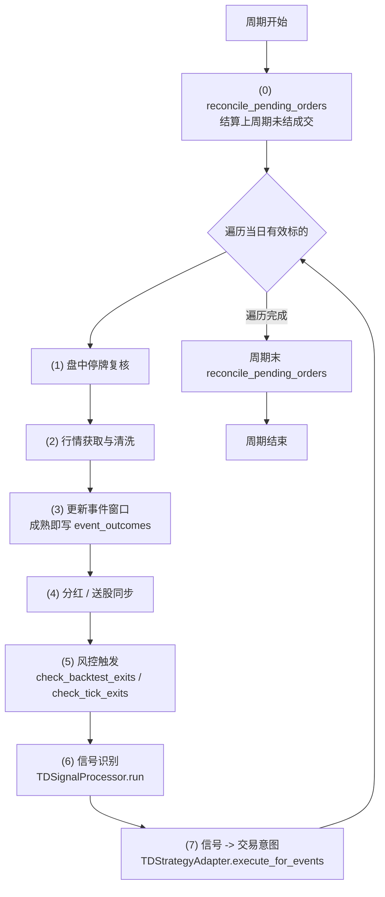
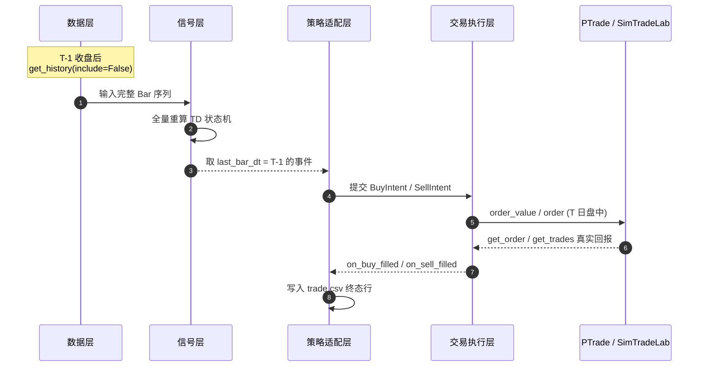
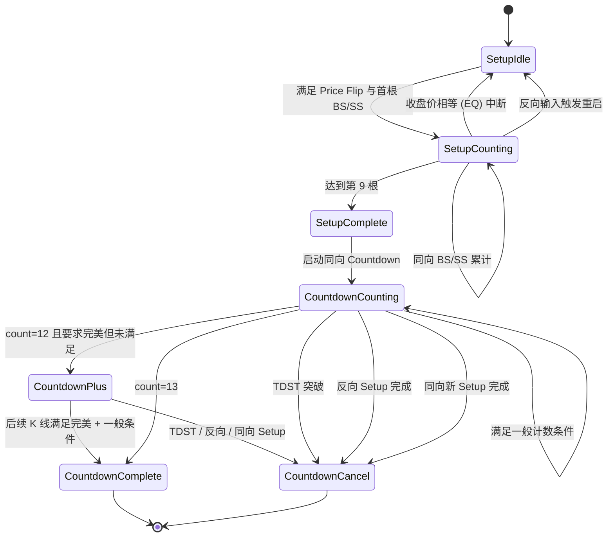
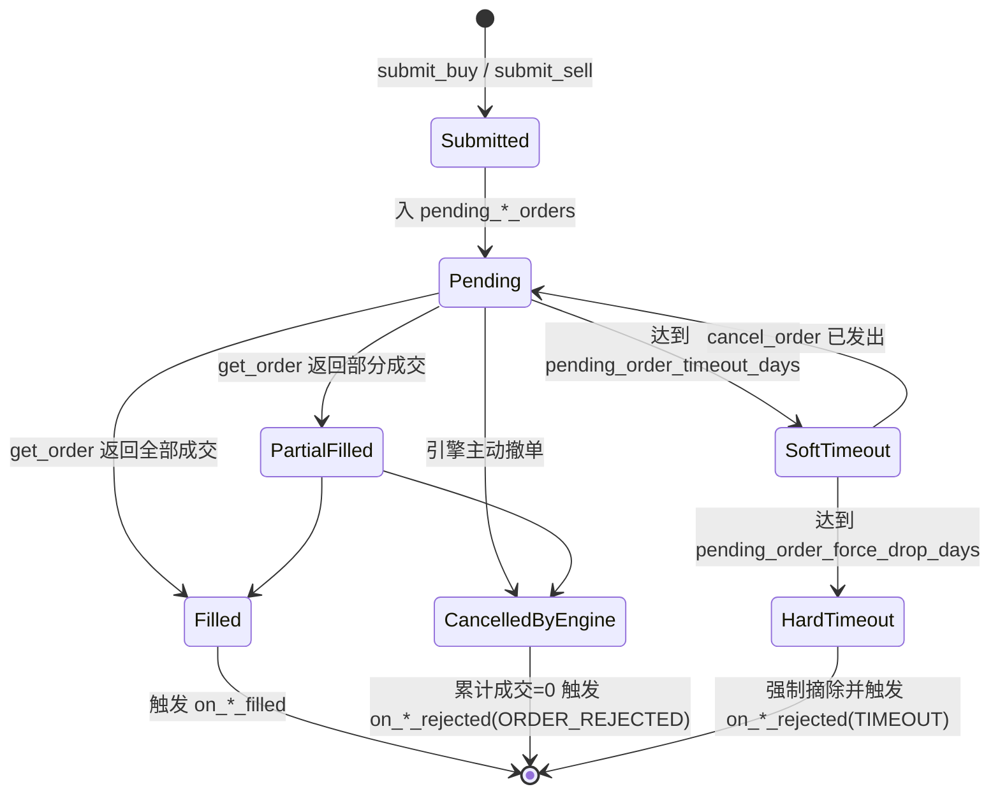

# 第四章图表说明

本文件用于集中存放论文 `paper/td_sequential_thesis.md` 第四章使用的全部图示。论文正文以 `` 形式引用，对应 PNG 文件需统一放置于 `paper/figures/` 子目录。当前论文实际使用 5 张图，与本文件中的 5 个图示小节一一对应。

可选的渲染方式：

1. 使用本文件给出的 Mermaid 代码块，配合 [mermaid.live](https://mermaid.live) 在线导出 PNG 后，按下方指定的文件名覆盖到 `paper/figures/`。
2. 使用 drawio、Visio 或 PlantUML 等工具按 Mermaid 代码所示拓扑手工绘制后，按下方指定的文件名导出 PNG。

为减少视觉信息密度，本文件给出的代码已避免使用颜色、特殊形状与跨节点连线，便于在黑白印刷条件下保持清晰。

---

## 图4-1 系统分层架构图（architecture.png）

展示 TD 9-13 量化交易系统的八层分层结构以及"通用交易层 / TD 适配层"的解耦关系。

绘图要点：分层在视觉上由上至下，箭头表示运行期主调用方向；交易层与适配层之间双向箭头表示通过回调接口完成职责对接。

---

## 图4-2 单周期 handle_data 主流程图（handle-data.png）

将 `handle_data` 七步流程显式绘制，便于复核执行顺序。

绘图要点：(0) 与周期末两次对账的位置必须保留，体现"成交先落账再做后续判断"的不变量。

---

## 图4-3 信号下单成交时序图（signal-order-sequence.png）

体现"昨日信号、今日入场、真实成交回报为准"的时序约定。

绘图要点：信号产生与下单执行分别处于 T-1 与 T；trade.csv 的写入位置必须在收到真实成交回报之后，而不是在下单瞬间。

---

## 图4-4 TD 信号生命周期状态图（signal-lifecycle.png）

合并 Setup 与 Countdown 两阶段状态。Setup 部分严格连续；Countdown 部分允许不连续，并叠加完美计数与多种取消规则。

手绘补充：可保留官方 q0–q8 命名作为辅助说明（即 `q0_idle / q1_post_ss_idle / q2_buy_setup_d1 / q3_buy_setup_2_8 / q4_buy_setup_done / q5_post_buy_setup / q6_sell_setup_d1 / q7_sell_setup_2_8 / q8_sell_setup_done`），但出版稿可使用上方简化命名以提高可读性。

---

## 图4-5 订单生命周期状态图（order-lifecycle.png）

订单从提交到终结的状态转换，含软超时与硬超时分支。

绘图要点：突出软/硬超时的两阶段保护逻辑，避免实盘异常下卖单永久阻塞止损。

---

## 文件与图示对照表

| 论文图编号 | 图题 | 论文中引用文件 |
| ---- | ---- | ---- |
| 图4-1 | 系统分层架构图 | `figures/architecture.png` |
| 图4-2 | 单周期 handle\_data 主流程图 | `figures/handle-data.png` |
| 图4-3 | 信号下单成交时序图 | `figures/signal-order-sequence.png` |
| 图4-4 | TD 信号生命周期状态图 | `figures/signal-lifecycle.png` |
| 图4-5 | 订单生命周期状态图 | `figures/order-lifecycle.png` |
