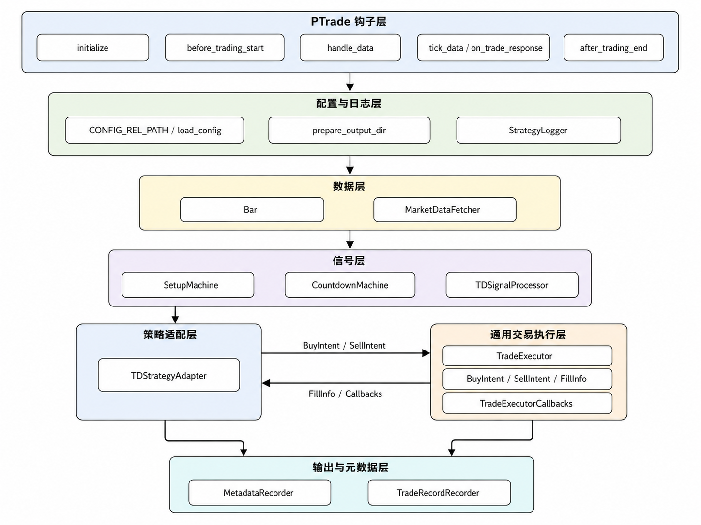
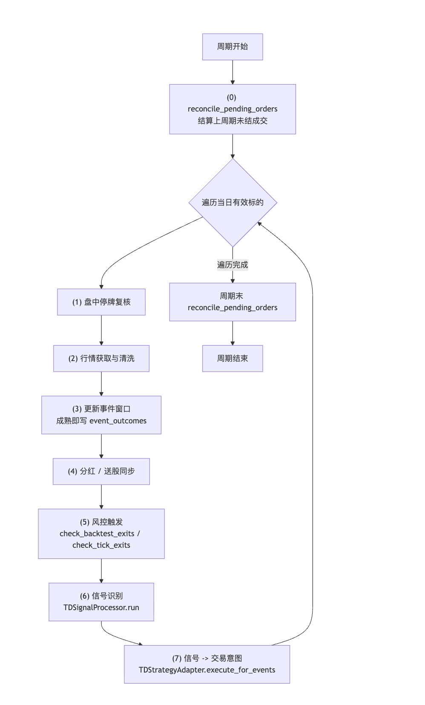
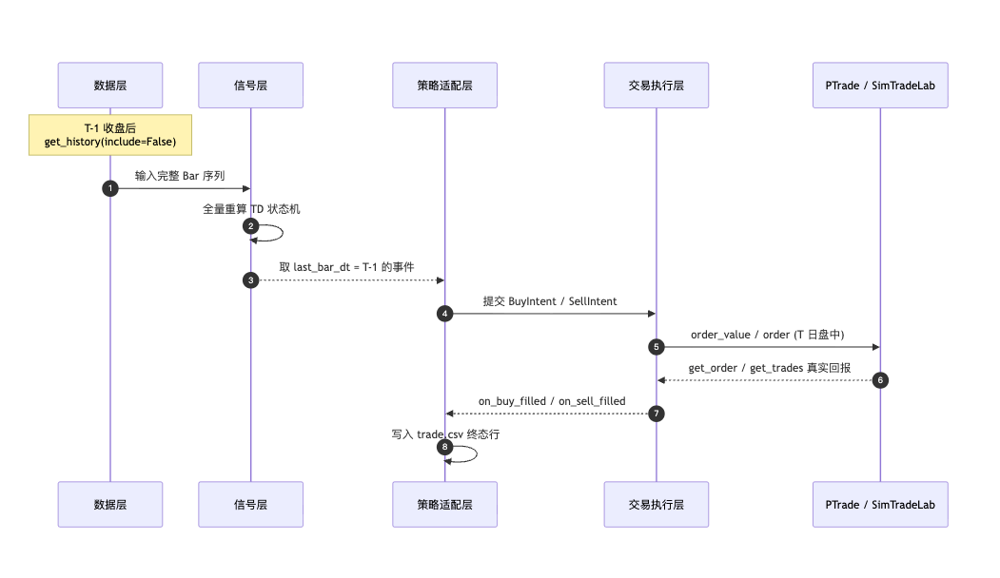
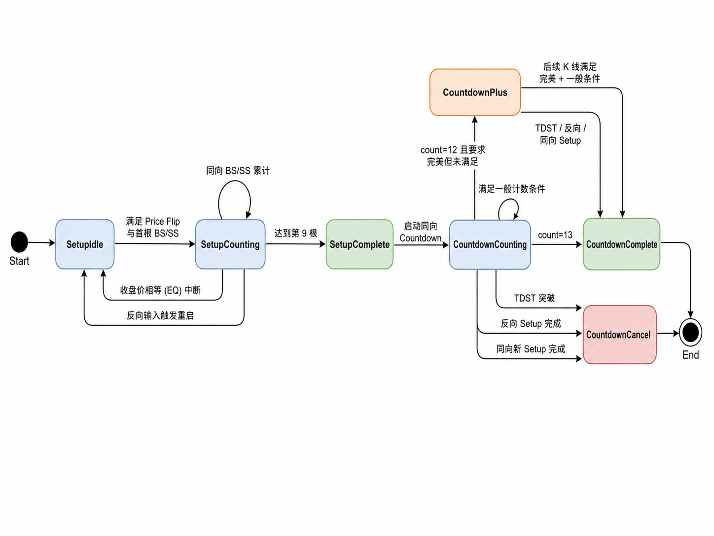
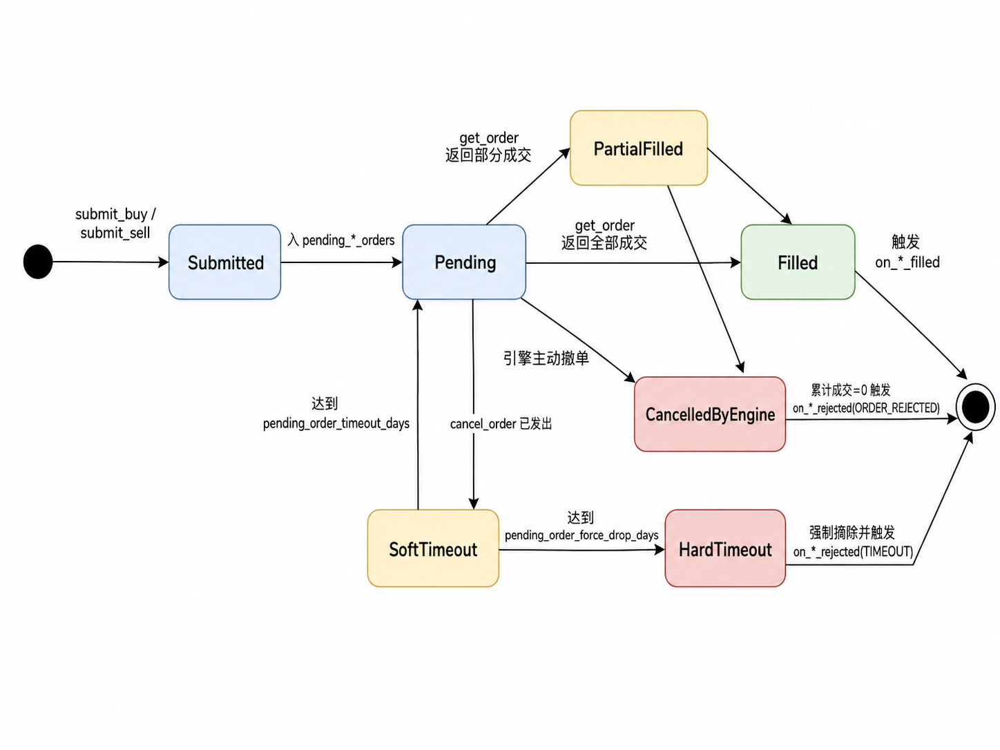

# 基于DeMarker指标的量化交易系统的设计与实现

## 摘要

量化交易系统能够将交易规则、数据处理、风险控制和评价流程转化为可重复执行的软件系统，对提高策略研究的规范性和可复现性具有重要意义。本文以 DeMark 指标体系中的 TD 9-13 Sequential 作为 DeMarker 指标量化实现的核心规则。TD 序列规则链条较长，包含 Setup、Countdown、完美计数和 TDST 取消等多阶段状态，若直接采用简单条件判断实现，容易出现计数边界不清、信号重复、复权数据不一致和交易记录不可追溯等问题。本文面向 A 股日线数据、PTrade 量化交易环境和 SimTradeLab 本地回测框架，从 TD 序列状态机实现和适用性评价方法两个方面开展研究，主要工作如下。

1. 针对 TD 9-13 Sequential 规则状态依赖强、计数过程易出错的问题，设计并实现了一种基于有限状态机的 TD 序列信号识别方法。该方法将 Setup 的严格连续计数、Countdown 的非连续计数、完美 Setup、完美 Countdown、TDST 取消、同向 Setup 取消和反向 Setup 取消统一建模为事件流；同时采用前复权数据全量重算和停牌过滤机制，解决了 A 股场景下历史价格可比性和信号可追溯性问题。

2. 针对 TD 序列不能仅以收益率和胜率评价的问题，设计并实现了一个兼容 PTrade 接口、可在 SimTradeLab 本地回测框架中运行的量化交易系统，并提出事件研究与事件驱动回测相结合的适用性分析方案。系统实现了配置管理、行情获取、信号输出、交易生命周期记录和统计输出等功能；评价方案从信号密度、完美信号比例、取消原因分布、事件后收益、最大有利波动、最大不利波动和样本外分层表现等角度分析 TD 序列在不同市场状态和股票特征下的适用性。
 
**关键词**  DeMarker指标  TD序列  量化交易  有限状态机  适用性分析

# Design and Implementation of Quantitative Trading System Based on DeMarker Indicator

## ABSTRACT

Quantitative trading systems transform trading rules, data processing, risk control, and evaluation procedures into repeatable software systems, which is meaningful for improving the standardization and reproducibility of strategy research. This thesis takes TD 9-13 Sequential in the DeMark indicator system as the core rule for implementing a DeMarker-indicator-based quantitative strategy. TD Sequential has a long rule chain and contains multi-stage states such as Setup, Countdown, perfected counting, and TDST cancellation. A direct implementation with simple conditional statements may lead to ambiguous counting boundaries, duplicated signals, inconsistent adjusted prices, and untraceable trading records. Taking A-share daily data, the PTrade quantitative trading environment, and the SimTradeLab local backtesting framework as the application context, this thesis studies TD Sequential from two aspects: state-machine-based implementation and applicability evaluation. The main work is as follows.

1. To solve the problems of strong state dependence and error-prone counting in TD 9-13 Sequential, a signal recognition method based on finite state machines is designed and implemented. The method models the strict consecutive counting of Setup, the non-consecutive counting of Countdown, perfected Setup, perfected Countdown, TDST cancellation, same-direction Setup cancellation, and opposite-direction Setup cancellation as a unified event flow. Meanwhile, full recalculation based on pre-adjusted prices and suspension filtering are adopted to address price comparability and signal traceability in the A-share market.

2. To avoid evaluating TD Sequential only by return and win rate, a quantitative trading system compatible with PTrade APIs and runnable on the SimTradeLab local backtesting framework is designed and implemented, and an applicability analysis scheme combining event study and event-driven backtesting is proposed. The system implements configuration management, market data acquisition, signal output, trade lifecycle recording, and statistical output. The evaluation scheme analyzes the applicability of TD Sequential under different market states and stock characteristics from the perspectives of signal density, perfected signal ratio, cancellation reason distribution, post-event return, maximum favorable excursion, maximum adverse excursion, and out-of-sample stratified performance.
 
**KEY WORDS**  DeMarker Indicator  TD Sequential  Quantitative Trading  Finite State Machine  Applicability Analysis

## 目录

## 第一章 绪论

### 1.1 研究背景与意义

随着证券市场电子化程度的提高，交易策略从经验判断逐渐转向规则化、程序化和可验证的系统实现。量化交易的基本思想是将投资假设转化为明确的计算规则，再通过历史数据、实时数据和交易接口完成信号生成、订单执行与结果反馈。与人工主观判断相比，量化系统的优势在于可重复、可回溯、可审计，但其风险也同样明显：若规则定义不清、数据处理不一致或回测方法过度简化，历史结果可能无法反映真实可执行性。

DeMarker 指标通常用于描述 DeMark 技术分析体系下的一类价格比较型指标。本文结合系统实现难度和 A 股日线数据特点，选取 DeMark 指标体系中应用较广的 TD 9-13 Sequential 作为具体研究对象，下文简称 TD 序列。TD 序列的原始思想强调以连续价格比较识别趋势耗竭，而不是简单追随趋势。官方说明将 Sequential 描述为由 Setup 和 Countdown 构成的多阶段价格比较过程，其目标是分析趋势强弱及其发生反转的可能性[^1]。DeMark 的技术分析体系强调用客观规则替代主观画线与形态识别[^2]，Perl 对多种 DeMark 指标的交易含义和使用方式进行了系统整理[^3]。从软件实现角度看，TD 序列的价值不仅在于给出买卖提示，更在于它天然具有状态机结构：Setup 要求严格连续，Countdown 允许不连续，取消条件又可能来自 TDST 突破、同向 Setup 或反向 Setup。这使得 TD 序列非常适合作为量化交易系统中“复杂技术指标工程化实现”的研究对象。

对于 A 股市场而言，TD 序列的研究还具有现实意义。A 股存在分红送转、停牌、涨跌停、ST 风险提示、退市整理和较明显的散户交易特征，直接照搬期货、外汇或指数市场中的技术指标规则，可能造成信号失真。尤其是 TD 序列依赖历史收盘价、高低价之间的相对关系，若复权方式不统一，历史序列的可比性会受到影响。因此，在 A 股环境中实现 TD 序列，需要同时处理复权数据、停牌过滤、信号时间对齐和可交易性约束。

本课题的意义主要体现在三个方面。第一，从指标实现角度，将 TD 序列拆解为可验证的状态机与事件流，减少复杂规则在代码中的隐式耦合。第二，从系统设计角度，围绕 PTrade 兼容环境和 SimTradeLab 本地回测框架设计可运行、可配置、可输出完整生命周期记录的量化交易系统。第三，从研究评价角度，不以盈利率和胜率作为唯一目标，而是建立面向适用性分析的回测方法，关注 TD 信号在不同市场状态、流动性水平和股票特征下的表现差异。

### 1.2 国内外研究现状

技术分析的有效性长期存在争议。一方面，有效市场假说认为历史价格信息难以稳定产生超额收益；另一方面，大量实证研究表明，在市场不充分有效、交易者行为偏差较强或制度摩擦较多的阶段，技术交易规则可能具有阶段性预测能力。国内早期研究中，韩杨对中国股市技术分析有效性进行了统计检验，认为早期 A 股市场中短期技术分析更容易体现有效性，但随着市场发展，单纯依靠技术分析获得超额收益的难度提高[^4]。孙碧波和方健雯从技术分析获利能力角度检验中国证券市场弱态有效性，指出部分技术规则在上证指数上具有长期、稳定的超额利润，且交易成本和异步交易不能完全解释该现象[^5]。林玲等使用移动平均线交易规则进行可预测性研究，认为移动平均线策略在样本中获得高于买入持有的平均收益率[^6]。唐雨虹等进一步研究量价配合的技术交易规则，发现交易规则有效性与时间跨度、成交量条件和交易成本有关[^7]。汤光华和邓益民则从技术指标与市场弱式有效的关系出发，说明技术指标的统计关系需要结合市场交易时段和信息反应速度理解[^8]。

近年的外文研究更加重视数据探测偏差和样本外稳定性。Wang 等对中国市场中数千种技术交易规则进行 Superior Predictive Ability 检验，指出部分指数阶段性存在技术交易规则盈利能力，但这种能力会随着市场效率提高而减弱[^9]。Jiang、Tong 和 Song 使用大量技术分析信号并控制数据探测偏差，发现中国股票市场中仍存在若干技术规则的可预测证据[^10]。Chuang 等基于 2010 年至 2021 年数据研究中国股票市场技术交易规则，在修正数据探测偏差后发现，仅少数复杂规则在部分阶段可以超过基准，且交易成本会显著削弱样本外收益[^11]。这些研究共同提示：技术指标研究不能只报告最优回测结果，而应关注样本外验证、交易成本、规则数量和稳健性。

在量化交易系统与回测方法方面，Campbell、Lo 和 MacKinlay 系统讨论了金融市场实证研究和事件研究方法，为用事件窗口考察价格反应提供了基础框架[^12]。Bailey 等提出回测过拟合概率问题，强调大量策略与参数组合反复测试会放大历史绩效[^13]。Sharpe 提出的风险调整后收益评价思想为夏普比率等指标提供了理论基础[^14]。国内教材方面，战雪丽和杨庆泉系统介绍了量化交易概念、策略类型、平台、样本内外测试和风险管理[^15]；丁鹏对量化投资策略与技术体系进行了较全面梳理[^16]；王晓华、欧阳鹏程等图书则从 Python 或 vn.py 实践角度介绍了量化交易系统开发流程[^17][^18]。这些成果为本文的系统设计和回测评价提供了参考。

现有研究对 TD 序列本身的系统化实现讨论相对不足。多数资料集中在交易规则解释或指标图形展示，对状态机建模、复权处理、信号生命周期输出和 A 股适配问题讨论较少。本文因此将研究重点放在 TD 9-13 Sequential 的规则形式化与系统实现上，并提出事件研究与事件驱动回测结合的适用性分析框架。

### 1.3 研究内容

本文围绕“TD 序列如何在 A 股量化交易系统中被准确实现并被合理评价”这一问题展开，主要研究内容如下。

第一，梳理 TD 9-13 Sequential 的核心规则。包括 Price Flip、Buy/Sell Setup、Setup Perfection、Sequence Countdown、Perfect Countdown、TDST 取消、同向 Setup 取消、反向 Setup 取消等内容，并明确本文系统已实现与暂不实现的规则边界。

第二，设计 TD 序列状态机模型。将 Setup 的严格连续计数抽象为有限状态机，将 Countdown 的非连续计数抽象为可启动、可推进、可完成、可取消的事件对象，并为每次信号生成保留 Setup 起点、Countdown 计数日、TDST 阈值、完美状态和取消原因。

第三，设计并实现量化交易系统。系统采用 PTrade 兼容接口编写策略逻辑，能够在 PTrade 环境中迁移运行，也能够借助 SimTradeLab 本地回测框架完成大规模历史回测，完成配置读取、行情获取、停牌过滤、K 线清洗、信号计算、交易生命周期记录、统计输出和日志管理。系统强调模块解耦、配置显式化和输出可追溯，并通过小样本一致性验证检查本地模拟环境与 PTrade 环境的关键行为是否一致。

第四，提出专业但不过度复杂的回测与适用性分析方法。该方法将策略实现、回测引擎和评价口径区分开来：策略代码负责按照 TD 规则生成信号并记录生命周期，SimTradeLab 负责在本地高效执行大规模历史回测，评价层采用事件研究和事件驱动交易回测两类口径分析信号适用性。

本文的贡献总结如下：第一，本文将 TD 9-13 Sequential 从描述性技术分析规则转化为可执行、可复核的有限状态机模型，把 Setup 连续计数、Countdown 非连续计数、完美信号和取消规则统一到事件流中，并结合 A 股前复权、停牌过滤和全量重算机制提高信号识别的一致性。第二，本文实现了兼容 PTrade 接口并可在 SimTradeLab 本地运行的量化交易系统，构建了 `td_events.csv`、`event_outcomes.csv` 和 `trade.csv` 等可追溯输出，并采用事件研究与事件驱动交易回测相结合的方法分析 TD 序列的适用性边界，而不是仅以收益率和胜率评价策略。

### 1.4 论文结构安排

全文共分为七章。第一章介绍研究背景、意义、国内外研究现状、研究内容与结构安排。第二章介绍 TD 序列相关理论、A 股数据处理问题以及 PTrade、SimTradeLab 与数据源等开发基础。第三章对系统进行需求分析，包括可行性分析、利益相关者与用例分析、功能需求与非功能需求规格以及设计约束。第四章给出 TD 序列信号模型设计，重点说明 Setup 与 Countdown 的状态机实现。第五章说明量化交易系统的架构、模块设计与关键实现。第六章说明回测方法，并结合运行结果进行事件研究、交易回测和适用性分层分析。第七章总结全文工作，并讨论后续优化方向。

## 第二章 相关理论与开发基础

### 2.1 TD 序列基本理论

TD Sequential 通常由 Setup 与 Countdown 两个核心阶段构成，并辅以 Price Flip、Intersection、TDST、Recycle 和若干滤网规则。本文实现重点集中在 TD 9-13 的主干流程，即 9 根 Setup 与 13 个 Countdown。由于 Intersection、Combo Countdown 和 Recycle 在不同资料中存在较多细节分歧，且会显著增加实现复杂度，本文将其作为扩展功能保留，不作为当前系统的必要条件。

Price Flip 是 Setup 启动前的方向转换条件。以买入方向为例，若前一根 K 线的收盘价不低于其前四根 K 线的收盘价，而当前 K 线收盘价低于其前四根 K 线的收盘价，则出现由强转弱的价格反转，当前 K 线可作为 Buy Setup 的第一根。卖出方向则相反。Setup 阶段要求连续 9 根 K 线满足同一方向的四日前收盘价比较关系：Buy Setup 要求当前收盘价严格小于四日前收盘价，Sell Setup 要求当前收盘价严格大于四日前收盘价。严格不等号意味着相等会中断 Setup。

Setup 完成后可以启动 Countdown。Sequence Countdown 不要求连续，Buy Countdown 的一般计数条件为当前收盘价小于等于两日前最低价，Sell Countdown 的一般计数条件为当前收盘价大于等于两日前最高价。计数达到 13 时，认为趋势耗竭信号完成。完美 Countdown 进一步要求 Buy Countdown 第 13 个计数日收盘价低于或等于第 8 个计数日收盘价，Sell Countdown 则要求第 13 个计数日收盘价高于或等于第 8 个计数日收盘价。

TDST 用于判断原 Setup 所代表的趋势结构是否被突破。以 Buy Countdown 为例，若价格向上突破 Setup 阶段高点或真实高点阈值，说明原下跌耗竭计数的结构基础可能失效，需要取消当前 Countdown。本文系统提供五种 TDST 取消规则配置，默认采用收盘价突破 Setup 阶段最高价的规则，使取消逻辑在保守性和可执行性之间保持平衡。

### 2.2 A 股市场数据与复权问题

TD 序列以历史价格之间的相对关系作为核心输入，因此数据连续性和可比性直接影响信号质量。A 股上市公司可能发生现金分红、送股、资本公积转增股本、配股和拆细等权益事件。交易所规则中，除权除息日即时行情显示的前收盘价会调整为除权除息参考价，并以该参考价作为当日涨跌幅限制的计算基准[^19]。这说明除权除息不是普通市场波动，而是由公司权益分派引起的价格口径变化。如果直接把未复权价格输入 TD 序列，除权除息日前后可能出现机械跳空，TD 的四日前收盘价比较、两日前高低价比较和 TDST 突破判断都可能受到扭曲。

具体而言，现金分红主要改变股票除息后的理论价格和投资者现金权益，送股和资本公积转增股本则会改变股本数量和每股价格口径。对于技术指标而言，这些事件本身并不必然代表市场供需关系或趋势耗竭发生变化，却会在未复权价格上形成明显的名义价格断点。因此，本文不将现金分红、送股和转增股本视为 TD 信号，也不把除权除息日的机械价格变化解释为趋势反转；其处理原则是通过复权价格消除价格序列不可比问题，同时在交易评价层保留除权除息状态和可交易性约束。

量化研究中常见的价格口径包括未复权、前复权和后复权。未复权价格保留交易日真实成交价格，适合用于订单执行、成交价格复核、涨跌停判断和资金流水核算；但它不能消除分红送转造成的名义价格断点。前复权以最近交易日价格为基准，将历史价格按复权因子向前调整，使近期价格保持接近真实市场价格，同时让历史 K 线在视觉和数值上连续，较适合技术指标计算、信号识别和历史形态比较。后复权通常以较早日期价格为基准，将后续权益影响累积到之后价格中，适合观察长期持有视角下的累计收益或总回报趋势，但后复权后的当前价格可能显著偏离真实可交易价格，因此不宜直接作为交易执行价格。DolphinDB 关于复权行情计算的资料也将未复权、前复权和后复权区分为不同用途，并指出复权处理的目的在于消除分红、送股、拆股等权息事件对股价走势的影响[^20]。

表2-1  价格复权口径比较表

| 价格口径 | 处理方式 | 主要适用场景 | 本文使用方式 |
| ---- | ---- | ---- | ---- |
| 未复权价格 | 保留交易当日实际成交价格，不消除权息事件造成的名义跳变 | 成交复核、涨跌停判断、资金流水和真实交易价格分析 | 用于交易执行口径和可交易性校验 |
| 前复权价格 | 以最近价格为基准，向前调整历史价格，使历史序列连续 | 技术指标计算、历史形态比较、信号识别 | 用于 TD Setup 与 Countdown 信号计算 |
| 后复权价格 | 以较早价格为基准，向后累积权息影响 | 长期持有收益展示、总回报趋势观察 | 本文不作为信号输入和执行价格 |

本文在系统实现中严格区分“信号价格口径”和“交易执行口径”。信号识别层采用前复权日线数据，目的是使 TD 序列比较的收盘价、高价和低价处于同一可比口径，避免把除权除息造成的名义价格变化误判为趋势耗竭或趋势突破。交易评价层则关注信号出现后是否真正能够成交，因此需要结合未复权或实际可交易价格、涨跌停价格、停牌状态和手续费税费进行判断。也就是说，前复权主要解决“信号能不能正确识别”的问题，未复权或实际交易价格主要解决“交易能不能真实执行”的问题，二者不能混用。

前复权还带来一个重要工程问题：每当新的分红、送转或配股发生时，历史复权因子可能变化，过去已经缓存的前复权 K 线和 TD 状态也可能随之改变。若系统采用长期增量缓存，只在前一日状态上继续推进，可能出现缓存状态与当前前复权序列不一致的问题。因此，本文系统采用“前复权 + 每日全量重算”的设计，即每个交易周期重新获取足够长度的历史 K 线，从头运行 Setup 与 Countdown 状态机，再筛选最后一根已完成 K 线产生的新信号。该方法牺牲少量计算效率，但日线级别下计算成本较低，能够保证 TD 状态始终来自同一复权口径下的价格序列。

在回测研究中，还需要注意前复权数据的时间视角。若直接使用样本期末一次性生成的前复权全历史数据，未来发生的权息事件会被反映到更早的历史价格中。对于只依赖同一权息区间内相对大小比较的 TD 规则而言，这通常不会改变同一区间内价格比较的方向；但为了保持研究口径严谨，本文在事件生成逻辑上采用滚动日视角：每个事件日只使用截至该日已经发生的行情和权息信息，事件日之后发生的权息变化只影响后续重新计算，不倒灌为事件日前的交易依据。这样可以减少复权处理引入未来信息的风险。

除复权外，A 股还需要处理停牌、涨跌停、ST 和退市风险。信号计算层需要过滤成交量为零或停牌的 K 线，交易评价层需要考虑信号出现后的可交易性。如果某只股票在事件后的下一交易日停牌、涨停无法买入或跌停无法卖出，回测应顺延到下一可交易日或记录为不可执行事件，而不能默认按理想价格成交。

### 2.3 PTrade、SimTradeLab 与数据源基础

本文策略代码按照 PTrade 量化交易平台的接口风格实现。PTrade 提供策略生命周期函数、股票池设置、行情获取、委托下单、持仓查询和交易回报等接口，支持研究、回测和交易模块中的策略开发[^21]。系统使用 `initialize` 完成配置读取、输出目录准备和对象构造；使用 `before_trading_start` 刷新当日可交易股票池；使用 `handle_data` 获取历史数据、计算信号并执行交易逻辑；在交易环境中使用 `tick_data` 和 `on_trade_response` 跟踪逐笔成交与止盈止损。

为提高大规模回测效率，本文采用 GitHub 开源项目 SimTradeLab 作为本地模拟回测环境。SimTradeLab 是一个受 PTrade 事件驱动架构启发的本地回测框架，提供 PTrade API 模拟层，并在项目说明中标明策略可在 SimTradeLab 与 PTrade 之间无代码迁移；其 README 还给出了相较 PTrade 平台 100-160 倍的性能提升说明[^22]。本文回测数据来自 SimTradeLab 配套数据项目 SimTradeData。该项目提供 A 股日线 OHLCV、涨跌停价格、估值、除权除息、交易日历、指数成分、ST/停牌状态等数据，并支持导出为 Parquet 文件供 SimTradeLab 使用[^23]。

### 2.4 本章小结

本章介绍了 TD 序列的核心理论、A 股市场数据与复权问题，以及 PTrade、SimTradeLab 与数据源等开发基础。TD 序列的实现难点在于状态依赖和事件生命周期，而 A 股环境又要求对复权、停牌与可交易性进行处理；PTrade 接口风格与 SimTradeLab 本地回测框架则共同界定了系统的运行环境与可迁移性约束。上述理论与技术基础为后续工作提供了问题域与技术域的双重输入：第三章将在此基础上对系统进行完整的需求分析，明确功能需求、非功能需求与设计约束；第四章给出 TD 信号识别的状态机模型；第五章以“信号与执行解耦、PTrade 真实回报对账”为核心说明系统的整体设计与实现。

## 第三章 需求分析

### 3.1 系统目标与可行性分析

系统的总体目标是：在 PTrade 兼容环境与 SimTradeLab 本地回测框架下，实现一个能够准确识别 TD 9-13 Sequential 信号、完整记录交易生命周期、输出可追溯结果并支持大规模适用性分析的量化交易系统。与以最大化收益为唯一目标的策略开发不同，本系统的目标函数同时包含信号识别的正确性、结果的可复现性与可追溯性，以及在不同市场环境下的适用性可评价性。

围绕该目标，本文从技术、数据、经济、操作与进度五个维度进行可行性分析。技术上，TD 序列的强状态依赖适合用有限状态机建模，Python 语言与 PTrade 接口风格能够支撑状态机、事件流与回调契约的实现，SimTradeLab 提供的 PTrade API 模拟层使同一份代码可在本地高效执行，技术路线成熟可行。数据上，SimTradeData 覆盖了信号识别所需的前复权行情与交易评价所需的涨跌停、停牌、除权除息等字段，数据供给充分。经济上，系统基于开源框架与本地算力运行，不依赖商业数据终端或付费撮合服务，成本可控。操作上，系统以单文件策略加单一 JSON 配置的形态部署，既能在 PTrade 沙盒中上传执行，也能在本地批量回测，使用门槛较低。进度上，本文将 Intersection、Combo Countdown 与 Recycle 等高复杂度规则列为可扩展项而非必做项，保证核心功能可在有限周期内交付。各维度的可行性分析结论汇总如表3-1所示。

表3-1  系统可行性分析表

| 可行性维度 | 分析要点 | 结论 |
| ---- | ---- | ---- |
| 技术可行性 | TD 序列可用有限状态机建模；Python 与 PTrade 接口可实现状态机、事件流与回调契约 | 可行 |
| 数据可行性 | SimTradeData 提供前复权行情与涨跌停、停牌、除权除息等完整字段 | 可行 |
| 经济可行性 | 基于开源框架与本地算力，不依赖商业终端或付费撮合 | 可行 |
| 操作可行性 | 单文件策略加单一配置部署，PTrade 与 SimTradeLab 均可运行 | 可行 |
| 进度可行性 | 高复杂度规则列为可扩展项，核心功能可在有限周期内交付 | 可行 |

### 3.2 利益相关者与用户角色分析

明确利益相关者有助于界定需求的优先级与验收口径。本系统面向研究型场景，其利益相关者既包括直接操作系统的用户，也包括为系统提供输入或对系统结果进行评判的间接相关方。直接用户为策略研究者，负责配置参数、运行回测并解读信号与交易结果，对信号正确性、结果可追溯性和分析灵活性最为关注。系统维护与扩展者负责在现有架构上接入新的 DeMark 规则或替换信号体系，对模块低耦合与可扩展性最为关注。指导教师与评阅人作为间接相关方，关注研究口径的严谨性与结论的可复现性。数据提供方 SimTradeData 与运行平台 PTrade、SimTradeLab 作为外部依赖，约束了系统的接口形态与数据口径。各角色的关注点与系统应承担的职责如表3-2所示。

表3-2  用户角色与职责表

| 角色 | 类型 | 主要关注点 | 系统应承担的职责 |
| ---- | ---- | ---- | ---- |
| 策略研究者 | 直接用户 | 信号正确性、结果可追溯、分析灵活 | 提供配置化运行入口与完整可追溯输出 |
| 系统维护与扩展者 | 直接用户 | 模块低耦合、可扩展 | 提供清晰的分层边界与稳定的层间契约 |
| 指导教师与评阅人 | 间接相关方 | 研究口径严谨、结论可复现 | 提供一致性验证与可复现的回测口径 |
| SimTradeData | 外部依赖 | 数据字段与口径一致 | 按既定字段消费前复权与可交易性数据 |
| PTrade 与 SimTradeLab | 外部依赖 | 接口兼容、可迁移 | 遵循平台生命周期函数与回报字段约定 |

### 3.3 业务流程与用例分析

从业务流程看，系统在一次完整回测中按"配置加载、盘前股票池刷新、逐交易周期处理、盘后统计、离线分析"的顺序推进。其中逐交易周期处理是核心循环，内部又包含未结订单对账、行情获取与清洗、TD 信号识别、信号到交易意图转换与下单、风控触发与退出、结果落账等子过程。该业务流程对外表现为若干可独立描述的用例，用例之间通过事件与数据文件衔接，而不是相互直接调用。

为刻画系统的功能边界，本文识别出九个核心用例，覆盖从配置初始化到回测统计的完整链路。各用例的参与者、触发条件、主要流程与输出如表3-3所示。需要说明的是，参与者既包括策略研究者这样的人工角色，也包括 PTrade 引擎、SimTradeLab 调度与数据源这样的外部系统角色，后者通过生命周期回调或数据接口参与用例。

表3-3  核心用例描述表

| 用例编号 | 用例名称 | 参与者 | 触发条件 | 主要流程与输出 |
| ---- | ---- | ---- | ---- | ---- |
| UC1 | 配置加载与初始化 | 策略研究者 引擎 | 策略启动 | 读取并校验 `config.json`，准备输出目录与核心对象 |
| UC2 | 行情获取与清洗 | 引擎 数据源 | 每个交易周期 | 拉取前复权 K 线，过滤停牌与成交量异常，输出有效 Bar 序列 |
| UC3 | TD 信号识别 | 引擎 | 获得有效 K 线 | 运行 Setup 与 Countdown 状态机，输出 TD 事件与取消事件 |
| UC4 | 交易意图转换与下单 | 引擎 | 产生可交易信号 | 将信号转换为买卖意图并在下一可交易日提交订单 |
| UC5 | 订单对账与成交落账 | 引擎 撮合 | 订单提交后 | 轮询真实成交回报，按真实价量写入交易记录 |
| UC6 | 风控触发与退出 | 引擎 | 持仓存续期间 | 检查止损止盈与趋势反转，触发后生成退出交易 |
| UC7 | 输出与可追溯记录 | 引擎 | 事件或交易终态 | 写入信号 事件窗口 交易 仓位四类 CSV |
| UC8 | 双环境一致性验证 | 策略研究者 | 大规模回测前 | 对比 PTrade 与 SimTradeLab 关键输出字段 |
| UC9 | 回测统计与适用性分析 | 策略研究者 | 回测结束后 | 基于输出文件进行事件研究与分层稳健性分析 |

### 3.4 功能需求分析

功能需求面向系统的策略运行流程与输出能力，是用例在规格层面的细化。本文按照配置与数据、信号识别、交易执行、输出与对账四个功能域归纳功能需求，并为每条需求标注优先级与验收标准，以便在设计与测试阶段进行核对。优先级分为高、中两档：高优先级需求构成系统的最小可用闭环，中优先级需求面向可扩展性与可比较性。

配置与数据域包含配置管理（FR1）与行情获取（FR2）：前者要求通过独立 JSON 集中管理股票池、频率、复权方式、TDST 规则、交易参数与日志参数，并对缺失或非法配置直接报错；后者要求在 PTrade 兼容生命周期内获取历史 K 线，并过滤停牌与成交量异常数据。信号识别域包含 Setup 识别（FR3）、Countdown 识别（FR4）与取消规则（FR5），分别对应 Buy/Sell Setup 与完美 Setup 的识别、非连续 Sequence Countdown 与完美 Countdown 的识别以及 TDST、同向与反向 Setup 三类取消。交易执行域包含信号与交易解耦（FR9）与真实回报对账（FR10），强调通过数据契约与回调接口隔离信号与执行，并以 PTrade 真实回报作为成交价量的唯一信源。输出域包含信号输出（FR6）、交易生命周期输出（FR7）与事件窗口结果输出（FR8），覆盖 TD 事件元数据、完整交易生命周期与事件后的方向收益及最大有利、不利波动。各功能需求的规格如表3-4所示。

表3-4  系统功能需求规格表

| 需求编号 | 需求名称 | 优先级 | 需求描述 | 验收标准 |
| ---- | ---- | ---- | ---- | ---- |
| FR1 | 配置管理 | 高 | 通过独立 JSON 配置股票池 频率 复权方式 TDST 规则 交易参数与日志参数 | 配置项缺失或类型非法时立即报错终止，不使用隐式默认值 |
| FR2 | 行情获取 | 高 | 在 PTrade 兼容生命周期内获取历史 K 线并过滤停牌与成交量异常数据 | 输出序列按时间升序且不含停牌或零成交量 K 线 |
| FR3 | Setup 识别 | 高 | 识别 Buy/Sell Setup 完美 Setup 与 Setup 起止日期 | 连续 9 根计数正确，相等中断与反向重启行为符合规则 |
| FR4 | Countdown 识别 | 高 | 识别非连续 Sequence Countdown 完美 Countdown 暂记加号与 13 完成信号 | 计数日期与第 8、13 根比较关系可逐笔复核 |
| FR5 | 取消规则 | 高 | 支持 TDST 同向 Setup 与反向 Setup 三类 Countdown 取消 | 取消事件携带可区分的取消原因字段 |
| FR6 | 信号输出 | 高 | 输出 TD 事件元数据并保留计数日期 关键价格及前 20 日上下文字段 | 每个事件具有唯一 `event_id` 且字段完整 |
| FR7 | 交易生命周期输出 | 高 | 从 Buy Setup 完成到取消 未买入或卖出终态形成完整可追溯记录 | 每笔交易可回溯到对应信号且终态唯一 |
| FR8 | 事件窗口结果输出 | 中 | 在事件窗口成熟后输出方向收益 最大有利波动与最大不利波动 | 窗口到期后结果可通过 `event_id` 与信号关联 |
| FR9 | 信号与交易解耦 | 中 | 通用交易执行层与策略适配层通过 `BuyIntent` `SellIntent` `FillInfo` 与回调接口通信 | 替换信号体系时无需改动通用交易执行层 |
| FR10 | 真实回报对账 | 高 | 成交价 成交量 成交时间与手续费以 PTrade 真实回报为唯一信源 | 交易流水可与引擎回报逐笔对账 |

### 3.5 非功能需求分析

非功能需求面向系统的质量属性，决定了系统在正确产出结果之外是否可信、可维护与可扩展。结合研究型系统的特点，本文重点关注可追溯性、可配置性、稳定性、低耦合、可扩展性、异步成交保护与双环境一致性七项质量属性，并尽量为其给出可度量的验收口径，避免非功能需求停留在定性描述。

可追溯性（NFR1）要求每个信号、订单与交易事件都能回溯到对应的 Setup、Countdown 与取消或拒单原因，验收口径是任意一笔交易都能通过标识字段在四类输出文件之间建立连接。可配置性（NFR2）要求 TDST 规则、完美信号要求、仓位比例、风控参数与超时阈值均通过配置控制，验收口径是不修改代码即可切换上述策略变体。稳定性（NFR3）要求配置缺失、数据不足、停牌与接口异常等情况被显式处理并记录日志而不中断主循环。低耦合（NFR4）要求数据层、信号层、适配层、交易层与输出层职责清晰、可独立替换。可扩展性（NFR5）要求为 Intersection、Combo Countdown、Recycle 与多频率联动预留扩展位置。异步成交保护（NFR6）要求跨周期未成交订单通过软超时与硬超时双阶段保护，避免挂单阻塞后续止损。双环境一致性（NFR7）要求同一份代码在 PTrade 与 SimTradeLab 上输出的关键字段可逐笔对账。各非功能需求的规格与度量如表3-5所示。

表3-5  系统非功能需求规格表

| 需求编号 | 质量属性 | 需求描述 | 度量与验收标准 |
| ---- | ---- | ---- | ---- |
| NFR1 | 可追溯性 | 信号 订单与交易事件可回溯到 Setup Countdown 与取消或拒单原因 | 任一交易可经标识字段在四类输出文件间连接 |
| NFR2 | 可配置性 | TDST 规则 完美信号要求 仓位比例 风控参数与超时阈值均可配置 | 不改代码即可切换策略变体 |
| NFR3 | 稳定性 | 配置缺失 数据不足 停牌与接口异常被显式处理并记录日志 | 异常场景下主循环不中断且日志可定位 |
| NFR4 | 低耦合 | 数据 信号 适配 交易与输出层职责清晰且可独立替换 | 单层替换不波及其他层的对外契约 |
| NFR5 | 可扩展性 | 为 Intersection Combo Countdown Recycle 与多频率联动预留扩展位 | 新增规则仅在信号层与适配层扩展 |
| NFR6 | 异步成交保护 | 跨周期未成交订单通过软超时与硬超时双阶段保护 | 超时挂单按阈值自动撤单或强制摘除 |
| NFR7 | 双环境一致性 | 同一份代码在 PTrade 与 SimTradeLab 输出的关键字段可逐笔对账 | 关键字段样本数量与取值在两环境一致 |

### 3.6 设计约束与假设

需求的实现受运行环境、市场制度与研究口径三方面约束。在平台约束方面，系统必须遵循 PTrade 的策略生命周期函数与回报字段约定，以单文件 Python 策略形态在沙盒中执行，并保证可在 SimTradeLab 上无代码迁移运行。在市场制度约束方面，系统必须区分信号识别口径与交易执行口径，信号层使用前复权价格以消除除权除息造成的名义跳变，执行层则需考虑涨跌停、停牌与 T+1 等可交易性约束，以及印花税、佣金与滑点等成本。在研究口径约束方面，系统必须避免未来函数，信号基于已收盘 K 线生成、订单在下一可交易日执行，事件窗口统计只使用截至当日已发生的信息。

此外，本文在需求实现中作出若干前提假设：假设数据源提供的前复权行情与可交易性字段在样本期内完整且口径一致；假设以日线最高价与最低价判断止损止盈触发是统一且偏保守的回测口径，不追求逐笔订单簿级别的成交模拟；假设系统服务于策略研究与适用性评价，不承担实盘资金管理与实时风控的全部职责。上述约束与假设构成需求边界，明确了系统"做什么"与"不做什么"。主要设计约束如表3-6所示。

表3-6  系统设计约束表

| 约束编号 | 约束类别 | 具体约束 | 约束来源 |
| ---- | ---- | ---- | ---- |
| C1 | 平台兼容 | 遵循 PTrade 生命周期函数与回报字段，单文件策略形态部署 | PTrade 平台规范 |
| C2 | 可迁移 | 同一份代码可在 SimTradeLab 本地框架无代码迁移运行 | SimTradeLab 框架 |
| C3 | 价格口径 | 信号层用前复权 执行层用实际可交易价格，二者不混用 | A 股复权与交易制度 |
| C4 | 可交易性 | 考虑涨跌停 停牌 T+1 与印花税 佣金 滑点等约束 | A 股交易制度 |
| C5 | 无未来函数 | 信号基于已收盘 K 线，订单在下一可交易日执行 | 研究严谨性要求 |
| C6 | 研究定位 | 服务于信号识别与适用性评价，不承担实盘资金管理 | 课题目标 |

### 3.7 本章小结

本章对 TD 序列量化交易系统进行了系统的需求分析。本章先明确了系统目标，并从技术、数据、经济、操作与进度五个维度论证了可行性；随后通过利益相关者分析与用例建模刻画了系统的功能边界，给出了配置与数据、信号识别、交易执行、输出与对账四个功能域的功能需求规格，以及可追溯性、稳定性、低耦合与可扩展性等七项非功能需求的度量口径；最后梳理了平台兼容、价格口径、无未来函数等设计约束。上述需求规格为第四章的 TD 信号模型设计与第五章的量化交易系统设计与实现提供了明确依据，也为第六章的回测与适用性分析确立了评价口径。

## 第四章 TD 序列信号模型设计

### 4.1 信号模型总体思路

TD 序列信号模型将原本描述性的交易规则转化为确定性的事件流。输入是一段按时间升序排列的有效 K 线序列，输出是 Setup 事件、Countdown 进位事件、Countdown 暂记事件、Countdown 完成事件和 Countdown 取消事件。每个事件均带有股票代码、周期、发生日期、方向、计数、完美状态、关联 Setup 信息、TDST 阈值和关键价格。

该模型采用两个子状态机组合实现。SetupMachine 负责严格连续的 9 根 Setup 识别，它只关心当前收盘价与四日前收盘价的关系。CountdownMachine 由 Setup 完成事件启动，负责非连续的 13 计数、完美 Countdown 判断和 TDST 取消。TDSignalProcessor 作为编排层，按时间顺序将 K 线输入两个状态机，并处理 Setup 完成时对当前 Countdown 的取消或重启。

### 4.2 Setup 状态机设计

Setup 的核心是“连续”。若直接用循环变量计数，容易忽略 Price Flip、相等中断、同向延续和反向重启之间的差异。本文将 Setup 抽象为有限状态机，状态由方向 `sd` 和计数 `sc` 组成，其中 `sd=1` 表示买入方向，`sd=-1` 表示卖出方向，`sd=0` 表示空闲；`sc` 表示 Setup 已累计根数。

SetupMachine 对每根 K 线先进行输入分类。若当前收盘价小于四日前收盘价，输入记为 `BS`；若大于四日前收盘价，输入记为 `SS`；若相等，输入记为 `EQ`。状态机根据当前状态和输入决定是否启动、累计、反向切换或重置。Buy Setup 在第 9 根完成时输出 `BUY_SETUP` 或 `BUY_SETUP_PERFECT`，Sell Setup 在第 9 根完成时输出 `SELL_SETUP` 或 `SELL_SETUP_PERFECT`。SetupMachine 的主要状态转换关系如图4-1所示。

图4-1  Setup状态转移图

表4-1  Setup输入分类表

| 输入 | 判定条件 | 含义 |
| ---- | ---- | ---- |
| BS | `close_t < close_{t-4}` | 满足买入 Setup 方向的价格关系 |
| SS | `close_t > close_{t-4}` | 满足卖出 Setup 方向的价格关系 |
| EQ | `close_t = close_{t-4}` | 严格条件中断，清空正在进行的 Setup |

在具体实现中，Setup 状态需要同时考虑空闲、同向累计、反向切换和相等中断等情形。图4-2进一步给出了不同输入下的状态转移表，便于将图4-1中的状态转换关系落实到代码分支。

图4-2  Setup状态转移表图

完美 Setup 是对普通 Setup 的附加确认。Buy Setup 中，第 8 或第 9 根 K 线的最低价需要小于等于第 6 和第 7 根 K 线的最低价；Sell Setup 中，第 8 或第 9 根 K 线的最高价需要大于等于第 6 和第 7 根 K 线的最高价。系统在 Setup 完成时直接基于 9 根 `setup_bars` 计算完美状态，并将结果写入信号事件。

### 4.3 Countdown 状态机设计

Countdown 与 Setup 的最大差异在于不要求连续。Setup 完成后，Countdown 从同一根 K 线开始检查计数条件，因为 TD 序列规则允许 Setup 第 9 根同时成为 Countdown 的第 1 个计数日。Buy Countdown 的进位条件为当前收盘价小于等于两日前最低价，Sell Countdown 的进位条件为当前收盘价大于等于两日前最高价。每满足一次条件，计数加一，直到达到 13。

CountdownMachine 保存当前方向、已计数数量、各计数日对应 K 线、启动它的 Setup 信息、TDST 阈值、完成状态和取消状态。该状态机的事件类型包括 `PROGRESS`、`PLUS_TENTATIVE`、`COMPLETE` 和 `CANCEL`。当配置要求完美 Countdown 且当前计数已经达到 12 时，若某根 K 线满足一般计数条件但不满足完美第 13 条件，则不进位，只输出暂记加号事件，等待后续更理想的第 13 根。

表4-2  Countdown事件类型表

| 事件类型 | 触发条件 | 输出含义 |
| ---- | ---- | ---- |
| PROGRESS | 满足一般计数条件且计数未达到 13 | Countdown 正常进位 |
| PLUS_TENTATIVE | 计数为 12，满足一般条件但不满足完美第 13 条件 | 暂记加号，不完成 |
| COMPLETE | 计数达到 13 | Countdown 完成 |
| CANCEL | TDST 突破、同向 Setup 或反向 Setup 触发取消 | 当前 Countdown 终止 |

### 4.4 TDST 与取消规则设计

Countdown 的取消规则决定了一个 TD 信号生命周期是否仍然有效。本文系统支持三类取消来源。第一类是 TDST 突破，即价格突破由 Setup 阶段推导出的关键阈值。第二类是反向 Setup 完成，表示市场结构发生相反方向变化。第三类是同向 Setup 完成，表示新的同方向结构出现，系统可根据配置取消旧 Countdown 并以新 Setup 启动新的 Countdown。

TDST 阈值提供五种规则配置。以 Buy Countdown 为例，规则可选择 Setup 阶段最高收盘价、最高最高价、收盘价突破最高收盘价、收盘价突破最高最高价或收盘价突破真实最高价。Sell Countdown 对应使用最低价方向。不同规则的保守程度不同，阈值越容易突破，Countdown 被取消的频率越高。系统默认采用“收盘价突破 Setup 阶段最高最高价”的规则，以减少盘中噪声对取消判断的影响。

### 4.5 TD事件元数据字段设计

为了支持后续事件研究、分层统计和一致性验证，系统不仅输出信号类型，还输出能够复盘信号生成过程的 TD 事件元数据。当前实现将 Setup、Countdown 完成、Countdown 取消和 Countdown 进位等事件统一写入运行根目录下的 `td_events.csv`，避免大规模回测时生成大量按股票拆分的中间文件。该文件以 `event_id` 作为事件唯一标识，记录事件日期、股票代码、周期、事件类别、事件类型、方向、计数、完美状态、取消原因、Setup 起止日期、Setup 阶段最高价、TDST 阈值、Countdown 起始日期、各计数日日期、计数第 8 日收盘价、Countdown 阶段最低价、事件 K 线价格以及事件日前 20 个交易日的成交额、波动率和收益率等上下文字段。

在事件窗口成熟后，系统另行生成 `event_outcomes.csv`，通过 `event_id` 与 `td_events.csv` 对应，记录事件窗口、到期日期、方向收益率、最大有利波动和最大不利波动。这样可以将“信号生成事实”和“事件后表现结果”分离保存，既便于复核 TD 状态机输出，也便于第六章在不同窗口和不同分组下进行统计分析。

表4-3  TD事件元数据字段表

| 字段 | 说明 | 适用分析 |
| ---- | ---- | ---- |
| event_id | 事件唯一标识 | 连接事件元数据和事件窗口结果 |
| datetime | 事件发生日期 | 定位事件日和事件窗口起点 |
| security | 股票代码 | 个股适用性和分层统计 |
| frequency | 数据周期 | 区分日线、周线等不同周期下的事件 |
| category | 事件类别 | 区分 Setup 与 Countdown |
| type | 事件类型 | 区分完成、进位、暂记和取消 |
| direction | 事件方向 | 计算方向收益和方向胜率 |
| count | 当前计数 | Setup 固定为 9，Countdown 取 1 至 13 |
| perfect | 是否完美完成 | 区分完美与非完美 Countdown 完成事件 |
| reason | 取消原因 | 分析失效模式 |
| setup_type、setup_perfect、setup_first_dt、setup_last_dt | 关联 Setup 信息 | 从 Countdown 事件回溯到发起它的 Setup |
| setup_highest_high | Setup 阶段最高价 | 计算 TDST 阈值与一致性验证 |
| tdst_threshold | TDST 取消阈值 | 分析取消规则和失效边界 |
| countdown_start_dt | Countdown 起始 K 线时间 | 标记 Countdown 启动点 |
| count_1_dt 至 count_13_dt | Countdown 各计数日期 | 分析计数节奏和时间跨度 |
| countdown_8_close | 第 8 个计数日收盘价 | 判断完美 Countdown |
| countdown_low_dt、countdown_low、countdown_low_bar_high | Countdown 阶段最低价 K 线及其 high/low | 复核 TD 风险价位 |
| bar_close、bar_high、bar_low | 事件日价格 | 复核事件触发条件和风险价位 |
| pre20_avg_amount | 事件日前 20 日平均成交额 | 流动性分层 |
| pre20_volatility | 事件日前 20 日波动率 | 波动率分层 |
| pre20_return | 事件日前 20 日收益率 | 市场状态分层 |

### 4.6 本章小结

本章将 TD 序列信号识别拆解为 SetupMachine、CountdownMachine 和 TDSignalProcessor 三部分。SetupMachine 解决严格连续计数问题，CountdownMachine 解决非连续计数和取消问题，处理器负责事件编排。通过 `td_events.csv` 和 `event_outcomes.csv` 的结构化输出，系统为后续回测和适用性分析保留了完整上下文。

## 第五章 量化交易系统设计与实现

第四章给出了 TD 序列信号的状态机模型，说明了规则层面“如何识别信号”。本章在该模型基础上完成系统层面的工程实现，回答“如何在 PTrade 兼容环境中稳定运行 TD 序列信号识别、交易生命周期记录与一致性可追溯输出”。本文系统虽然以单文件策略形式编写，但内部设计参考软件工程教材中关于需求分解、模块划分、接口设计与可维护性的基本原则[^24]，并借鉴设计模式中关于职责分离与回调契约的经验[^25]，使复杂技术指标策略能够以模块化、可配置、可扩展的方式落地。

### 5.1 系统设计目标与约束

本系统的设计目标按优先级排列为正确性、健壮性、性能与工程优雅。其中正确性是底线：TD 序列状态机不能因为工程妥协引入信号偏差；交易生命周期记录与 PTrade 引擎的成交流水必须能够逐笔对账，否则后续事件研究与适用性分析的可信度无法保证。健壮性强调任何接口异常、停牌、跨周期成交、除权除息等情况下主循环不中断；性能定位为日线策略可在合理时间内完成全市场长周期回测；工程优雅体现为模块解耦、配置显式与异常可定位。

系统在运行环境上同时面向 PTrade 量化交易平台与 SimTradeLab 本地回测框架两套引擎。PTrade 平台对策略代码施加了较多沙盒约束：禁止 `import os` 与 `import sys`，文件与目录操作只能使用平台注入的 `create_dir`、`get_research_path` 等接口，部分 API 仅可在固定生命周期钩子内调用。SimTradeLab 在 API 层面遵循 PTrade 接口模拟，但允许标准 Python 文件系统操作，且默认采用同步撮合，行为细节与 PTrade 异步撮合存在差异。系统设计需要在两套环境之间保持代码同源、行为同源，仅通过接口适配与字段映射屏蔽差异。

部署形态上系统采用单文件策略实现，除 `config.json` 外所有逻辑封装在 `backtest.py` 一个文件中，便于在 PTrade 沙盒中上传执行；本地回测则通过 SimTradeLab 提供的策略加载接口直接调用同一文件。功能与非功能需求已在第三章给出，本章在每节实现说明中以 FR/NFR 编号形式回链需求，体现需求向设计的可追溯。

### 5.2 系统总体架构

系统按“配置—数据—信号—适配—执行—输出—钩子”的纵向流与“通用交易层与策略适配层”的横向解耦组织。除策略钩子层之外，其余各层均以纯计算或纯 IO 类的形式存在，不直接调用 PTrade API；策略钩子层负责把这些类组装到 PTrade 的 `initialize`、`before_trading_start`、`handle_data`、`tick_data`、`on_trade_response` 与 `after_trading_end` 生命周期中。系统分层架构与跨层调用关系如图5-1所示。

图5-1  系统分层架构图

表5-1  系统分层职责表

| 层次 | 关键对象 | 主要职责 |
| ---- | ---- | ---- |
| 配置与日志层 | `CONFIG_REL_PATH`、`load_config`、`prepare_output_dir`、`StrategyLogger` | 校验 JSON 配置完整性，按启动日期创建防覆盖输出目录，控制台与文件双写日志 |
| 数据层 | `Bar`、`MarketDataFetcher` | 调用 `get_history(include=False)` 获取已收盘 K 线，过滤停牌与无效成交日 |
| 信号层 | `SetupMachine`、`CountdownMachine`、`TDSignalProcessor` | 纯函数式状态机；输入 `Bar` 序列，输出 TD 事件流 |
| 策略适配层 | `TDStrategyAdapter` | 把 TD 事件翻译为通用 `BuyIntent` 或 `SellIntent`，独占 `trade.csv` 写入 |
| 通用交易执行层 | `TradeExecutor`、`BuyIntent` 与 `SellIntent`、`FillInfo`、`TradeExecutorCallbacks` | 不感知 TD 概念；以 PTrade 真实成交回报为唯一信源管理订单、仓位、风控与超时 |
| 输出与元数据层 | `MetadataRecorder`、`TradeRecordRecorder` | 写入 `td_events.csv`、`event_outcomes.csv`、`position_snapshot.csv` 与 `trade.csv` |
| 策略钩子层 | `initialize`、`before_trading_start`、`handle_data`、`tick_data`、`on_trade_response`、`after_trading_end` | 在 PTrade 允许的钩子内编排上述各层 |

从模块依赖角度看，信号层只依赖 `Bar` 序列，与 PTrade API 完全解耦；通用交易执行层向上接受 `BuyIntent` 与 `SellIntent`，向下与 PTrade 或 SimTradeLab API 通信，与具体信号语义无关。这种结构使得若未来研究者改用均线、布林带或机器学习信号，仅需替换信号层与策略适配层，交易执行、对账、超时与除权除息等通用机制可全部复用。

### 5.3 关键功能模块设计

系统的可维护性主要由模块边界决定。本节按分层介绍各模块的关键类与协作关系，对应需求 FR1 至 FR8 与 NFR4。配置与日志层在 5.4 节专门讨论，数据层与信号层分别在 5.5 节与第四章讨论，本节集中说明输出层、策略适配层与通用交易执行层。

`MetadataRecorder` 与 `TradeRecordRecorder` 共同负责输出层。前者写入 `td_events.csv`、`event_outcomes.csv` 与 `position_snapshot.csv`，三者均按时间顺序追加；后者写入 `<SEC>/trade.csv` 与运行根目录下的汇总 `trade.csv`，仅在生命周期终态新增一行。两类记录器使用统一的表头并通过首行检测决定是否补写表头，便于不同运行批次之间的合并与对比。

`TDStrategyAdapter` 是 TD 信号与通用交易意图之间的桥梁，与 `TradeExecutor` 通过 `BuyIntent`、`SellIntent`、`FillInfo` 三个数据对象以及 `TradeExecutorCallbacks` 中的 `on_buy_filled`、`on_buy_rejected`、`on_sell_filled`、`on_sell_rejected`、`on_position_adjusted` 五个回调方法通信，“意图下发”与“成交回报”在方向上严格分离，符合命令查询职责分离原则。该适配层保留 TD 特有的预检逻辑（如 `require_perfect_setup_for_buy`）与风控参数（`stop_loss_range_multiple`、`profit_target_r_multiple`、`take_profit_on_sell_countdown`），并独占 `trade.csv` 的写入。

`TradeExecutor` 对外暴露 9 个公开方法，包括 `submit_buy`、`submit_sell`、`reconcile_pending_orders`、`check_backtest_exits`、`check_tick_exits`、`accrue_dividends`、`reconcile_position_adjustments`、`on_trade_response` 与 `set_callbacks`，覆盖订单提交、跨周期对账、回测与实盘风控触发、分红累计、除权送股同步以及外部成交回报响应六类职责。该模块对外暴露稳定接口、对内封装与 PTrade 或 SimTradeLab API 的字段差异，体现了开闭原则在策略系统中的应用[^25]。

### 5.4 配置管理与运行目录设计

配置层使用单一 JSON 文件 `config.json` 作为可调参数集中点。系统对配置采用强制 schema 校验：所有顶层段以及必填字段缺失或类型非法时直接抛出异常终止策略，不再使用任何内置默认值兜底。该约束的目的是避免“看似运行成功实则走错配置”的情形，保证不同运行批次之间的可比性。配置项按业务域划分如表5-2所示。

表5-2  配置项类别表

| 配置类别 | 顶层段 | 关键字段 | 主要影响 |
| ---- | ---- | ---- | ---- |
| 股票池与基准 | `universe` | `securities`、`benchmark` | 决定回测范围与评价基准 |
| 数据接入 | `data` | `frequency`、`fq`、`lookback_count`、`min_required_bars` | 控制 K 线频率、复权口径与历史回看窗口 |
| 引擎参数 | `backtest` | `slippage`、`limit_mode`、`commission_ratio`、`min_commission` | 与 PTrade `set_slippage`、`set_limit_mode`、`set_commission` 同步 |
| Setup 信号 | `setup` | `require_perfect_for_signal` | 控制是否仅认可完美 Setup 触发 Countdown |
| Countdown 信号 | `countdown` | `enabled`、`tdst_cancel_rule`、`cancel_on_opposite_setup`、`cancel_on_same_setup`、`require_perfect` | 控制 Countdown 启用、取消策略与完美计数 |
| 交易与风控 | `trade` | `enabled`、`buy_fraction_of_portfolio`、`stop_loss_range_multiple`、`profit_target_r_multiple`、`max_holding_days`、`pending_order_timeout_days`、`pending_order_force_drop_days` | 控制单笔仓位比例、止损止盈、最大持仓天数与超时保护 |
| 日志与输出 | `log` | `level`、`csv_output`、`verbose_state_transition`、`verbose_countdown_step` | 控制日志级别与 CSV 输出开关 |

运行输出目录由策略启动日期与配置文件路径共同决定。`prepare_output_dir` 以“配置文件父目录加启动日期”作为初始路径；若该路径已存在，则自动追加 `_1`、`_2` 等后缀直到不冲突。每个标的拥有独立子目录，用于存放 `<SEC>/trade.csv`；运行根目录额外存放 `td_events.csv`、`event_outcomes.csv`、`position_snapshot.csv`、`trade.csv` 与 `strategy.log`。该设计满足 NFR1 可追溯性与 NFR3 稳定性的双重要求。

### 5.5 数据获取与清洗设计

数据层的主要任务是把外部行情接口产出的原始数据转换为按时间升序排列、剔除无效成交日的 `Bar` 序列，输入到信号层。`MarketDataFetcher` 通过 `get_history(count=lookback_count, include=False)` 获取 K 线，其中 `include=False` 保证最后一根 K 线为已收盘 K 线。该约定使得日线策略中“信号基于昨日收盘后可确认的信息生成、订单在今日盘中执行”的时序成立，避免使用未来数据。

A 股市场存在停牌、退市风险与新股上市初期价格异常等情况，本系统采用三层停牌过滤防护：盘前由 `before_trading_start` 调用 `filter_stock_by_status(["HALT","DELISTING"])` 剔除当日停牌或退市标的；盘中由 `handle_data` 调用 `get_stock_status('HALT', today)` 进行二次复核；历史数据层则直接丢弃 `volume<=0` 的 K 线，使 Setup 与 Countdown 状态机接收的永远是连续的有效成交日序列。

复权口径方面系统采用前复权全量重算策略。每个交易周期内 `MarketDataFetcher` 重新拉取 `lookback_count` 根前复权 K 线，状态机从头计算事件流，避免长期缓存与新发生的权益事件之间出现复权因子不一致的问题。该处理对应第二章关于“前复权加每日全量重算”的论述，并把信号识别口径与交易执行口径在系统层面解耦。

### 5.6 单周期主流程设计

`handle_data` 是系统在每个交易周期被调用一次的主流程入口，也是系统健壮性最关键的部分。流程按“先落账、再决策、最后再落账”的顺序组织，共分为七步：周期开始时调用 `reconcile_pending_orders` 结算上周期未结成交；遍历当日有效标的并复核停牌；对每只标的获取并清洗 K 线；更新事件窗口结果，使成熟事件落入 `event_outcomes.csv`；同步当日除权送股与现金分红；调用风控触发器检查止损止盈；运行 TD 信号处理器并将事件交付策略适配层提交订单；周期末再次调用 `reconcile_pending_orders`，捕获 SimTradeLab 同步撮合下本周期内即可结算的订单。完整流程如图5-2所示。

图5-2  单周期 handle\_data 主流程图

该顺序的设计依据可归纳为四点。第一，上周期的成交回报必须先被结算到 `open_trades` 与 `position_snapshot.csv` 中，否则风控触发器看到的是过期持仓；第二，分红与送股引起的数量、止损价与止盈价同步必须先于风控触发，否则止损价可能在除权日错误命中；第三，信号识别本身不依赖持仓状态，因此放在最后执行；第四，周期末再次对账可使 SimTradeLab 同步撮合下本周期内的成交立即落入 `trade.csv`，避免一律延后到下一周期。

信号产生与下单执行之间的时序关系如图5-3所示。`include=False` 决定了信号事件的 `datetime` 永远等于上一交易日；交易层基于这些“昨日新鲜信号”在今日盘中下单；订单的真实成交结果需要等到 PTrade 异步撮合返回 `business_price` 与 `business_amount` 之后才被写入 `trade.csv` 终态行，避免回测中的预估 PnL 与引擎实际扣账不一致。

图5-3  信号下单成交时序图

### 5.7 信号、订单与仓位的生命周期建模

系统在三个不同尺度上建立了显式的生命周期模型：信号尺度的 Setup 与 Countdown 状态、订单尺度的提交至撮合至终结、以及仓位尺度的开仓至调整至平仓。三类生命周期相互独立、相互配合，分别对应 FR3 至 FR4、FR6 至 FR7 与 NFR1。

信号生命周期由 `SetupMachine`、`CountdownMachine` 与 `TDSignalProcessor` 构成的事件流驱动。Setup 状态机要求严格连续的 9 根 K 线计数，可在反向输入或相等输入下被中断或重启；Countdown 状态机允许非连续计数，在配置 `require_perfect=true` 且计数为 12 时支持 `PLUS_TENTATIVE` 暂记态，并在 TDST 突破、反向 Setup 或同向新 Setup 下转入 `CANCEL` 终态。综合的信号生命周期状态如图5-4所示。

图5-4  TD 信号生命周期状态图

订单生命周期在通用交易执行层中由 `pending_buy_orders` 与 `pending_sell_orders` 两个队列维护。订单提交后进入 `Pending` 状态，由 `reconcile_pending_orders` 通过 `get_order(order_id)` 与 `get_trades(security)` 接口轮询真实成交；部分成交、全部成交、引擎主动撤单与跨日未成交分别走不同终态分支。为防止极端情况下订单挂起阻塞后续止损，系统设置了软超时 `pending_order_timeout_days` 与硬超时 `pending_order_force_drop_days` 两阶段保护，对应 NFR3 与 NFR6 的稳定性要求。订单生命周期如图5-5所示。

图5-5  订单生命周期状态图

仓位生命周期以 `_trade_id` 为唯一标识，每笔仓位独立追踪止损价、止盈价、最大持仓天数与分红归属。仓位在送股、转增或账户兜底校验出现差额时进入 `ADJUST` 中间状态，在该状态下系统按比例同步剩余数量、买入价、止损价与止盈价，并在 `position_snapshot.csv` 写入 `ADJUST` 行，但不写入 `trade.csv`，以保持 `trade.csv` 仅记录终态的不变量。

### 5.8 交易执行层与策略适配层的解耦设计

通用交易执行层与策略适配层之间通过明确的数据契约与回调接口通信，体现了“信号与执行解耦”的设计思想。该解耦使 TD 序列的研究改进与一般交易工程功能（订单状态机、风控触发、除权除息、分红归属、超时保护、PTrade 与 SimTradeLab 字段映射等）相互独立演化，是系统可扩展性的核心。契约字段与回调方法如表5-3所示。

表5-3  适配层与执行层通讯契约表

| 契约对象 | 流向 | 关键字段或方法 | 含义 |
| ---- | ---- | ---- | ---- |
| `BuyIntent` | 适配层至执行层 | `security`、`target_value`、`decision_dt`、`fallback_price`、`metadata` | 描述一次买入意图与对应 TD 上下文 |
| `SellIntent` | 适配层至执行层 | `security`、`trade`、`sell_reason`、`fallback_price`、`metadata` | 描述一次卖出意图与卖出原因 |
| `FillInfo` | 执行层至适配层 | `order_id`、`quantity`、`price`、`commission`、`fill_dt` | 真实成交回报封装 |
| `TradeExecutorCallbacks` | 执行层至适配层 | `on_buy_filled`、`on_buy_rejected`、`on_sell_filled`、`on_sell_rejected`、`on_position_adjusted` | 由适配层实现，处理拒单、成交与除权除息事件 |

拒单原因来自交易层与适配层的不同决策点，但统一在 `trade.csv` 的 `buy_reject_reason` 字段中表达，便于后续按原因聚合分析。完整的拒单原因枚举如表5-4所示。

表5-4  买入拒单原因枚举表

| 拒单原因 | 触发场景 | 决策来源 |
| ---- | ---- | ---- |
| `TRADE_DISABLED` | 配置 `trade.enabled=false` | TradeExecutor |
| `INSUFFICIENT_CASH` | 可用现金低于 `min_cash_for_buy` | TradeExecutor |
| `MIN_TRADE_VALUE` | 目标买入金额低于 `min_trade_value` | TradeExecutor |
| `ORDER_REJECTED` | `order_value` 返回空订单号或终态时累计成交为零 | TradeExecutor |
| `ORDER_ERROR` | 下单接口抛出异常 | TradeExecutor |
| `TIMEOUT` | 硬超时强制摘除 pending 项 | TradeExecutor |
| `NON_PERFECT_SETUP` | `require_perfect_setup_for_buy=true` 且 Setup 不完美 | TDStrategyAdapter |

### 5.9 输出文件与可追溯设计

系统的可追溯性由四个 CSV 文件协同实现，分别覆盖信号层、事件研究层、仓位层与生命周期层。四类文件的字段不重复、终态触发条件互不冲突，支持后续离线分析工具按 `event_id` 与 `_trade_id` 在文件之间建立连接。文件用途与终态写入触发条件如表5-5所示。

表5-5  输出文件用途表

| 文件 | 写入位置 | 终态写入触发 | 主要分析用途 |
| ---- | ---- | ---- | ---- |
| `td_events.csv` | 运行根目录 | Setup 完成、Countdown 进位、暂记、完成与取消事件即时写入 | 事件研究、状态机复核、分层统计 |
| `event_outcomes.csv` | 运行根目录 | 事件后 5、20、60、120 个交易日窗口成熟时写入 | 方向收益、最大有利波动与最大不利波动分析 |
| `position_snapshot.csv` | 运行根目录 | `OPEN`、`CLOSE`、`ADJUST` 三种快照即时写入 | 组合资金占用与持仓变化复现 |
| `<SEC>/trade.csv` 与根目录 `trade.csv` | 标的子目录与运行根目录 | Buy Countdown 取消、买入被拒、买入后卖出（含部分平仓） | 完整交易生命周期对账与适用性分析 |

为保证 PnL 与 PTrade 引擎逐笔对齐，系统约定 `buy_price` 与 `sell_price` 永远写入 PTrade 真实成交回报中的 `business_price`，`buy_date` 与 `sell_date` 永远写入 `business_time`，`buy_quantity` 与卖出数量取自 `business_amount`，并以 `commission_ratio` 加经手费、印花税自算手续费补足 PTrade Python API 不暴露 commission 字段的限制。这些约束以代码不变量形式写入 `TradeExecutor._settle_pending_*` 方法，是 5.11 节一致性验证可以成立的基础。

### 5.10 异常处理与可扩展性

系统在配置错误、行情接口异常、时间序列倒序、停牌检查失败、订单接口异常、跨日订单未成交、除权送股接口异常以及回调实现 bug 等场景下都设置了显式的异常处理策略，对应 NFR3 的稳定性要求。主要处理策略汇总如表5-6所示。

表5-6  异常处理矩阵表

| 异常情形 | 触发条件 | 当前处理策略 |
| ---- | ---- | ---- |
| 配置非法 | `config.json` 不存在或缺字段 | `initialize` 抛异常中止策略 |
| 行情数据异常 | `get_history` 返回空或时间倒序 | 写日志，跳过该标的当周期 |
| K 线不足 | 有效 K 线少于 `min_required_bars` | 跳过当根处理，不写 `td_events` |
| 停牌过滤接口失败 | `filter_stock_by_status` 抛异常 | 保守保留全部标的，由盘中复核兜底 |
| 下单接口异常 | `order_value` 抛异常或返回空订单号 | 写入 `ORDER_ERROR` 或 `ORDER_REJECTED` |
| 跨日订单未成交 | `get_order` 始终非终态 | 软超时主动撤单，硬超时强制摘除 |
| 部分成交 | 已成交数量小于委托数量 | 每周期把“新增成交”写入 `trade.csv`，pending 累计游标避免重复或遗漏 |
| 除权送股接口异常 | `get_stock_exrights` 抛异常 | 走账户持仓差额兜底校验，差额超阈值时写 `ADJUST` |
| 回调实现 bug | adapter 回调抛异常 | `_safe_callback` 捕获并写日志，不传染至执行层 |
| 沙盒禁用 `os` | PTrade 环境 | 改用 `create_dir` 与 `.initialized` 标记文件 |

可扩展性方面系统在配置中预留了 Intersection、Combo Countdown、Recycle 与 TD Termination Count 等位置，对应第四章中提到的尚未实现的 DeMark 规则。后续若加入这些规则，可在信号层扩展新的状态机或事件类型；交易执行层、输出层与适配层契约保持稳定，无需修改。同样，若研究者希望以均线、布林带或机器学习模型替换 TD 信号，可仅替换信号层与策略适配层并复用通用交易执行层。

### 5.11 本地模拟环境一致性验证

第 5.6 节明确了 SimTradeLab 是大规模回测的主要执行环境，5.10 节给出了异常处理与可扩展性边界。在用 SimTradeLab 替代 PTrade 进行长周期回测之前，仍需验证两套环境在关键行为上的一致性。本节给出小样本一致性验证方法，以 5 只样本股票（600519.SS、000858.SZ、601318.SS、600036.SS 与 000651.SZ）、2016-01-01 至 2021-01-01 共五个完整交易年度作为样本区间，复权方式为前复权，初始资金 1,000,000 元，单笔仓位为总资产的 1%，滑点为 0、佣金费率 0.03%、最低佣金 5 元，TDST 采用默认规则 4，Buy Countdown 完成后允许直接买入，Sell Countdown 完成在仓位盈利时作为趋势反转止盈。

对账以 5.9 节提到的四类输出文件为基础，按“信号、事件研究、交易生命周期、仓位过程”四层递进。两套环境运行结束后所有输出文件的样本数量完全一致，且关键路径——包括事件类型、Setup 与 Countdown 计数、取消原因、Buy Countdown 完成日期、买入与卖出交易日、退出原因、止损价与止盈价主体以及分红收益——也完全一致。对账结果如表5-7所示。

表5-7  本地模拟环境一致性验证结果表

| 验证层次 | 对比内容 | 合格口径 | 验证结果 |
| ---- | ---- | ---- | ---- |
| 信号层 | TD 事件编号、事件类型、方向、计数、Setup 起止日期、Countdown 计数日、取消原因 | 事件样本完全一致 | `td_events.csv` 均为 1731 条事件，事件键集合完全一致，类别字段无差异 |
| 事件研究层 | 5、20、60、120 日事件窗口、方向收益、最大有利波动、最大不利波动 | 事件键一致，指标差异落在精度范围 | `event_outcomes.csv` 均为 1361 条记录，事件键完全一致，方向收益最大差异约 0.0001 |
| 交易生命周期层 | Countdown 终态、买入状态、买入日期、卖出日期、退出原因 | 交易路径一致 | `trade.csv` 均为 92 条；终态分布为 39 条 `NORMAL`、20 条 `CANCEL_BY_TDST_RULE_4`、18 条 `CANCEL_BY_SAME_SETUP`、15 条 `CANCEL_BY_OPPOSITE_SETUP`；其中 22 笔买入成交、70 笔未买入（含 17 笔 `ORDER_REJECTED`） |
| 退出原因 | 已闭环卖出的 19 笔交易的 `sell_reason` | 退出路径一致 | 14 笔 `STOP_LOSS`、3 笔 `TREND_REVERSAL`、1 笔 `PROFIT_TARGET`、1 笔 `MAX_HOLDING_DAYS`，两环境完全一致 |
| 持仓过程层 | OPEN、CLOSE、ADJUST 数量与顺序 | 组合资产差异接近零 | `position_snapshot.csv` 均为 45 条（23 OPEN 与 22 CLOSE），开平仓顺序一致，区间末组合总资产差异不足 6 元 |
| 行情精度 | 前复权 OHLC、TDST 阈值、Setup 阶段最高价 | 数值差异不改变 TD 比较关系 | `setup_highest_high` 等价格类字段最大差异约 0.01 元，未改变任何事件识别结果 |

除上述完全一致项外，两环境之间仍存在三类可解释差异，分类与原因如表5-8所示。

表5-8  本地模拟环境差异来源分析表

| 差异类型 | 数据表现 | 原因分析 | 是否可接受 |
| ---- | ---- | ---- | ---- |
| 交易日时间戳差异 | SimTradeLab 记录为 `00:00:00`，PTrade 记录为 `15:00:00` | 两套环境对日线成交时间的记录方式不同，对应同一交易日 | 可接受，不构成交易日差异 |
| 价格精度差异 | `setup_highest_high`、`stop_loss_price`、`take_profit_price` 末位差 0.01 元级 | 两环境在前复权价格保留位与四舍五入策略上略有不同，按合规规则约束传导到由其计算的 TDST 阈值与风控价 | 可接受，未改变任何事件触发与风控触发结论 |
| 单笔 PnL 差异 | 单笔 `pnl` 最大差异约 1.6 元（如 2022-10-25 STOP_LOSS 为 -1334.36 元与 -1335.96 元；2023-04-18 TREND_REVERSAL 为 3468.16 元与 3465.28 元） | 由价格末位差异传导至 `price_pnl`，并叠加分红字段两位小数差，与组合资金规模相比量级极小 | 可接受，未改变交易方向、退出原因与适用性结论 |

综合表5-7 与表5-8，可以认为 SimTradeLab 与 PTrade 在信号识别、事件研究、交易生命周期与仓位过程四个层面具有较好一致性。两套环境下 TD 事件编号集合、Setup 与 Countdown 的计数路径、完成日期与取消原因均没有差异；交易层的买入状态、买入日期、卖出日期、退出原因、止损价、卖出价与分红收益字段也完全一致。差异主要集中在交易日时间戳的表达、价格记录的末位精度以及由此传导的小幅 PnL 偏移，均不影响策略适用性研究的结论。

基于上述验证，本文后续以 SimTradeLab 作为全市场长周期回测的主要执行环境，第六章统计以 `td_events.csv`、`event_outcomes.csv` 与 `trade.csv` 作为主要依据，以 `position_snapshot.csv` 作为辅助检查文件，不将过程性快照中的暂态记录差异作为策略表现差异。

### 5.12 本章小结

本章按软件工程的需求、架构、模块、流程与质量五个层次，给出了 TD 9-13 量化交易系统的设计与实现。系统通过分层架构、配置显式化、状态机信号识别、信号与执行解耦、PTrade 真实回报对账以及四类 CSV 输出实现了 TD 序列在 PTrade 兼容环境下的完整闭环；通过 SimTradeLab 作为本地回测引擎完成大规模长周期回测；通过 PTrade 与 SimTradeLab 的小样本一致性验证保证本地回测结果的可信度。第六章将在该系统输出基础上开展事件研究、事件驱动交易回测与适用性分层分析。

## 第六章 回测方法与适用性分析

### 6.1 回测研究目标

本文已经围绕 TD 序列完成两类回测分析。第一类是信号事件分析，目标是判断 TD Setup、TD Countdown 和 Countdown 取消事件在 A 股样本中是否具有稳定的价格行为特征；第二类是事件驱动交易回测，目标是在加入可交易性约束、交易成本和基础风控后，检验 TD 买入信号是否能够形成完整交易闭环。事件研究方法常用于检验特定事件前后证券价格反应，Fama 等对股票价格对新信息的调整进行了经典事件研究，Brown 和 Warner 进一步讨论了日收益率数据下事件研究方法的统计特征，Kothari 和 Warner 对事件研究方法的模型设定、样本特征和短窗口可靠性进行了系统综述[^26][^27][^28]。本文借鉴该思路，将 TD 信号视为技术分析事件，而不是公司公告事件。两类分析共同服务于“适用性”判断，而不是单纯证明策略必须取得较高收益率或胜率。

具体而言，本文将 TD 序列适用性拆分为四个可观测问题：第一，信号能否在全市场样本中稳定生成，Setup 到 Countdown 的转化比例如何；第二，Buy Countdown 完成后，事件窗口内是否存在可观察的反弹、跌幅收敛或风险收益结构变化；第三，完美 Setup、完美 Countdown、不同取消原因和不同市场状态是否会造成信号表现差异；第四，在下一可交易日入场、固定仓位、TD 风险价位止损和 1.5R 止盈规则下，信号能否形成可执行的交易流程。

### 6.2 数据样本与预处理方法

本文使用 SimTradeData 提供的 A 股日线数据，并通过 SimTradeLab 在本地完成回测。正式统计前先按照第五章的一致性验证方法对 PTrade 与 SimTradeLab 的关键输出进行抽样对比；通过一致性验证后，再使用 SimTradeLab 执行全市场长周期回测。回测区间设定为 2016 年 1 月 1 日至 2025 年 12 月 31 日，研究对象为数据源中具备有效日线数据的全部 A 股股票，并在交易执行与统计分析前过滤退市股票、退市整理股票和 ST 状态股票。

信号识别层使用前复权日线价格，字段包括开盘价、最高价、最低价、收盘价和成交量；该处理与第二章所述复权口径一致，目的是保证 TD 价格比较关系连续[^20]。交易执行层使用事件日之后的下一可交易日实际可交易价格口径，并根据涨跌停和停牌状态判断能否执行。本文所用 SimTradeData 提供日线行情、涨跌停价格、除权除息、交易日历、指数成分和 ST/停牌状态等字段，可支撑信号识别和交易约束的分层处理[^23]。为避免新股上市初期价格行为对 TD 序列造成明显干扰，股票上市后前 120 个交易日不纳入事件统计。退市股票、退市整理股票和 ST 状态股票在样本构造阶段过滤；若某股票在事件日或入场日处于停牌或缺少必要价格字段状态，则该事件记为不可执行，但仍保留在信号统计中。

现金分红、送股和转增股本属于 A 股市场常见权益事件，本文不因其发生而剔除对应股票或交易日。其原因在于，剔除除权除息日前后样本会破坏时间序列连续性，并可能使样本偏向低分红或低送转股票。本文的处理方式是：在信号事件分析中，权益事件通过前复权价格进入 TD 计算和事件窗口收益计算，机械除权除息跳变不作为 TD 信号来源；在事件驱动交易回测中，权益事件不作为独立买卖信号，也不单独进行分红公告效应研究，而是作为市场真实交易环境的一部分进入持仓收益计算。若某一完整交易周期跨越除权送股或转增股本事件，回测系统根据权益事件数据调整持仓数量和持仓成本，保证除权前后的持仓价值口径连续；若持仓期间发生现金分红，则将对应分红金额计入该笔完整 trade 的收益中，使单笔交易收益反映价格变动与持有期现金分红的综合结果。上述处理能够避免只使用除权后卖出价格计算盈亏而低估分红股票收益，也能够避免送股和转增后持仓数量变化未被反映的问题。

表6-1  回测数据样本表

| 项目 | 取值 |
| ---- | ---- |
| 回测区间 | 2016-01-01 至 2025-12-31 |
| 市场范围 | 全部 A 股股票，经退市、退市整理和 ST 状态过滤 |
| 数据频率 | 日线 |
| 数据来源 | SimTradeData 导出数据 |
| 回测引擎 | SimTradeLab |
| 回测基准 | 沪深300指数（收盘价） |
| 配置股票池 | 5014 支 |
| 实际产生 Buy Countdown 完成事件的股票数 | 4839 支 |
| 有效交易日数量 | 2430 天 |
| TD 事件输出数量 | 2,013,247 条 |
| 事件窗口成熟样本数量 | 1,664,187 条 |
| 交易生命周期记录数量 | 113,806 条 |
| 实际成交完整交易数量 | 32,780 笔 |
| 平均同时持仓股票数量 | 706.2 支（最大 1066 支） |

由于 TD 序列需要一定历史 K 线启动状态机，运行输出中包含少量 2016 年以前的预热事件，占总体样本比例极低。为保持输出文件的完整性，本文在统计中保留这些预热记录，不影响主要结论。配置股票池共 5014 支，其中 4839 支在样本期内至少产生 1 次 Buy Countdown 完成事件，差额主要来自 2016 年以后陆续上市的次新股在前 120 交易日不纳入信号统计、以及部分股票在样本期内长期处于停牌或退市整理状态。

表6-2  数据预处理规则表

| 项目 | 处理方法 | 目的 |
| ---- | ---- | ---- |
| 复权方式 | 信号识别使用前复权价格 | 保证 TD 价格比较关系连续 |
| 执行价格 | 入场、退出和交易成本使用实际可交易价格口径 | 避免用复权价格替代真实成交价格 |
| 权益事件 | 现金分红、送股和转增股本不剔除，不作为独立交易信号 | 保留真实市场样本，同时避免除权除息机械跳变影响 TD 计数 |
| 停牌处理 | 成交量为零或状态为停牌的 K 线不推进信号 | 避免无交易日扭曲连续计数 |
| 涨跌停处理 | 涨停日不可买入，跌停日不可卖出 | 保证交易回测可执行 |
| ST/退市处理 | 过滤退市股票、退市整理股票和 ST 状态股票 | 降低非正常交易状态对统计结果的干扰 |
| 新股处理 | 上市后前 120 个交易日不纳入统计 | 降低新股异常波动影响 |

### 6.3 TD 信号事件研究方法

本文将 TD 信号输出记录转换为事件样本，事件日记为 `t`。事件类型包括 Buy Setup 完成、Sell Setup 完成、Buy Countdown 完成、Sell Countdown 完成、Buy Countdown 取消和 Sell Countdown 取消。其中，Buy Countdown 完成是交易回测的主要入场事件，Setup 完成和 Countdown 取消主要用于解释 TD 序列状态变化和适用性边界。与公司公告事件不同，TD 信号可能在市场下跌或上涨阶段集中出现，因此本文不只报告平均收益，还同时报告中位数、分位数和分层结果，以减少极端样本和事件聚集对结论的影响。该处理也符合事件研究文献中对日频样本特征和样本分层问题的关注[^27][^28]。

事件研究采用 5、20、60、120 个交易日作为观察窗口，其中 20 个交易日作为主观察窗口，5 个交易日用于观察短期反应，60 个和 120 个交易日用于观察信号效果是否延续或衰减。对于 Buy 方向事件，未来收益率定义为事件日后第 `h` 个交易日收盘价相对事件日收盘价的涨跌幅；对于 Sell 方向事件，为了保持“方向正确为正”的解释口径，采用相反数处理。方向收益率公式如下：

$$
R_{i,t,h}^{dir}=D_i \times \left(\frac{P_{i,t+h}}{P_{i,t}}-1\right) % 式（6-1）
$$

其中，`i` 表示第 `i` 个 TD 事件样本，`t` 表示该事件发生的交易日，`h` 表示事件日后的观察窗口长度；`P_{i,t}` 表示第 `i` 个事件对应股票在事件日 `t` 的前复权收盘价，`P_{i,t+h}` 表示同一股票在事件日后第 `h` 个交易日的前复权收盘价；`D_i=1` 表示 Buy 方向事件，`D_i=-1` 表示 Sell 方向事件。相对基准方向收益率使用个股方向收益率减去同期沪深 300 指数方向收益率。最大有利波动和最大不利波动分别用于衡量事件窗口内最有利价格变化和最不利价格变化。对于 Buy 方向，最大有利波动取窗口最高价相对事件日收盘价的最大涨幅，最大不利波动取窗口最低价相对事件日收盘价的最大跌幅；Sell 方向按方向取反。

表6-3  事件研究指标表

| 指标 | 计算口径 | 说明 |
| ---- | ---- | ---- |
| 事件数量 | 各类 TD 事件的样本数 | 衡量信号密度 |
| 方向收益率 | `D × (P_{t+h}/P_t - 1)` | 衡量信号方向上的价格变化 |
| 方向收益均值 95% 置信区间 | `mean ± 1.96 × se`，`se = sd / √n` | 大样本下基于中心极限定理近似 |
| 方向胜率 | 方向收益率为正的事件占比 | 衡量信号判断方向的概率 |
| 最大有利波动 | 事件窗口内方向上最有利价格变化 | 衡量潜在机会空间 |
| 最大不利波动 | 事件窗口内方向上最不利价格变化 | 衡量信号风险暴露 |
| 子期间一致性 | 将样本以 2021-01-01 为界划分前后两段 | 检验方向特征是否依赖单一时段 |

本文对事件收益分布计算样本量、均值、95% 置信区间、中位数、25% 与 75% 分位数、方向胜率以及最大有利波动与最大不利波动的中位数。为避免只依赖单一均值结论，本文优先使用中位数与分位数描述 TD 信号的典型表现，并结合最大不利波动判断信号风险。当方向收益均值在 95% 置信区间下显著偏离 0 且方向中位数与之同号、子期间结论一致时，则认为该类 TD 信号在事件层具有稳定方向性；若仅出现在均值或仅依赖单一时段，则只作为有限的现象记录。

表6-4  TD信号事件研究结果表

| 事件类型 | 样本数 | 5日方向收益中位数 | 20日方向收益中位数 | 20日方向收益均值 | 60日方向收益中位数 | 120日方向收益中位数 | 20日方向胜率 | 20日最大有利波动中位数 | 20日最大不利波动中位数 |
| ---- | ---- | ---- | ---- | ---- | ---- | ---- | ---- | ---- | ---- |
| Buy Setup 完成 | 114,960 | +0.28% | +0.19% | +1.81% | +0.18% | +0.30% | 50.5% | +7.47% | -6.73% |
| Buy Countdown 完成 | 36,318 | +0.18% | 0.00% | +1.31% | +1.21% | +0.50% | 49.7% | +7.34% | -6.79% |
| Sell Setup 完成 | 99,383 | +0.44% | +0.26% | -1.57% | +2.41% | +2.13% | 50.7% | +7.69% | -9.07% |
| Sell Countdown 完成 | 25,775 | +0.60% | +2.43% | +0.65% | +3.90% | +3.99% | 58.0% | +9.06% | -8.38% |
| Countdown 取消 | 152,449 | -0.06% | +0.28% | -0.06% | +0.51% | +0.07% | 50.8% | +8.21% | -7.52% |

根据表 6-4，TD 序列在事件层面能够稳定产生大规模样本，但不同事件类型的方向特征差异显著。以 20 日窗口为例，五类事件方向收益均值的 95% 置信区间分别为：Buy Setup 完成 [+1.70%, +1.93%]、Buy Countdown 完成 [+1.17%, +1.46%]、Sell Setup 完成 [-1.81%, -1.33%]、Sell Countdown 完成 [+0.37%, +0.93%]、Countdown 取消 [-0.11%, +0.00%]；前四类置信区间均不覆盖 0，方向均值在 5% 显著性水平下显著，Countdown 取消的置信区间紧贴 0，可视作均值不显著。Buy Countdown 完成是本文交易回测的核心入场信号，其 5 日与 20 日方向收益中位数分别为 +0.18% 与 0.00%、20 日方向胜率为 49.7%，短期内并未体现出稳定的反弹优势；但 60 日与 120 日方向收益均值分别为 +5.41% 与 +7.57%，95% 置信区间分别为 [+4.79%, +6.02%] 与 [+6.88%, +8.26%]，均显著大于 0，说明在中长期窗口内事件平均存在显著的多头方向收益，其典型形态为“短期震荡—中期回升”。Buy Setup 完成的 5 日方向收益中位数为 +0.28%，20、60、120 日方向收益均值均为正且 95% 置信区间始终位于 0 以上，方向特征比 Buy Countdown 更早出现，但中位数幅度较小，更接近“早期提示”性质。

Sell 方向事件出现了与文献中常见的“卖出信号反向”现象一致的结构。Sell Setup 完成事件的 20 日方向收益均值为 -1.57%（即在卖出方向上反向 1.57%），95% 置信区间显著为负，说明 Sell Setup 在 A 股样本中并非稳定的看跌预测信号，更多体现为“超买后的进一步惯性”。Sell Countdown 完成事件则呈现典型的“短中期看跌、长期反转”特征：5 日、20 日和 60 日方向收益中位数依次为 +0.60%、+2.43% 与 +3.90%，20 日方向胜率达到 58.0%（同期 Buy 方向事件均不到 51%）；但 60 日与 120 日方向收益均值反转为 -0.85% 与 -2.60%，95% 置信区间均显著为负，说明该信号能够在 1～3 个月内反映多头力量衰竭，6 个月以上的看空判断往往被超卖反弹否定。Countdown 取消事件共 152,449 条，明显多于 Countdown 完成事件，且其方向收益分布在不同窗口下基本以 0 为中心，胜率均接近 50.8%，与上述置信区间紧贴 0 的结论相互印证，表明 TD 序列在 A 股日线环境中因 TDST 突破或反向 Setup 频繁失效是普遍现象，进一步说明只把“完成事件”作为入场基础、把“取消事件”作为信号失效记录的处理是合理的。

由于本文交易回测仅以 Buy Countdown 完成作为入场信号，事件研究层面的结论可以归纳为：Buy Countdown 完成在 A 股样本中对应“波动空间约 ±7%、短期震荡、中期均值显著为正”的价格行为，因此能否将其转化为可交易策略，关键取决于后续章节中风控规则对最大有利波动与最大不利波动的截断方式。

### 6.4 事件驱动交易回测方法

交易回测只使用 Buy Countdown 完成事件作为入场信号。由于 A 股普通股票不能直接做空，Sell Countdown 不作为开仓信号，仅作为事件研究对象与可选的趋势反转退出信号。事件驱动回测按照“信号出现、下一可交易日执行、持仓期间按规则退出”的顺序推进，避免在信号日收盘后又假设以同日收盘价成交的未来函数问题。入场日为信号事件日后的下一可交易日，入场以 PTrade 真实撮合回报中的 `business_price` 为成交价；若下一交易日停牌或挂单未在 5 个自然日内全部成交，则由通用交易执行层按软超时主动撤单退出该次入场尝试，30 个自然日仍无法消化的挂单触发硬超时强制摘除。

仓位控制采用固定比例法。初始资金设为 10,000,000 元，每次买入目标金额为组合当日总资产的 0.1%，单只股票同一时间可以持有多笔未平仓交易，组合不设硬性持仓数量上限，仅以可用现金作为隐式约束；样本期内组合平均同时持仓 706.2 支股票，最大达到 1066 支。若可用现金低于 `min_cash_for_buy`（1000 元）或买入目标金额低于 `min_trade_value`（1000 元），则该信号记为 `INSUFFICIENT_CASH` 拒单。交易成本设置为买卖双边佣金万分之三（最低 5 元）、卖出印花税千分之一、单边滑点千分之一，并按 PTrade 默认规则补加经手费。交易成本是回测与实盘差异的重要来源，相关研究将交易成本划分为显性成本与隐性成本，并强调最优执行和成本估计对策略评价的影响[^29]；国内量化投资教材也通常将手续费、印花税、滑点和资金管理作为回测评价中的必要约束[^15][^16]。本文采用相对简单但明确的固定成本口径，目的不是精确模拟每一笔订单簿成交，而是在各类 TD 信号之间建立统一可比较的交易评价基准。

对于持仓期间发生的权益事件，事件驱动交易回测采用总收益口径处理。除权、送股和转增股本会引起持仓数量和持仓成本变化，回测系统根据权益事件数据调整对应 trade 的仓位记录，使除权前后的持仓价值保持连续；现金分红则在该笔完整 trade 平仓结算时计入交易收益。也就是说，分红不触发买卖行为，也不改变 TD 信号状态，但会作为持有期现金收益进入单笔交易 `pnl` 和组合资产统计。该处理使跨越除权除息日的交易能够反映真实持仓收益，避免将分红收益遗漏或将送转股造成的价格下降误判为交易亏损。

退出规则按优先级执行。第一，若持仓期间价格触及 TD 风险价位（1R 止损），则以止损价退出；第二，若价格触及 1.5R 止盈目标，则以止盈价退出；第三，若出现 Sell Countdown 完成且该笔持仓处于盈利状态，则以该日收盘价退出；第四，若持仓达到最大持仓 400 个交易日仍未触发上述任一条件，则强制按收盘价平仓。同一根 K 线同时触发止损和止盈时，按保守原则优先认定止损。本文的信号事件分析只依赖已完成日 K 线上的 TD 事件及事件后价格窗口，不涉及持仓后的订单执行过程，因此交易执行粒度的差异不会影响 Setup、Countdown、取消事件、事件收益、最大有利波动与最大不利波动等信号层指标。该差异仅可能影响事件驱动交易回测中的退出时点、成交价格与资金曲线。鉴于本文研究重点在于 TD 序列信号实现与适用性分析，而非精确复现实盘逐笔成交过程，本文采用日线最高价和最低价判断止损止盈触发，作为统一、可复现且偏保守的回测口径。

表6-5  事件驱动回测规则表

| 模块 | 本文设定 |
| ---- | ---- |
| 入场信号 | Buy Countdown 完成 |
| 入场时间 | 事件日后下一可交易日 |
| 入场价格 | PTrade 真实撮合 `business_price` |
| 软超时与硬超时 | 软超时 5 个自然日撤单，硬超时 30 个自然日强制摘除 |
| 初始资金 | 10,000,000 元 |
| 单笔仓位 | 总资产 0.1% |
| 持仓数量限制 | 不设硬性上限，受可用现金隐式约束 |
| 止损规则 | TD 风险价位（1R） |
| 止盈规则 | 1.5R 目标价 |
| 趋势反转退出 | 盈利状态下 Sell Countdown 完成 |
| 最大持仓天数 | 400 个交易日，达到则强制平仓 |
| 权益事件处理 | 送股与转增调整持仓数量与成本，现金分红计入完整 trade 收益 |
| 交易成本 | 佣金万分之三（最低 5 元）、印花税千分之一、单边滑点千分之一 |

表6-6  事件驱动交易回测结果表

| 策略口径 | 交易次数 | 胜率 | 平均盈亏比 | 累计盈亏（折合初始资金） | 交易序列最大回撤 | 交易序列夏普比率 | 结论 |
| ---- | ---- | ---- | ---- | ---- | ---- | ---- | ---- |
| 全部 Buy Countdown | 32,780 | 36.55% | 2.42 | +86.90% | 33.99% | 1.755 | 加入风控后形成显著正收益，单笔胜率仍低于 50% |
| 仅完美 Setup 过滤 | 26,092 | 36.77% | 2.42 | +71.80% | 24.95% | 1.805 | 交易数减少 20%，回撤同步下降，夏普略升 |
| 仅完美 Countdown 过滤 | 22,691 | 35.25% | 2.48 | +47.09% | 21.46% | 1.559 | 收益密度下降，最大回撤进一步收敛 |
| 双完美 Setup + Countdown | 17,979 | 35.65% | 2.49 | +40.61% | 15.63% | 1.664 | 风险最低但收益规模最小 |

根据表 6-6，本次基于 SimTradeLab 全市场长周期回测显示，TD 序列在加入下一可交易日入场、TD 风险价位 1R 止损、1.5R 止盈、最大持仓 400 日与 Sell Countdown 趋势反转退出等风控规则后，全部 Buy Countdown 口径下共形成 32,780 笔完整交易，胜率为 36.55%，平均盈亏比 2.42，累计交易盈亏 8,690,421 元，按初始资金 10,000,000 元口径折合 +86.90%，交易序列最大回撤 33.99%，交易序列夏普比率为 1.755。该结果与“胜率低于 50%、但盈亏比显著大于 1”的非对称回报结构一致，验证了 1R 止损 1.5R 止盈的风控配比对 TD 信号有较强的适配性。此处“交易序列夏普比率”基于单笔交易收益率序列计算，不等同于资金曲线层面的组合夏普比率，仅用于跨过滤口径的相对比较；组合层面的资金曲线统计将在 6.5 节给出。

进一步对四种信号质量过滤口径进行比较可以发现：仅以“完美 Setup”作为过滤条件时，交易数下降至 26,092 笔（减少约 20%），胜率与盈亏比与全样本基本一致，但最大回撤从 33.99% 收敛到 24.95%，交易序列夏普比率从 1.755 提升到 1.805，是四种口径中风险调整后表现最优的方案；继续叠加“完美 Countdown”过滤后，交易数与累计收益按比例下降，夏普反而回落到 1.664，说明完美 Countdown 在排除部分非完美信号的同时也排除了一部分对回报贡献较高的中段信号，过滤价值有限。这意味着完美 Setup 是性价比最高的可选过滤层，而完美 Countdown 更适合用于事件研究层面的状态精细化，而不是直接作为交易过滤条件。

退出原因分布同样可以对上述结果给出经济上的解释。32,780 笔完整交易中，21,456 笔（65.5%）以止损 1R 退出，平均单笔盈亏 -966.9 元；7,487 笔（22.8%）以 1.5R 止盈退出，平均单笔盈亏 +2,799.9 元；1,790 笔（5.5%）以 Sell Countdown 趋势反转盈利退出，平均单笔盈亏 +3,114.8 元；2,047 笔（6.2%）触发最大持仓天数后强制平仓，平均单笔盈亏 +1,415.3 元。可以看到，止损与止盈/趋势反转的笔数比约为 2.7:1，但盈亏金额比近似 1:1.2，说明 TD 信号配合 1R 止损 1.5R 止盈的“小亏多次、大胜偶发”结构在 A 股长周期样本中是可持续的。这一结论也与 6.3 节事件层“短期方向性弱、中期均值显著为正、波动空间约 ±7%”的结论自洽：事件层显示信号本身只打开了一定的波动空间，能否将其转化为盈利由风控对最大有利波动与最大不利波动的截断方式决定。

### 6.5 适用性分层分析方法

本文在全样本交易回测后进一步进行了适用性分层分析。分层分析不改变 TD 序列规则与交易规则，只按照事件发生时的市场状态、股票特征与信号质量对完整交易样本重新分组，并比较各组交易笔数、胜率、平均盈亏比、累计盈亏与平均单笔交易收益率。Kothari 和 Warner 指出事件研究方法的性质可能受样本公司特征和波动水平影响[^28]，因此本文不把全市场平均结果视为唯一结论，而是重点观察 TD 序列在不同市场环境与股票特征下是否存在适用边界。

分层口径采用 Buy Countdown 完成事件日前 20 个交易日的个股状态作为分组依据：若事件标的前 20 日收益率大于 5%，定义为上涨阶段；小于 -5% 定义为下跌阶段；其余为震荡阶段。流动性分组使用事件日前 20 个交易日的平均成交额，其中高成交额为不低于 3 亿元，低成交额为不高于 5000 万元，其余为中成交额。波动率分组使用事件日前 20 个交易日日收益率标准差，其中高波动组为不低于 3.5%，低波动组为不高于 1.5%，其余为中波动组。信号质量分组按照是否完美 Setup 与是否完美 Countdown 进一步交叉划分。每笔完整交易仅按其入场对应的 Buy Countdown 事件特征归入唯一桶内，避免同一交易在不同事件下被重复计入造成口径不一致。

表6-7  适用性分层分析结果表

| 分层维度 | 分组 | 完整交易数 | 胜率 | 平均盈亏比 | 累计盈亏（元） | 平均单笔交易收益率 | 分层结论 |
| ---- | ---- | ---- | ---- | ---- | ---- | ---- | ---- |
| 市场状态 | 上涨阶段 | 2,246 | 44.43% | 1.96 | +1,334,497 | +6.08% | 顺势补充入场机会，胜率最高但密度低 |
| 市场状态 | 下跌阶段 | 17,154 | 36.69% | 2.51 | +4,551,573 | +2.86% | 信号最密集，反弹机会与回撤压力并存 |
| 市场状态 | 震荡阶段 | 13,356 | 34.97% | 2.38 | +2,682,463 | +1.87% | 胜率最低，靠盈亏比维持正贡献 |
| 流动性 | 高成交额 | 3,276 | 34.31% | 2.17 | +352,947 | +1.30% | 可交易性最好，但收益密度最低 |
| 流动性 | 中成交额 | 16,023 | 36.54% | 2.35 | +3,966,138 | +2.51% | 样本最多，表现接近全样本 |
| 流动性 | 低成交额 | 13,481 | 37.11% | 2.62 | +4,371,336 | +3.30% | 收益密度高，但需警惕成交约束与容量问题 |
| 波动率 | 高波动 | 4,268 | 49.60% | 2.39 | +4,374,194 | +10.62% | 信号方向性最强、回撤最低，是适用边界的核心区间 |
| 波动率 | 中波动 | 21,821 | 36.03% | 2.31 | +4,536,730 | +2.13% | 主要信号区间，表现接近全样本 |
| 波动率 | 低波动 | 6,667 | 29.71% | 2.15 | -342,391 | -0.61% | 唯一负贡献组，TD 在低波动结构下失效 |
| 信号质量 | 完美 Setup + 完美 Countdown | 17,979 | 35.65% | 2.49 | +4,061,033 | +2.44% | 风险最低但收益规模最小 |
| 信号质量 | 仅完美 Setup | 8,113 | 39.25% | 2.24 | +3,119,079 | +3.71% | 完美 Setup 是性价比最高的过滤项 |
| 信号质量 | 仅完美 Countdown | 4,712 | 33.70% | 2.44 | +648,305 | +1.38% | 单独的完美 Countdown 提升有限 |
| 信号质量 | 非完美信号 | 1,976 | 40.49% | 2.25 | +862,004 | +4.31% | 样本最少，仅作参考 |

根据表 6-7，TD 序列的适用性在三个维度上呈现差异。第一，**波动率是最核心的适用边界**。高波动组（前 20 日日收益率标准差不低于 3.5%）的 4,268 笔交易胜率达到 49.60%、平均单笔交易收益率达到 +10.62%，是唯一胜率接近 50% 的分组；低波动组（标准差不高于 1.5%）则是唯一累计盈亏为负的分组，平均单笔交易收益率 -0.61%。这一结果与 6.3 节事件层“信号打开 ±7% 波动空间”的结论一致：当个股自身波动尚不足以打开止盈空间时，TD 信号的“波动空间假设”无法兑现，1.5R 止盈极难命中而 1R 止损频繁触发。第二，**市场状态层面，下跌阶段提供最大信号密度，上涨阶段提供最高单笔回报**。下跌阶段 17,154 笔交易（占总数 52.3%）累计盈亏 +455 万、单笔平均收益 +2.86%，验证了 TD 是“下跌耗竭后买入”信号；上涨阶段交易仅 2,246 笔但胜率 44.43%、平均单笔回报 +6.08%，体现了顺势补充入场的特征。第三，**信号质量上完美 Setup 是最有效的可选过滤**。仅完美 Setup 组胜率 39.25%、平均单笔回报 +3.71%，均高于全样本（36.55% / +2.72%）；而仅完美 Countdown 组胜率 33.70%、反而低于全样本，意味着完美 Countdown 不能单独作为充分过滤器。

需要指出的是，低成交额组累计盈亏 +437 万、单笔回报 +3.30%，相对高成交额组（+0.35 万 / +1.30%）确实存在收益密度优势，但该现象与冲击成本、最低交易金额约束、大资金容量上限和样本聚集等问题相关。本文的回测以单笔仓位 0.1% 与最低 1000 元交易门槛为约束，原则上能在小样本上落地；但若放大到机构资金量级，低成交额组的结论需要在加入更严格的可交易性约束（如成交额占比、价格冲击模型）后重新评估。

考虑到 TD 序列在 A 股日线下事件密度有限——单股 Buy Countdown 完成事件中位数为 8 次、最高 19 次，单股完整交易中位数为 7 次、最高 19 次——本文不再尝试通过设置单股事件阈值将“适用股票集合”固化为明确名单，因为这种做法在小样本下容易产生选择性偏差且统计意义不足。本文改为以探索性视角呈现单股表现：在完整交易数不少于 10 笔的 1175 支股票候选池中，分别按 20 日方向收益中位数与交易胜率给出前 20 名作为代表性参考；其中表 6-8 直接按 20 日方向收益中位数从大到小排序取前 20，表 6-9 在表 6-8 基础上进一步限定 20 日方向收益中位数为正以排除路径异常样本后再按交易胜率从大到小排序取前 20。两个排名共出现 36 支不重复股票（部分股票在两个维度同时入榜），说明在小样本下“事件方向收益最高”与“交易胜率最高”并不指向同一组股票，单股结果存在较大随机性。

表6-8  单股 20 日方向收益中位数 Top 20 表

| 排名 | 股票代码 | BCC 事件数 | 完整交易数 | 20 日方向收益中位数 | 20 日 MFE 中位数 | 20 日 MAE 中位数 | 交易胜率 | 平均盈亏比 | 子期间一致性 |
| ---- | ---- | ---- | ---- | ---- | ---- | ---- | ---- | ---- | ---- |
| 1 | 601001.SS | 12 | 12 | 16.85% | 23.68% | -6.12% | 58.3% | 5.13 | True |
| 2 | 600348.SS | 10 | 10 | 12.72% | 21.45% | -6.51% | 30.0% | 8.89 | False |
| 3 | 002149.SZ | 11 | 11 | 11.54% | 20.97% | -6.58% | 36.4% | 2.02 | False |
| 4 | 603068.SS | 11 | 11 | 11.14% | 15.56% | -7.17% | 45.5% | 2.65 | False |
| 5 | 002036.SZ | 11 | 10 | 11.12% | 12.70% | -5.91% | 70.0% | 1.86 | True |
| 6 | 603036.SS | 12 | 10 | 10.92% | 15.32% | -5.07% | 70.0% | 2.15 | False |
| 7 | 600546.SS | 12 | 11 | 10.69% | 46.62% | -6.76% | 54.5% | 5.80 | False |
| 8 | 300049.SZ | 11 | 10 | 10.39% | 14.33% | -5.95% | 60.0% | 3.72 | True |
| 9 | 002141.SZ | 10 | 10 | 10.13% | 19.84% | -9.35% | 50.0% | 2.39 | True |
| 10 | 002016.SZ | 11 | 11 | 10.09% | 21.21% | -4.92% | 45.5% | 3.74 | False |
| 11 | 000586.SZ | 11 | 11 | 9.69% | 9.69% | -7.72% | 27.3% | 2.04 | False |
| 12 | 002664.SZ | 12 | 12 | 9.15% | 12.65% | -3.12% | 58.3% | 4.72 | True |
| 13 | 000030.SZ | 10 | 10 | 8.88% | 12.44% | -6.95% | 40.0% | 3.02 | True |
| 14 | 300554.SZ | 12 | 11 | 8.79% | 12.40% | -6.30% | 72.7% | 1.62 | True |
| 15 | 000807.SZ | 11 | 11 | 8.54% | 15.64% | -3.52% | 45.5% | 5.21 | True |
| 16 | 000576.SZ | 13 | 12 | 8.42% | 15.49% | -5.52% | 50.0% | 0.99 | False |
| 17 | 300047.SZ | 11 | 11 | 8.36% | 11.58% | -6.29% | 54.5% | 0.87 | False |
| 18 | 600521.SS | 11 | 11 | 8.30% | 9.84% | -3.88% | 45.5% | 2.82 | False |
| 19 | 600522.SS | 12 | 11 | 8.15% | 11.82% | -3.02% | 54.5% | 4.30 | True |
| 20 | 002284.SZ | 12 | 12 | 8.14% | 12.20% | -4.72% | 66.7% | 1.81 | True |

表6-9  单股交易胜率 Top 20 表

| 排名 | 股票代码 | BCC 事件数 | 完整交易数 | 交易胜率 | 20 日方向收益中位数 | 平均盈亏比 | 子期间一致性 |
| ---- | ---- | ---- | ---- | ---- | ---- | ---- | ---- |
| 1 | 000720.SZ | 10 | 10 | 80.0% | 7.59% | 0.47 | True |
| 2 | 002636.SZ | 10 | 10 | 80.0% | 3.05% | 1.14 | True |
| 3 | 002162.SZ | 14 | 13 | 76.9% | 5.90% | 1.78 | False |
| 4 | 600114.SS | 13 | 12 | 75.0% | 5.89% | 4.60 | True |
| 5 | 002439.SZ | 12 | 12 | 75.0% | 2.91% | 0.89 | False |
| 6 | 300554.SZ | 12 | 11 | 72.7% | 8.79% | 1.62 | True |
| 7 | 002241.SZ | 11 | 11 | 72.7% | 2.39% | 2.21 | False |
| 8 | 000520.SZ | 11 | 11 | 72.7% | 2.38% | 2.69 | True |
| 9 | 600601.SS | 11 | 11 | 72.7% | 1.16% | 1.58 | False |
| 10 | 600593.SS | 11 | 11 | 72.7% | 0.76% | 3.32 | False |
| 11 | 002510.SZ | 14 | 14 | 71.4% | 2.63% | 1.82 | False |
| 12 | 002036.SZ | 11 | 10 | 70.0% | 11.12% | 1.86 | True |
| 13 | 603036.SS | 12 | 10 | 70.0% | 10.92% | 2.15 | False |
| 14 | 002246.SZ | 10 | 10 | 70.0% | 4.86% | 2.55 | True |
| 15 | 300184.SZ | 10 | 10 | 70.0% | 3.60% | 2.97 | False |
| 16 | 300143.SZ | 12 | 10 | 70.0% | 1.84% | 1.07 | True |
| 17 | 300170.SZ | 10 | 10 | 70.0% | 0.95% | 1.84 | False |
| 18 | 300180.SZ | 13 | 13 | 69.2% | 1.68% | 1.32 | True |
| 19 | 002284.SZ | 12 | 12 | 66.7% | 8.14% | 1.81 | True |
| 20 | 300222.SZ | 13 | 12 | 66.7% | 3.20% | 0.99 | True |

需要再次强调，表 6-8 与表 6-9 列出的股票均为单股完整交易数 10 至 14 次量级，统计意义有限，不能视为“TD 序列在这些股票上具有稳定适用性”的结论。从两张表可以观察到：第一，前 20 名股票分布在不同的板块代码段（沪市主板、深市主板、创业板、中小板均有出现），并未集中于某一类板块或行业；第二，子期间一致性（即将该股票样本以 2021-01-01 为界划分前后两段后两段方向均为正）在前 20 名中只有约一半为 True，进一步说明小样本下的方向收益不能稳健外推；第三，方向收益中位数最高的股票其交易胜率并不一定最高，例如排名第 11 的 000586.SZ 方向收益中位数 9.69%，但交易胜率仅 27.3%，说明高方向收益更多反映了样本期内少数大幅反弹事件，而不是稳健的入场胜率。基于以上观察，本文不将单股层面作为 TD 序列适用性的结论性证据，而是把适用边界定位在“波动率不低于 3.5% 的中高波动结构 + 完美 Setup 过滤”的二维区间内。

### 6.6 稳健性检验

为验证结论不依赖单一观察口径，本文进行了五组稳健性检验。第一，将事件窗口从 20 个交易日扩展到 5、60 与 120 个交易日，观察事件方向收益的均值与中位数是否保持一致；第二，比较全部 Buy Countdown、仅完美 Setup、仅完美 Countdown 与双完美信号四种质量过滤口径下的交易结果，观察交易结论是否依赖单一信号筛选条件；第三，按照流动性、波动率与市场状态三个维度重新计算交易回测结果，观察盈利是否集中在不可交易或不可放大资金量的样本上；第四，将样本以 2021-01-01 为界分为 P1（2016-2020）与 P2（2021-2025）两段，分别计算两段的事件方向收益与交易回测指标，检验结论是否在不同市场环境下都成立；第五，将组合资金曲线层面的指标与交易序列层面的指标进行比对，避免使用单一指标得出不平衡的结论。回测研究容易受到参数选择、重复试验和样本内优化影响，Bailey 等提出的回测过拟合概率问题以及 López de Prado 对金融机器学习回测偏差的讨论均提示，策略评价应通过样本分层、参数扰动和约束一致性降低偶然结果的影响[^13][^30]。近年关于技术交易规则可预测性、中国市场形态交易规则和含交易成本最优交易的研究也表明，技术信号评价需要同时考虑市场差异、规则复杂度和成本约束[^31][^32][^33]。

表6-10  稳健性检验结果表

| 检验项目 | 对照口径 | 结果摘要 | 是否支持主结论 |
| ---- | ---- | ---- | ---- |
| 事件窗口 | 5 日 / 20 日 / 60 日 / 120 日 | Buy Countdown 方向收益均值依次为 +0.48% / +1.31% / +5.41% / +7.57%（95% 置信区间均显著大于 0）；Sell Countdown 方向收益均值依次为 +0.05% / +0.65% / -0.85% / -2.60%（短中期看跌、长期反转） | 支持事件层方向特征在不同窗口下存在结构性差异，且 Buy Countdown 中长期均值显著为正 |
| 信号质量过滤 | 全部 / 仅完美 Setup / 仅完美 Countdown / 双完美 | 全部 Buy Countdown 累计盈亏 +86.90%、夏普 1.755；仅完美 Setup +71.80% / 1.805；仅完美 Countdown +47.09% / 1.559；双完美 +40.61% / 1.664 | 支持仅完美 Setup 是性价比最高的可选过滤；完美 Countdown 单独使用并不增益 |
| 流动性 | 高 / 中 / 低成交额 | 三组累计盈亏分别为 +35 万 / +397 万 / +437 万，胜率分别为 34.31% / 36.54% / 37.11%；三组均为正贡献 | 支持盈利不集中于单一流动性桶，但低成交额组的实盘容量需要在大资金下重新评估 |
| 波动率 | 高 / 中 / 低波动 | 高波动 4,268 笔胜率 49.60%、平均单笔回报 +10.62%；低波动 6,667 笔胜率 29.71%、平均单笔回报 -0.61%（唯一负贡献） | 支持波动率是 TD 序列的核心适用边界，低波动结构下信号失效 |
| 子期间一致性 | P1（2016-2020）与 P2（2021-2025） | Buy Countdown 20 日方向均值 P1=+0.37% / P2=+1.91%，胜率 P1=47.3% / P2=51.2%；交易回测累计盈亏 P1=+11.2 万 / P2=+757 万，胜率 P1=31.0% / P2=40.4% | 两段方向同号、胜率同号上升；P2 表现明显强于 P1，2018-2019 熊市段拖低 P1 但未推翻方向结论 |
| 组合 vs 交易序列 | 组合资金曲线 / 单笔交易序列 | 组合层面：总收益 +90.47%、年化 +6.91%、最大回撤 -40.49%、夏普 0.508、Sortino 0.605、Calmar 0.171；交易序列层面：累计盈亏 +86.90%、最大回撤 33.99%、夏普 1.755 | 两层面结论方向一致；组合夏普低于交易夏普，原因是组合受新建仓资金分批与同时持仓 700 余支个股的相关性约束 |

根据表 6-10，五组稳健性检验整体支持本文的核心结论。事件窗口方面，Buy Countdown 在 5 日至 120 日窗口的方向收益均值 95% 置信区间均位于零的上方，证明其方向性特征不是只依赖中位数或某一特定窗口；Sell Countdown 则呈现“中短期看跌有效、长期被超卖反弹否定”的结构，与 6.3 节描述一致。信号质量过滤方面，四种口径下交易序列累计盈亏均显著为正，仅完美 Setup 达到风险调整最优，验证了“完美条件不能单独构成充分过滤器，但完美 Setup 是性价比最高的过滤项”的结论。流动性与波动率分层进一步说明，盈利能力主要由波动率而非成交额驱动，波动率是 TD 序列的关键适用边界；子期间一致性检验显示 P1 与 P2 两段在事件层与交易层都给出方向相同的结果，差异主要体现在 P2（2021-2025）信号密度与单笔回报均高于 P1（2016-2020），与该期间 A 股小盘成长板块波动放大的市场背景一致。

最后，组合层面与交易序列层面的指标存在数量级差异需要单独说明。组合层面以 10,000,000 元资金跑全市场 4839 支股票、平均同时持仓 706.2 支，10 年总收益 +90.47%、年化 +6.91%、最大回撤 -40.49%、夏普 0.508、Sortino 0.605、Calmar 0.171，相对沪深 300 实现 +57.01% 的超额收益、Alpha +5.17%、Beta 0.573、信息比率 0.280。组合夏普明显低于交易序列夏普（1.755）的原因有两方面：其一，单笔仓位 0.1% 意味着大量资金长期处于现金状态，资金利用率不高；其二，组合中同时持有 700 余支股票，整体回报率与市场指数呈现 0.573 的 Beta 关系，市场系统性风险并未通过 TD 信号被消除。这一现象表明 TD 序列在 A 股长周期样本中能产生显著的 Alpha，但其策略适用性更接近于“对个股入场点位做有方向性的择时筛选”，而非“独立成形的市场中性策略”。

### 6.7 本章小结

本章给出了本文实际采用的回测分析方法，并基于全市场 4839 支股票、2016-01-04 至 2025-12-31 共 2430 个交易日的回测运行结果形成实证结论。本文先对 TD 信号进行事件研究，再在固定交易规则下进行事件驱动交易回测，并进一步从市场状态、流动性、波动率与信号质量四个维度进行分层分析与稳健性检验。综合结果表明，TD 序列在事件层能够稳定生成大规模可分析样本，且 Buy Countdown 完成在中长期窗口（60 日、120 日）的方向收益均值显著大于 0，Sell Countdown 完成在 20 日窗口具有最明显的方向胜率（58.0%）但长期方向被超卖反弹否定，方向特征与文献中“超卖反弹、超买衰竭”的描述一致。

在交易层面，Buy Countdown 完成事件配合 1R 止损、1.5R 止盈、Sell Countdown 趋势反转退出与最大持仓 400 日的风控规则后，全部 32,780 笔完整交易胜率为 36.55%、平均盈亏比 2.42、累计盈亏 +86.90%、交易序列夏普比率 1.755；组合资金曲线层面 10 年总收益 +90.47%、年化 +6.91%、最大回撤 -40.49%、夏普 0.508、相对沪深 300 实现 Alpha +5.17%、信息比率 0.280。波动率分层表明 TD 序列的核心适用边界是“个股自身波动不低于 3.5% 的中高波动结构”——高波动组胜率 49.60%、单笔平均回报 +10.62%，而低波动组是唯一累计盈亏为负的分组；信号质量分层进一步表明，仅以“完美 Setup”作为过滤是性价比最高的可选过滤，而完美 Countdown 不能单独作为充分过滤器。子期间一致性检验显示 P1（2016-2020）与 P2（2021-2025）两段方向同号、P2 表现优于 P1，结论不依赖单一时段。

因此，本文认为 TD 序列在 A 股长周期样本中具备明确的工程实现价值与可观测的方向性 Alpha，但其策略定位更接近于“对个股入场点位做有方向性择时筛选”的事件驱动信号系统，而不是独立成形的市场中性策略；其稳定盈利能力依赖配套的 1R 止损 1.5R 止盈风控结构与“中高波动 + 完美 Setup”的适用边界。

## 第七章 总结与展望

### 7.1 研究工作总结

本文围绕 TD 9-13 Sequential 的工程化实现与适用性评价展开研究，完成了 TD 序列规则梳理、状态机模型设计、PTrade 量化交易系统实现和回测方法设计。与单纯追求策略收益不同，本文重点关注复杂技术指标在真实量化交易环境中的可解释、可复现和可追溯实现。

1.在规则建模方面，本文将 Setup 的严格连续计数和 Countdown 的非连续计数拆分为两个状态机，分别处理价格关系判断、完美信号、TDST 取消、同向与反向 Setup 取消。该设计使 TD 序列不再是散落在代码中的条件判断，而是可以通过状态、输入和事件清晰描述的模型。

2.在系统实现方面，本文设计了配置管理、日志、数据获取、信号处理、输出记录、交易执行和统计输出等模块。系统能够在 PTrade 兼容环境下运行，支持前复权全量重算、停牌过滤、按股票输出信号 CSV、记录完整交易生命周期和周期统计，并借助 SimTradeLab 完成大规模本地回测。为保证本地回测环境的可信度，本文还设计了 PTrade 与 SimTradeLab 的小样本一致性验证流程。该实现体现了软件工程中模块化、低耦合、配置显式化和异常可定位的原则。

3.在回测分析方面，本文采用事件研究和事件驱动交易回测结合的方案，对 TD 序列在 A 股市场中的适用性进行了检验。回测覆盖 2016-2025 共 10 年、4839 支股票，共输出 2,013,247 条 TD 事件、1,664,187 条成熟事件窗口记录与 113,806 条交易生命周期记录，其中 32,780 笔为完整成交闭环。结果显示：第一，Buy Countdown 完成在中长期窗口（60 日、120 日）的方向收益均值分别为 +5.41% 与 +7.57%，均通过 95% 置信区间显著性检验，Sell Countdown 完成在 20 日窗口的方向胜率达到 58.0%、为各类事件中最高，TD 序列在事件层具有可观测的方向性。第二，Buy Countdown 完成配合 1R 止损 1.5R 止盈风控规则后，全部口径下 32,780 笔完整交易胜率 36.55%、平均盈亏比 2.42、累计盈亏 +86.90%、交易序列夏普 1.755；组合层面 10 年总收益 +90.47%、年化 +6.91%、最大回撤 -40.49%、夏普 0.508、相对沪深 300 取得 Alpha +5.17% 与 +57.01% 超额收益。第三，波动率是 TD 序列最核心的适用边界，高波动组胜率近 50%、单笔平均回报 +10.62%；低波动组是唯一负贡献组，单笔平均回报 -0.61%。第四，仅完美 Setup 是性价比最高的可选过滤项（夏普从 1.755 提升到 1.805），而完美 Countdown 单独使用不增益。由此可见，TD 序列在 A 股长周期样本中具有明确的工程实现价值与可观测的方向性 Alpha，但其策略定位更接近于“对个股入场点位做有方向性择时筛选”的事件驱动系统，依赖 1R 止损 1.5R 止盈的非对称风控结构与“中高波动 + 完美 Setup”的适用边界，并非独立成形的市场中性策略。

### 7.2 未来工作展望

未来研究可以从四个方向展开。首先，可以在本文已实现的 Sequence Countdown 基础上，进一步扩展 Intersection、Combo Countdown、Recycle 与更细粒度的 TDST 有效突破确认，从而形成更完整的 DeMark 规则族实现，并通过消融实验定量比较不同 Countdown 规则对事件密度与适用边界的贡献。其次，可以围绕本文识别出的核心适用边界——“前 20 日波动率不低于 3.5% 且完美 Setup 触发”——构建波动率筛选与 TD 信号联动的过滤层，并在大资金量级下加入成交额占比与价格冲击模型，验证低波动组失效与低成交额组收益密度的边界条件能否在实盘资金体量下保持。第三，可以建立独立的研究型回测模块，将事件研究、样本外滚动检验、Bootstrap 置信区间、分位数回归和分层统计自动化，使 TD 序列适用性分析能够在不同参数、不同市场阶段、不同股票池与不同风控配比之间快速复现，并支持对组合层 Beta 0.573 的来源进行进一步分解。最后，可以将 TD 序列与成交量结构、行业景气度、宏观波动率或基本面过滤条件结合，并通过严格消融实验分析不同模块对结果的贡献，避免简单叠加指标后无法判断 TD 序列本身作用的问题，从而把“事件层方向性 Alpha”转化为可解释、可外推的策略组件。

## 参考文献

[^1]: DeMARK Analytics. Sequential Indicator[EB/OL]. [2026-05-02]. https://demark.com/sequential-indicator/.

[^2]: DeMark T R. The New Science of Technical Analysis[M]. New York: John Wiley & Sons, 1994.

[^3]: Perl J. DeMark Indicators[M]. New York: Bloomberg Press, 2008.

[^4]: 韩杨. 对技术分析在中国股市的有效性研究[J]. 经济科学, 2001, 23(03):49-57.

[^5]: 孙碧波, 方健雯. 对中国证券市场弱态有效性的检验——基于技术分析获利能力的实证研究[J]. 上海财经大学学报, 2004, 6(6):53-58.

[^6]: 林玲, 曾勇, 唐小我. 移动平均线交易规则检验[J]. 电子科技大学学报, 2000, 29(6):647-650.

[^7]: 唐雨虹, 曾勇, 唐小我. 量价配合的技术分析交易规则有效性研究[J]. 电子科技大学学报, 2005, 34(5):720-723.

[^8]: 汤光华, 邓益民. 技术指标与市场弱式有效的实证研究[J]. 统计研究, 2004(12):31-34.

[^9]: Wang S, Jiang Z Q, Li S P, 等. Testing the performance of technical trading rules in the Chinese markets based on superior predictive test[J]. Physica A: Statistical Mechanics and its Applications, 2015, 439:114-123.

[^10]: Jiang F, Tong G, Song G. Technical analysis profitability without data snooping bias: Evidence from Chinese stock market[J]. International Review of Finance, 2019, 19(1):191-206.

[^11]: Chuang O C, Chuang H C, Wang Z, 等. Profitability of technical trading rules in the Chinese stock market[J]. Pacific-Basin Finance Journal, 2024, 84:102278.

[^12]: Campbell J Y, Lo A W, MacKinlay A C. The Econometrics of Financial Markets[M]. Princeton: Princeton University Press, 1997.

[^13]: Bailey D H, Borwein J M, López de Prado M, 等. The probability of backtest overfitting[J]. Journal of Computational Finance, 2016, 20(4):39-69.

[^14]: Sharpe W F. The Sharpe Ratio[J]. Journal of Portfolio Management, 1994, 21(1):49-58.

[^15]: 战雪丽, 杨庆泉. 量化投资实务[M]. 北京: 清华大学出版社, 2022.

[^16]: 丁鹏. 量化投资: 策略与技术[M]. 北京: 电子工业出版社, 2016.

[^17]: 王晓华. Python量化交易实战[M]. 北京: 清华大学出版社, 2019.

[^18]: 欧阳鹏程. Python量化交易实战: 使用vn.py构建交易系统[M]. 北京: 清华大学出版社, 2023.

[^19]: 上海证券交易所. 关于修改《上海证券交易所交易规则》及《上海证券交易所参与者交易业务单元实施细则》涉及交易参与人若干条款的通知[EB/OL]. [2026-05-04]. https://big5.sse.com.cn/site/cht/www.sse.com.cn/lawandrules/sselawsrules/trade/universal/c/c_20210128_5312084.shtml.

[^20]: DolphinDB. 股票复权因子和复权行情计算[EB/OL]. [2026-05-04]. https://docs.dolphindb.cn/zh/tutorials/market_condition_adjustments.html.

[^21]: PTrade. PTrade量化交易API接口文档[EB/OL]. [2026-05-02]. https://ptradeapi.com/.

[^22]: kay-ou. SimTradeLab: 轻量级量化回测框架 - PTrade API本地实现[EB/OL]. [2026-05-02]. https://github.com/kay-ou/SimTradeLab.

[^23]: kay-ou. SimTradeData: Stock Market Data Downloader and Processor[EB/OL]. [2026-05-02]. https://github.com/kay-ou/SimTradeData.

[^24]: 张海藩, 牟永敏. 软件工程导论: 第6版[M]. 北京: 清华大学出版社, 2013.

[^25]: Gamma E, Helm R, Johnson R, 等. 设计模式: 可复用面向对象软件的基础[M]. 李英军, 马晓星, 蔡敏, 等译. 北京: 机械工业出版社, 2007.

[^26]: Fama E F, Fisher L, Jensen M C, 等. The Adjustment of Stock Prices to New Information[J]. International Economic Review, 1969, 10(1):1-21.

[^27]: Brown S J, Warner J B. Using daily stock returns: The case of event studies[J]. Journal of Financial Economics, 1985, 14(1):3-31.

[^28]: Kothari S P, Warner J B. Econometrics of event studies[M]//Eckbo B E. Handbook of Empirical Corporate Finance. Amsterdam: Elsevier, 2007:3-36.

[^29]: Kissell R, Glantz M. A practical framework for estimating transaction costs and developing optimal trading strategies to achieve best execution[J]. Finance Research Letters, 2004, 1(1):35-46.

[^30]: López de Prado M. Advances in Financial Machine Learning[M]. Hoboken: Wiley, 2018.

[^31]: Rink K. The predictive ability of technical trading rules: an empirical analysis of developed and emerging equity markets[J]. Financial Markets and Portfolio Management, 2023, 37:403-456.

[^32]: Lobão J, Pacheco L, Fernandes A. Trading rule discovery using technical analysis and a template matching technique for pattern recognition: Evidence from the Chinese stock market[J]. International Studies of Economics, 2024, 19(2):168-185.

[^33]: Murthy S, Wald J K. Optimal trading with transaction costs and short-term predictability[J]. Quantitative Finance, 2023, 23(7-8):1115-1127.

## 致谢

论文落笔，四年本科生涯亦至此收官。回望来路，从初入校园的踟蹰，到敲下致谢时的沉淀，青春的每一步，都浸透着成长与思量。

学术求索路上，最谢指导老师的悉心点拨。从选题构思到反复打磨，每一处细节的修正、每一次思路的厘清，都让我在严谨的学术训练中褪去浮躁，习得治学的踏实与审慎。亦感念四年间所有授谋师长的传道授业，你们传递的不仅是知识，更是看待世界的视角，这份师恩，镌刻于心。

身后的家人，是我最坚实的底气。二十余载的养育与包容，是我追逐梦想时无所畏惧的源头，也是我无论行至多远，都能安心回望的港湾。你们的支持无声却厚重，惟愿家人岁岁安康，福暖四季。

大学四年，庆幸与一群同频的伙伴并肩同行。那些一起奔赴课堂、共同备考的日夜，那些分享欢喜、分担愁绪的瞬间，让原本平淡的求学时光，充盈着温暖与力量。感谢你们的陪伴，让这段青春有了更鲜活的注脚。

更要感谢从未放弃的自己。扛过的深夜、熬过的压力、走过的迷茫，都化作此刻迈步向前的底气。

谨以此篇，致敬我滚烫的青春，致敬所有温柔的相遇。

愿我始终带着热爱与赤诚，奔赴下一段山海。

此去乘风，步履不停