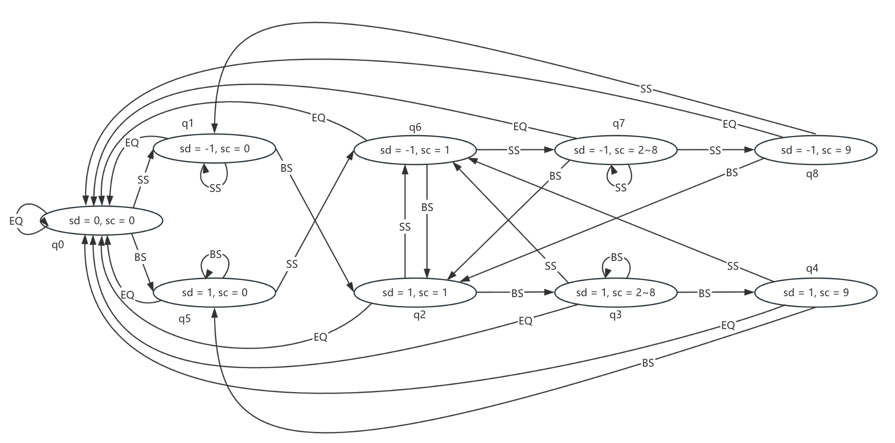
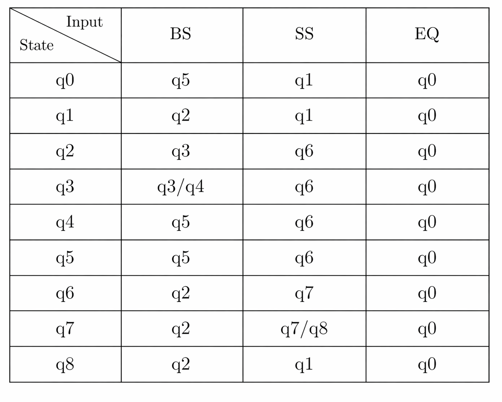

# 基于 TD 序列的量化交易系统设计与实现

## 摘要

量化交易系统能够将交易规则、数据处理、风险控制和评价流程转化为可重复执行的软件系统，对提高策略研究的规范性和可复现性具有重要意义。TD 序列规则链条较长，包含 Setup、Countdown、完美计数和 TDST 取消等多阶段状态，若直接采用简单条件判断实现，容易出现计数边界不清、信号重复、复权数据不一致和交易记录不可追溯等问题。本文面向 A 股日线数据和 PTrade 量化交易环境，从 TD 序列状态机实现和适用性评价方法两个方面开展研究，主要工作如下。

1. 针对 TD 9-13 Sequential 规则状态依赖强、计数过程易出错的问题，设计并实现了一种基于有限状态机的 TD 序列信号识别方法。该方法将 Setup 的严格连续计数、Countdown 的非连续计数、完美 Setup、完美 Countdown、TDST 取消、同向 Setup 取消和反向 Setup 取消统一建模为事件流；同时采用前复权数据全量重算和停牌过滤机制，解决了 A 股场景下历史价格可比性和信号可追溯性问题。

2. 针对 TD 序列不能仅以收益率和胜率评价的问题，设计并实现了一个基于 PTrade 的量化交易系统，并提出事件研究与事件驱动回测相结合的适用性分析方案。系统实现了配置管理、行情获取、信号输出、交易生命周期记录和统计输出等功能；评价方案从信号密度、完美信号比例、取消原因分布、事件后收益、最大有利波动、最大不利波动和样本外分层表现等角度分析 TD 序列在不同市场状态和股票特征下的适用性。
 
**关键词**  TD序列  量化交易  有限状态机  回测方法  适用性分析

# Design and Implementation of Quantitative Trading System Based on TD Sequential

## ABSTRACT

Quantitative trading systems transform trading rules, data processing, risk control, and performance evaluation into repeatable software workflows. They are important applications at the intersection of financial engineering and software engineering. TD Sequential, proposed by Thomas R. DeMark, is a price-comparison-based technical analysis method. Its core process includes price flip, Setup, Countdown, TDST cancellation rules, and perfected counting. It is often used to identify trend exhaustion and potential reversal zones. Compared with common moving-average and momentum indicators, TD Sequential has longer rule chains and stronger state dependence. A direct implementation with scattered conditional statements may lead to ambiguous counting boundaries, duplicated signals, inconsistent adjusted prices, and untraceable trading records.

This thesis designs and implements a quantitative trading system based on TD 9-13 Sequential in the context of A-share daily data and the PTrade environment. The system adopts a layered architecture that decouples configuration management, market data acquisition, bar cleaning, Setup state machine, Countdown state machine, signal recording, trade lifecycle recording, and statistical output. In the signal layer, a finite state machine is used to model the strict consecutive counting process of Setup, while CountdownMachine handles non-consecutive sequential counting, perfected Countdown, and TDST cancellation. In the data layer, pre-adjusted prices and full historical recalculation are used to maintain consistency of historical price series. The focus of this thesis is not to maximize profitability or win rate, but to study how TD Sequential can be implemented accurately, stably, and traceably, and how its applicability can be evaluated across different market states and stock characteristics.

For backtesting, this thesis proposes a more professional yet moderately complex two-layer validation method instead of relying on the simplified execution logic currently implemented in code. The first layer is a TD signal event study, which evaluates the signal's ability to identify price exhaustion zones through post-event returns, benchmark-adjusted returns, maximum favorable excursion, maximum adverse excursion, and signal conversion rates. The second layer is an event-driven trading backtest that executes on the next tradable day and incorporates transaction costs, slippage, suspension, limit-up/limit-down constraints, ST and delisting filters, fixed position sizing, TD risk-level stop loss, 1.5R profit target, and maximum holding period. Empirical results can be filled in later under this framework, with emphasis on signal density, perfected signal ratio, cancellation reason distribution, out-of-sample stability, and stratified applicability rather than a single return metric.
 
**KEY WORDS**  TD Sequential  Quantitative Trading  Finite State Machine  Backtesting Method  Applicability Analysis

## 目录

## 第一章 绪论

### 1.1 研究背景与意义

随着证券市场电子化程度的提高，交易策略从经验判断逐渐转向规则化、程序化和可验证的系统实现。量化交易的基本思想是将投资假设转化为明确的计算规则，再通过历史数据、实时数据和交易接口完成信号生成、订单执行与结果反馈。与人工主观判断相比，量化系统的优势在于可重复、可回溯、可审计，但其风险也同样明显：若规则定义不清、数据处理不一致或回测方法过度简化，历史结果可能无法反映真实可执行性。

TD 序列是 DeMark 指标体系中应用较广的技术分析方法，原始思想强调以连续价格比较识别趋势耗竭，而不是简单追随趋势。官方说明将 Sequential 描述为由 Setup 和 Countdown 构成的多阶段价格比较过程，其目标是分析趋势强弱及其发生反转的可能性[^3]。DeMark 的技术分析体系强调用客观规则替代主观画线与形态识别[^1]，Perl 对多种 DeMark 指标的交易含义和使用方式进行了系统整理[^2]。从软件实现角度看，TD 序列的价值不仅在于给出买卖提示，更在于它天然具有状态机结构：Setup 要求严格连续，Countdown 允许不连续，取消条件又可能来自 TDST 突破、同向 Setup 或反向 Setup。这使得 TD 序列非常适合作为量化交易系统中“复杂技术指标工程化实现”的研究对象。

对于 A 股市场而言，TD 序列的研究还具有现实意义。A 股存在分红送转、停牌、涨跌停、ST 风险提示、退市整理和较明显的散户交易特征，直接照搬期货、外汇或指数市场中的技术指标规则，可能造成信号失真。尤其是 TD 序列依赖历史收盘价、高低价之间的相对关系，若复权方式不统一，历史序列的可比性会受到影响。因此，在 A 股环境中实现 TD 序列，需要同时处理复权数据、停牌过滤、信号时间对齐和可交易性约束。

本课题的意义主要体现在三个方面。第一，从指标实现角度，将 TD 序列拆解为可验证的状态机与事件流，减少复杂规则在代码中的隐式耦合。第二，从系统设计角度，围绕 PTrade 环境设计可运行、可配置、可输出完整生命周期记录的量化交易系统。第三，从研究评价角度，不以盈利率和胜率作为唯一目标，而是建立面向适用性分析的回测方法，关注 TD 信号在不同市场状态、流动性水平和股票特征下的表现差异。

### 1.2 国内外研究现状

技术分析的有效性长期存在争议。一方面，有效市场假说认为历史价格信息难以稳定产生超额收益；另一方面，大量实证研究表明，在市场不充分有效、交易者行为偏差较强或制度摩擦较多的阶段，技术交易规则可能具有阶段性预测能力。国内早期研究中，韩杨对中国股市技术分析有效性进行了统计检验，认为早期 A 股市场中短期技术分析更容易体现有效性，但随着市场发展，单纯依靠技术分析获得超额收益的难度提高[^4]。孙碧波和方健雯从技术分析获利能力角度检验中国证券市场弱态有效性，指出部分技术规则在上证指数上具有长期、稳定的超额利润，且交易成本和异步交易不能完全解释该现象[^5]。林玲等使用移动平均线交易规则进行可预测性研究，认为移动平均线策略在样本中获得高于买入持有的平均收益率[^6]。唐雨虹等进一步研究量价配合的技术交易规则，发现交易规则有效性与时间跨度、成交量条件和交易成本有关[^7]。汤光华和邓益民则从技术指标与市场弱式有效的关系出发，说明技术指标的统计关系需要结合市场交易时段和信息反应速度理解[^8]。

近年的外文研究更加重视数据探测偏差和样本外稳定性。Wang 等对中国市场中数千种技术交易规则进行 Superior Predictive Ability 检验，指出部分指数阶段性存在技术交易规则盈利能力，但这种能力会随着市场效率提高而减弱[^9]。Jiang、Tong 和 Song 使用大量技术分析信号并控制数据探测偏差，发现中国股票市场中仍存在若干技术规则的可预测证据[^10]。Chuang 等基于 2010 年至 2021 年数据研究中国股票市场技术交易规则，在修正数据探测偏差后发现，仅少数复杂规则在部分阶段可以超过基准，且交易成本会显著削弱样本外收益[^11]。这些研究共同提示：技术指标研究不能只报告最优回测结果，而应关注样本外验证、交易成本、规则数量和稳健性。

在量化交易系统与回测方法方面，Campbell、Lo 和 MacKinlay 系统讨论了金融市场实证研究和事件研究方法，为用事件窗口考察价格反应提供了基础框架[^12]。Bailey 等提出回测过拟合概率问题，强调大量策略与参数组合反复测试会放大历史绩效[^13]。Sharpe 提出的风险调整后收益评价思想为夏普比率等指标提供了理论基础[^14]。国内教材方面，战雪丽和杨庆泉系统介绍了量化交易概念、策略类型、平台、样本内外测试和风险管理[^15]；丁鹏对量化投资策略与技术体系进行了较全面梳理[^16]；王晓华、欧阳鹏程等图书则从 Python 或 vn.py 实践角度介绍了量化交易系统开发流程[^17][^18]。这些成果为本文的系统设计和回测评价提供了参考。

现有研究对 TD 序列本身的系统化实现讨论相对不足。多数资料集中在交易规则解释或指标图形展示，对状态机建模、复权处理、信号生命周期输出和 A 股适配问题讨论较少。本文因此将研究重点放在 TD 9-13 Sequential 的规则形式化与系统实现上，并提出事件研究与事件驱动回测结合的适用性分析框架。

### 1.3 研究内容

本文围绕“TD 序列如何在 A 股量化交易系统中被准确实现并被合理评价”这一问题展开，主要研究内容如下。

第一，梳理 TD 9-13 Sequential 的核心规则。包括 Price Flip、Buy/Sell Setup、Setup Perfection、Sequence Countdown、Perfect Countdown、TDST 取消、同向 Setup 取消、反向 Setup 取消等内容，并明确本文系统已实现与暂不实现的规则边界。

第二，设计 TD 序列状态机模型。将 Setup 的严格连续计数抽象为有限状态机，将 Countdown 的非连续计数抽象为可启动、可推进、可完成、可取消的事件对象，并为每次信号生成保留 Setup 起点、Countdown 计数日、TDST 阈值、完美状态和取消原因。

第三，设计并实现量化交易系统。系统基于 PTrade 策略生命周期函数运行，完成配置读取、行情获取、停牌过滤、K 线清洗、信号计算、交易生命周期记录、统计输出和日志管理。系统强调模块解耦、配置显式化和输出可追溯。

第四，提出专业但不过度复杂的回测与适用性分析方法。该方法将当前策略代码视为信号生成与记录系统，而不是直接将其简化成交方式作为论文回测方法；论文采用事件研究和事件驱动交易回测两层设计，为后续填入结果提供统一口径。

### 1.4 论文组织结构

全文共分为六章。第一章介绍研究背景、意义、国内外研究现状、研究内容与结构安排。第二章介绍 TD 序列相关理论、A 股数据处理问题、PTrade 和 Tushare 环境以及系统需求分析。第三章给出 TD 序列信号模型设计，重点说明 Setup 与 Countdown 的状态机实现。第四章说明量化交易系统的架构、模块设计与关键实现。第五章提出回测方法与适用性分析方案，并预留后续实证结果展示位置。第六章总结全文工作，并讨论后续优化方向。

## 第二章 相关理论与需求分析

### 2.1 TD 序列基本理论

TD Sequential 通常由 Setup 与 Countdown 两个核心阶段构成，并辅以 Price Flip、Intersection、TDST、Recycle 和若干滤网规则。本文实现重点集中在 TD 9-13 的主干流程，即 9 根 Setup 与 13 个 Countdown。由于 Intersection、Combo Countdown 和 Recycle 在不同资料中存在较多细节分歧，且会显著增加实现复杂度，本文将其作为扩展功能保留，不作为当前系统的必要条件。

Price Flip 是 Setup 启动前的方向转换条件。以买入方向为例，若前一根 K 线的收盘价不低于其前四根 K 线的收盘价，而当前 K 线收盘价低于其前四根 K 线的收盘价，则出现由强转弱的价格反转，当前 K 线可作为 Buy Setup 的第一根。卖出方向则相反。Setup 阶段要求连续 9 根 K 线满足同一方向的四日前收盘价比较关系：Buy Setup 要求当前收盘价严格小于四日前收盘价，Sell Setup 要求当前收盘价严格大于四日前收盘价。严格不等号意味着相等会中断 Setup。

Setup 完成后可以启动 Countdown。Sequence Countdown 不要求连续，Buy Countdown 的一般计数条件为当前收盘价小于等于两日前最低价，Sell Countdown 的一般计数条件为当前收盘价大于等于两日前最高价。计数达到 13 时，认为趋势耗竭信号完成。完美 Countdown 进一步要求 Buy Countdown 第 13 个计数日收盘价低于或等于第 8 个计数日收盘价，Sell Countdown 则要求第 13 个计数日收盘价高于或等于第 8 个计数日收盘价。

TDST 用于判断原 Setup 所代表的趋势结构是否被突破。以 Buy Countdown 为例，若价格向上突破 Setup 阶段高点或真实高点阈值，说明原下跌耗竭计数的结构基础可能失效，需要取消当前 Countdown。本文系统提供五种 TDST 取消规则配置，默认采用收盘价突破 Setup 阶段最高最高价的规则，使取消逻辑在保守性和可执行性之间保持平衡。

### 2.2 A 股市场数据与复权问题

TD 序列以历史价格之间的相对关系作为核心输入，因此数据连续性和可比性直接影响信号质量。A 股股票存在现金分红、送股、转增、配股和拆细等情形，若直接使用未复权价格，除权除息日附近会出现机械价格跳变，可能被 TD 序列误识别为趋势变化。对于用于信号识别的历史日线序列，本文采用前复权数据，使当前视角下的历史价格保持可比。

前复权数据也带来一个工程问题：随着新的分红送转发生，历史价格会被重新调整，过去已经计算过的 TD 状态可能发生变化。因此，系统采用“前复权 + 每日全量重算”的设计，即每个交易周期重新拉取足够长度的历史 K 线，从头运行 Setup 与 Countdown 状态机，再筛选最后一根已完成 K 线产生的新信号。该方法牺牲少量计算效率，但日线级别下计算成本较低，能够避免增量缓存与复权变动之间的不一致。

除复权外，A 股还需要处理停牌、涨跌停、ST 和退市风险。信号计算层需要过滤成交量为零或停牌的 K 线，交易评价层需要考虑信号出现后的可交易性。如果某只股票在事件后的下一交易日停牌、涨停无法买入或跌停无法卖出，回测应顺延到下一可交易日或记录为不可执行事件，而不能默认按理想价格成交。

### 2.3 PTrade 与数据接口基础

本文系统运行环境为 PTrade 量化交易平台。PTrade 提供策略生命周期函数、股票池设置、行情获取、委托下单、持仓查询和交易回报等接口，支持研究、回测和交易模块中的策略开发[^21]。系统使用 `initialize` 完成配置读取、输出目录准备和对象构造；使用 `before_trading_start` 刷新当日可交易股票池；使用 `handle_data` 获取历史数据、计算信号并执行回测环境中的交易逻辑；在交易环境中使用 `tick_data` 和 `on_trade_response` 跟踪逐笔成交与止盈止损。

Tushare 是国内常用金融数据接口平台，提供股票基础信息、交易日历、日线行情、复权行情、停复牌信息、财务数据、指数数据等接口[^22]。本文系统当前主要通过 PTrade 获取回测行情，但在股票池构建、流动性筛选和后续适用性分层分析中，可使用 Tushare 或券商数据接口补充总市值、成交额、行业分类、上市状态和停复牌信息。

### 2.4 系统需求分析

根据毕业设计任务要求与 TD 序列研究目标，系统需求可分为功能需求和非功能需求。功能需求面向策略运行流程，非功能需求面向系统稳定性、可追溯性和可扩展性。

表2-1  系统功能需求表

| 需求编号 | 需求名称 | 需求说明 |
| ---- | ---- | ---- |
| FR1 | 配置管理 | 通过独立 JSON 配置股票池、频率、复权方式、TDST 规则、交易参数和日志参数 |
| FR2 | 行情获取 | 在 PTrade 合法生命周期内获取历史 K 线，并过滤停牌和成交量异常数据 |
| FR3 | Setup 识别 | 识别 Buy/Sell Setup、完美 Setup 和 Setup 起止日期 |
| FR4 | Countdown 识别 | 识别非连续 Sequence Countdown、完美 Countdown、暂记加号和 13 完成信号 |
| FR5 | 取消规则 | 支持 TDST、同向 Setup、反向 Setup 导致的 Countdown 取消 |
| FR6 | 信号输出 | 按股票输出 Setup 与 Countdown 信号事件，保留计数日期和关键价格 |
| FR7 | 交易生命周期输出 | 从 Buy Setup 到 Countdown 取消、未买入或卖出终态形成完整记录 |
| FR8 | 统计输出 | 输出周期级统计数据，为后续适用性分析提供数据基础 |

表2-2  系统非功能需求表

| 需求编号 | 需求名称 | 需求说明 |
| ---- | ---- | ---- |
| NFR1 | 可追溯性 | 每个信号和交易事件均可回溯到 Setup、Countdown 和取消原因 |
| NFR2 | 可配置性 | TDST 规则、完美信号要求、仓位比例和风控参数均通过配置控制 |
| NFR3 | 稳定性 | 配置缺失、数据不足、停牌、接口异常等情况应记录日志并可定位 |
| NFR4 | 低耦合 | 数据层、信号层、输出层和交易层职责清晰，便于独立测试和替换 |
| NFR5 | 可扩展性 | 预留 Intersection、Combo Countdown、Recycle 和多频率联动扩展位置 |

### 2.5 本章小结

本章介绍了 TD 序列的核心理论、A 股数据处理问题、PTrade 与 Tushare 环境以及系统需求。TD 序列的实现难点在于状态依赖和事件生命周期，而 A 股环境又要求对复权、停牌和可交易性进行处理。因此，后续章节将围绕状态机建模和系统分层实现展开。

## 第三章 TD 序列信号模型设计

### 3.1 信号模型总体思路

TD 序列信号模型将原本描述性的交易规则转化为确定性的事件流。输入是一段按时间升序排列的有效 K 线序列，输出是 Setup 事件、Countdown 进位事件、Countdown 暂记事件、Countdown 完成事件和 Countdown 取消事件。每个事件均带有股票代码、周期、发生日期、方向、计数、完美状态、关联 Setup 信息、TDST 阈值和关键价格。

该模型采用两个子状态机组合实现。SetupMachine 负责严格连续的 9 根 Setup 识别，它只关心当前收盘价与四日前收盘价的关系。CountdownMachine 由 Setup 完成事件启动，负责非连续的 13 计数、完美 Countdown 判断和 TDST 取消。TDSignalProcessor 作为编排层，按时间顺序将 K 线输入两个状态机，并处理 Setup 完成时对当前 Countdown 的取消或重启。

### 3.2 Setup 状态机设计

Setup 的核心是“连续”。若直接用循环变量计数，容易忽略 Price Flip、相等中断、同向延续和反向重启之间的差异。本文将 Setup 抽象为有限状态机，状态由方向 `sd` 和计数 `sc` 组成，其中 `sd=1` 表示买入方向，`sd=-1` 表示卖出方向，`sd=0` 表示空闲；`sc` 表示 Setup 已累计根数。

SetupMachine 对每根 K 线先进行输入分类。若当前收盘价小于四日前收盘价，输入记为 `BS`；若大于四日前收盘价，输入记为 `SS`；若相等，输入记为 `EQ`。状态机根据当前状态和输入决定是否启动、累计、反向切换或重置。Buy Setup 在第 9 根完成时输出 `BUY_SETUP` 或 `BUY_SETUP_PERFECT`，Sell Setup 在第 9 根完成时输出 `SELL_SETUP` 或 `SELL_SETUP_PERFECT`。

图3-1  Setup状态转移图

表3-1  Setup输入分类表

| 输入 | 判定条件 | 含义 |
| ---- | ---- | ---- |
| BS | `close_t < close_{t-4}` | 满足买入 Setup 方向的价格关系 |
| SS | `close_t > close_{t-4}` | 满足卖出 Setup 方向的价格关系 |
| EQ | `close_t = close_{t-4}` | 严格条件中断，清空正在进行的 Setup |

图3-2  Setup状态转移表图

完美 Setup 是对普通 Setup 的附加确认。Buy Setup 中，第 8 或第 9 根 K 线的最低价需要小于等于第 6 和第 7 根 K 线的最低价；Sell Setup 中，第 8 或第 9 根 K 线的最高价需要大于等于第 6 和第 7 根 K 线的最高价。系统在 Setup 完成时直接基于 9 根 `setup_bars` 计算完美状态，并将结果写入信号事件。

### 3.3 Countdown 状态机设计

Countdown 与 Setup 的最大差异在于不要求连续。Setup 完成后，Countdown 从同一根 K 线开始检查计数条件，因为 TD 序列规则允许 Setup 第 9 根同时成为 Countdown 的第 1 个计数日。Buy Countdown 的进位条件为当前收盘价小于等于两日前最低价，Sell Countdown 的进位条件为当前收盘价大于等于两日前最高价。每满足一次条件，计数加一，直到达到 13。

CountdownMachine 保存当前方向、已计数数量、各计数日对应 K 线、启动它的 Setup 信息、TDST 阈值、完成状态和取消状态。该状态机的事件类型包括 `PROGRESS`、`PLUS_TENTATIVE`、`COMPLETE` 和 `CANCEL`。当配置要求完美 Countdown 且当前计数已经达到 12 时，若某根 K 线满足一般计数条件但不满足完美第 13 条件，则不进位，只输出暂记加号事件，等待后续更理想的第 13 根。

表3-2  Countdown事件类型表

| 事件类型 | 触发条件 | 输出含义 |
| ---- | ---- | ---- |
| PROGRESS | 满足一般计数条件且计数未达到 13 | Countdown 正常进位 |
| PLUS_TENTATIVE | 计数为 12，满足一般条件但不满足完美第 13 条件 | 暂记加号，不完成 |
| COMPLETE | 计数达到 13 | Countdown 完成 |
| CANCEL | TDST 突破、同向 Setup 或反向 Setup 触发取消 | 当前 Countdown 终止 |

### 3.4 TDST 与取消规则设计

Countdown 的取消规则决定了一个 TD 信号生命周期是否仍然有效。本文系统支持三类取消来源。第一类是 TDST 突破，即价格突破由 Setup 阶段推导出的关键阈值。第二类是反向 Setup 完成，表示市场结构发生相反方向变化。第三类是同向 Setup 完成，表示新的同方向结构出现，系统可根据配置取消旧 Countdown 并以新 Setup 启动新的 Countdown。

TDST 阈值提供五种规则配置。以 Buy Countdown 为例，规则可选择 Setup 阶段最高收盘价、最高最高价、收盘价突破最高收盘价、收盘价突破最高最高价或收盘价突破真实最高价。Sell Countdown 对应使用最低价方向。不同规则的保守程度不同，阈值越容易突破，Countdown 被取消的频率越高。系统默认采用“收盘价突破 Setup 阶段最高最高价”的规则，以减少盘中噪声对取消判断的影响。

### 3.5 信号输出字段设计

为了支持后续适用性分析，信号输出不仅记录事件类型，还记录事件上下文。`signnal.csv` 按股票分流保存，字段包括事件日期、股票代码、周期、事件类别、事件类型、方向、计数、完美状态、取消原因、Setup 起止日期、Setup 阶段最高价、TDST 阈值、Countdown 起始日期、各计数日日期、计数第 8 日收盘价、Countdown 阶段最低价和事件 K 线价格。

表3-3  关键信号字段表

| 字段 | 说明 | 适用分析 |
| ---- | ---- | ---- |
| setup_first_dt | Setup 第一根日期 | 计算 Setup 持续区间 |
| setup_last_dt | Setup 第九根完成日期 | 定位生命周期起点 |
| setup_perfect | 是否完美 Setup | 比较完美与非完美信号差异 |
| count_1_dt 至 count_13_dt | Countdown 各计数日期 | 分析计数节奏和时间跨度 |
| countdown_8_close | 第 8 个计数日收盘价 | 判断完美 Countdown |
| countdown_low | Countdown 阶段最低价 | 计算 TD 风险价位 |
| reason | 取消原因 | 分析失效模式 |

### 3.6 本章小结

本章将 TD 序列信号识别拆解为 SetupMachine、CountdownMachine 和 TDSignalProcessor 三部分。SetupMachine 解决严格连续计数问题，CountdownMachine 解决非连续计数和取消问题，处理器负责事件编排。通过结构化事件输出，系统为后续回测和适用性分析保留了完整上下文。

## 第四章 量化交易系统设计与实现

### 4.1 系统总体架构

系统采用分层架构设计，避免将行情接口、信号计算、交易执行和文件输出混写在同一逻辑块中。软件工程教材强调需求分析、模块划分和接口设计对于系统可维护性的重要作用[^19]，设计模式思想也强调通过清晰对象职责提高代码复用性和可扩展性[^20]。本文系统虽然以单文件策略方式部署到 PTrade，但内部按照配置层、日志层、数据层、信号层、输出层、交易层和策略钩子层进行组织。

表4-1  系统分层架构表

| 层次 | 主要对象 | 职责 |
| ---- | ---- | ---- |
| 配置层 | `load_config`、配置 schema | 读取 JSON 配置并强制校验必填字段 |
| 日志层 | `StrategyLogger` | 控制台与文件双写，记录状态转移和异常 |
| 数据层 | `Bar`、`MarketDataFetcher` | 获取历史行情，转换为内部 K 线并过滤停牌 |
| 信号层 | `SetupMachine`、`CountdownMachine`、`TDSignalProcessor` | 生成 TD Setup 与 Countdown 事件 |
| 输出层 | `SignalRecorder`、`TradeRecordRecorder`、`StatisticsRecorder` | 输出信号、交易生命周期和统计 CSV |
| 交易层 | `TradeExecutor` | 将 Buy Countdown 完成信号接入基础仓位与风控 |
| 钩子层 | `initialize`、`before_trading_start`、`handle_data` 等 | 连接 PTrade 生命周期 |

### 4.2 配置与运行目录设计

系统将全部可调参数集中在 `config.json` 中，包括股票池、基准、数据频率、复权方式、历史回看长度、滑点、涨跌停成交模式、Setup 完美要求、Countdown 启用状态、TDST 规则、交易仓位、止盈止损、日志级别和统计输出开关。策略启动时若配置缺失或格式错误，系统直接抛出异常终止运行，避免在错误默认值下生成看似有效的回测结果。

运行输出目录由配置文件所在目录和策略启动日期共同确定。若同日多次启动，目录自动追加 `_1`、`_2` 等后缀，避免覆盖历史结果。每个股票拥有独立子目录，用于保存信号、交易生命周期和统计文件；运行根目录保存汇总交易记录、总统计和策略日志。该设计使不同运行批次之间相互隔离，便于复现实验。

### 4.3 数据获取与清洗实现

数据层通过 PTrade 的历史行情接口获取最近 `lookback_count` 根 K 线，并使用 `include=False` 获取已完成 K 线。日线策略下，`handle_data` 中最后一根 K 线通常是上一交易日 K 线，信号基于昨日收盘后可确认的信息生成，交易层在今日执行。这种时序避免使用未来数据。

MarketDataFetcher 将外部行情数据转换为内部 `Bar` 对象，统一字段包括日期、开盘价、最高价、最低价、收盘价和成交量。成交量小于等于零的 K 线被视为无效交易日并过滤。盘前阶段使用 PTrade 状态过滤接口剔除停牌和退市标的，盘中处理时再进行二次确认，减少对不可交易股票下单的可能。

### 4.4 信号处理流程实现

信号处理在每个周期对每只有效股票独立执行。系统每日构造新的 TDSignalProcessor，将最近 N 根有效 K 线全量输入状态机，得到完整历史事件流，再筛选最后一根 K 线产生的新事件。该方式虽然不是最高效的增量更新，但能适配前复权价格历史变动，避免长期缓存状态与当前复权序列不一致。

信号处理流程如下：首先，SetupMachine 从第 5 根 K 线开始运行，保证四日前收盘价可用；其次，若 Setup 完成，则输出 Setup 事件，并根据配置决定是否启动 Countdown；再次，若已有 Countdown 且新 Setup 与其方向相反或相同，则根据取消配置输出取消事件并启动新 Countdown；最后，CountdownMachine 在每根 K 线上检查 TDST 取消和计数条件，输出进位、暂记、完成或取消事件。

### 4.5 交易生命周期记录实现

本文系统虽然包含交易执行层，但其定位是为信号形成可执行闭环和记录完整生命周期，而不是以当前成交近似方式作为论文最终回测方法。交易生命周期从 Buy Setup 完成开始，可能在 Buy Countdown 取消、Buy Countdown 完成但未买入、买入后止损、买入后止盈或趋势反转卖出时结束。每个终态写入一行 `trade.csv`，避免中间事件重复写入导致统计口径混乱。

表4-2  交易生命周期字段表

| 字段类别 | 代表字段 | 说明 |
| ---- | ---- | ---- |
| Setup 信息 | `setup_completed_at`、`setup_is_perfect`、`setup_highest_high` | 记录生命周期起点 |
| Countdown 信息 | `count_1_at` 至 `count_13_at`、`count_8_close` | 记录计数路径 |
| 终态信息 | `countdown_status`、`countdown_completed_count` | 标记正常完成或取消原因 |
| 买入信息 | `bought`、`buy_reject_reason`、`buy_quantity`、`buy_price` | 记录买入与未买入原因 |
| 风控信息 | `stop_loss_price`、`take_profit_price` | 记录 TD 风险价位和止盈目标 |
| 卖出信息 | `sell_price`、`sell_date`、`sell_reason`、`pnl` | 记录终态交易结果 |

### 4.6 交易与风控规则实现

交易层默认只根据 Buy Countdown 完成信号进行买入，Sell Countdown 默认保留为信号，不直接用于卖出。若配置开启 `take_profit_on_sell_countdown`，则 Sell Countdown 完成且当前仓位盈利时可作为趋势反转止盈信号。每次买入使用总资产固定比例，默认 10%，并设置最小交易金额和最小现金要求，防止过小订单和近似满仓状态下继续下单。

止损价基于 TD 序列建议的风险价位计算。系统在 Countdown 阶段找到最低价所在 K 线，将该 K 线最低价减去其高低价差的一定倍数作为止损价；止盈价采用 1.5R 规则，即买入价与止损价之间的风险距离乘以 1.5 后加到买入价上。实盘环境中，成交价和数量以 `on_trade_response` 的成交回报为准，止盈止损在 `tick_data` 中逐 tick 追踪；回测环境中则降级为在后续已完成 K 线上使用最高价和最低价判断触发。

### 4.7 异常处理与可扩展性

系统在配置缺失、文件不可读、行情数据不足、停牌、下单失败和 CSV 写入失败等情况下写入日志。对于 PTrade 禁用部分标准库的限制，系统尽量使用平台允许的文件和目录接口，并将本地 SimTradeLab 环境作为回测兼容路径。输出文件使用固定表头和按股票分流方式，便于后续使用 Python、Excel 或数据库进行统计分析。

在可扩展性方面，系统已为 Intersection、Combo Countdown、Recycle、Setup 延伸记录和多频率联动保留配置位置。后续若加入这些规则，可在信号层扩展新的状态或事件类型，同时保持输出层和适用性分析层的字段结构稳定。

### 4.8 本章小结

本章说明了基于 TD 序列的量化交易系统架构和关键实现。系统通过配置显式化、分层职责划分、状态机信号识别和生命周期记录，实现了 TD 9-13 Sequential 在 PTrade 环境中的可运行闭环。后续研究评价不应简单依赖当前交易层的近似成交，而应使用更规范的回测方法。

## 第五章 回测方法与适用性分析方案

### 5.1 回测研究目标

本文回测方法的目标不是证明 TD 序列一定能获得高收益或高胜率，而是评价其在 A 股市场中的适用性。适用性包括三个层面：第一，规则层面，TD Setup 和 Countdown 是否能够稳定生成逻辑一致、可解释的信号；第二，市场层面，信号在不同市场状态、行业、流动性、波动率和市值分组下是否表现出差异；第三，执行层面，若加入基础风控和交易成本，信号能否形成可执行的交易流程。

因此，本文采用“事件研究 + 事件驱动交易回测”的两层验证方案。事件研究用于隔离 TD 信号自身的信息含量，不依赖具体仓位管理；交易回测用于检验信号接入最小交易规则后的执行可行性。该方法比直接报告当前代码中的简化回测结果更专业，也避免将论文重点误导为单次收益率比较。

### 5.2 数据样本与预处理方法

数据样本建议覆盖 A 股主板、创业板和科创板中满足上市时间与流动性要求的股票。为减少幸存者偏差，应尽量使用历史成分或全市场历史股票池，并保留退市、ST 和停牌信息。若无法完整获取历史全市场股票池，可在论文中明确说明样本边界，并将结果解释限定在可观测股票集合内。

信号识别使用前复权日线数据，交易执行评价使用实际可交易价格或由未复权行情近似的下一可交易日开盘价。样本可以划分为样本内观察期和样本外检验期，例如 2016 年至 2020 年用于规则确认和描述性统计，2021 年至 2025 年用于样本外评价；也可以采用滚动窗口方法，例如每三年为观察窗口、下一年为检验窗口。由于 TD 序列默认参数较少，本文不进行大规模参数优化，以降低回测过拟合风险。

表5-1  数据预处理规则表

| 项目 | 处理方法 | 目的 |
| ---- | ---- | ---- |
| 复权方式 | 信号层使用前复权日线 | 保证历史价格比较一致 |
| 停牌处理 | 成交量为零或状态为停牌的 K 线不参与信号推进 | 避免无交易日扭曲连续关系 |
| 涨跌停处理 | 交易回测中涨停不可买入、跌停不可卖出 | 提高可执行性 |
| ST/退市处理 | 可作为过滤条件或单独分组 | 分析风险股票对信号表现的影响 |
| 流动性处理 | 以成交额或换手率过滤极低流动性股票 | 降低成交不可实现风险 |

### 5.3 TD 信号事件研究方法

事件研究以 TD 信号作为事件日，观察事件日前后价格行为。事件类型包括 Buy Setup 完成、Sell Setup 完成、Buy Countdown 完成、Sell Countdown 完成、Buy Countdown 取消和 Sell Countdown 取消。核心事件以 Countdown 完成为主，因为 Setup 更接近趋势结构形成，而 Countdown 更接近趋势耗竭判断。

对每个事件，记录事件日 `t` 后 1、5、10、20、60 个交易日的未来收益率、相对基准收益率和行业中性收益率。Buy 方向事件预期关注后续上涨或跌幅收敛，Sell 方向事件预期关注后续下跌或涨幅收敛。除终点收益外，还应记录事件窗口内最大有利波动和最大不利波动。最大有利波动可以衡量信号后潜在机会空间，最大不利波动可以衡量信号后继续逆向运行的风险。

表5-2  事件研究指标表

| 指标 | 说明 | 解释重点 |
| ---- | ---- | ---- |
| 事件后收益 | 事件后 N 日收盘价相对事件日收盘价收益 | 信号方向上的后续价格变化 |
| 相对基准收益 | 个股收益减同期沪深 300 或中证全指收益 | 剔除市场整体涨跌影响 |
| 最大有利波动 | 事件后窗口内最有利价格变化 | 信号提供的机会空间 |
| 最大不利波动 | 事件后窗口内最不利价格变化 | 信号失效时的潜在风险 |
| Setup 到 Countdown 转化率 | Setup 完成后最终形成 Countdown 13 的比例 | 规则链条完成能力 |
| Countdown 取消率 | Countdown 被 TDST、同向或反向 Setup 取消的比例 | 信号稳定性与趋势持续性 |

统计检验上，可采用均值、分位数、中位数、胜率、Bootstrap 置信区间和非参数秩和检验。本文不建议使用复杂到难以复现的多重检验框架作为本科论文主线，但应在文字中说明存在数据探测偏差风险，并通过样本外区间、少参数规则和分层稳定性降低该风险[^13]。

### 5.4 事件驱动交易回测方法

事件驱动交易回测以 Buy Countdown 完成为主要入场事件，Sell Countdown 可作为可选退出事件。入场价格采用事件日后的下一可交易日开盘价，若开盘涨停或停牌，则顺延至下一可交易日；若连续若干日不可交易，则记录为不可执行事件。每次入场使用固定资金比例或固定风险预算，不根据历史最优参数动态调整。

退出规则由四部分组成。第一，TD 风险价位止损：找到 Countdown 阶段最低价所在 K 线，以最低价减去高低价差得到止损价。第二，1.5R 止盈：以买入价到止损价的距离作为风险 R，止盈目标为买入价加 1.5R。第三，最大持仓期：若持仓达到 20、40 或 60 个交易日仍未触发止盈止损，则按期末收盘价退出。第四，反向 Countdown：若开启该规则，Sell Countdown 完成且仓位盈利时退出。

交易成本方面，应加入佣金、印花税和滑点。佣金可设为万分之三或按实际券商费率设置，卖出印花税按 A 股现行规则设置，滑点可采用固定比例或半个最小报价单位。所有成本参数应在论文中明确，并在结果表中报告是否含成本。

表5-3  事件驱动回测规则表

| 模块 | 规则 |
| ---- | ---- |
| 入场信号 | Buy Countdown 完成，区分完美与非完美 Countdown |
| 入场价格 | 下一可交易日开盘价或成交量加权近似价 |
| 仓位控制 | 固定资金比例或固定风险预算，单只股票持仓上限固定 |
| 止损 | TD 风险价位 |
| 止盈 | 1.5R 目标价 |
| 时间退出 | 最大持仓期退出 |
| 成本 | 佣金、印花税、滑点、不可交易顺延 |

### 5.5 适用性分层分析方法

适用性分析比单一收益率更符合本文研究目标。TD 序列本质上试图识别趋势耗竭，因此其效果可能与市场状态密切相关。论文后续补充结果时，应至少从市场状态、个股特征和信号质量三个维度进行分层。

市场状态可以按指数均线、指数收益、波动率或成交额划分为上涨、下跌和震荡阶段。个股特征可以按流动性、市值、波动率、行业和上市年限划分。信号质量可以按完美 Setup、完美 Countdown、Countdown 用时、TDST 距离和取消原因划分。比较各组信号密度、事件后收益、最大不利波动和交易可执行率，可以回答 TD 序列更适合趋势快速衰竭、震荡筑底、流动性较好还是波动率较高的股票。

表5-4  适用性分析分层表

| 分层维度 | 分组方式 | 关注问题 |
| ---- | ---- | ---- |
| 市场状态 | 上涨、下跌、震荡、高波动、低波动 | TD 是否更适合趋势耗竭或震荡区间 |
| 流动性 | 成交额或换手率分位数 | 信号能否真实成交 |
| 市值 | 大盘、中盘、小盘 | 信号是否受个股规模影响 |
| 行业 | 申万或中信行业 | 信号是否存在行业差异 |
| 信号质量 | 完美/非完美、快速/慢速 Countdown | 完美规则是否提高稳定性 |

### 5.6 结果展示模板

本节为后续补充实证结果预留统一展示模板。由于当前论文阶段不要求填入最终回测结果，表格中的数值列暂以“待补充”表示。后续补齐时，应保持同一数据口径，避免只选择表现较好的阶段或股票组展示。

表5-5  TD信号事件研究结果占位表

| 事件类型 | 样本数 | 事件后5日收益中位数 | 事件后20日收益中位数 | 最大有利波动中位数 | 最大不利波动中位数 |
| ---- | ---- | ---- | ---- | ---- | ---- |
| Buy Setup 完成 | 待补充 | 待补充 | 待补充 | 待补充 | 待补充 |
| Buy Countdown 完成 | 待补充 | 待补充 | 待补充 | 待补充 | 待补充 |
| Sell Setup 完成 | 待补充 | 待补充 | 待补充 | 待补充 | 待补充 |
| Sell Countdown 完成 | 待补充 | 待补充 | 待补充 | 待补充 | 待补充 |

表5-6  事件驱动交易回测结果占位表

| 策略口径 | 交易次数 | 胜率 | 平均盈亏比 | 最大回撤 | 年化收益 | 夏普比率 |
| ---- | ---- | ---- | ---- | ---- | ---- | ---- |
| 全部 Buy Countdown | 待补充 | 待补充 | 待补充 | 待补充 | 待补充 | 待补充 |
| 完美 Setup + Countdown | 待补充 | 待补充 | 待补充 | 待补充 | 待补充 | 待补充 |
| 高流动性股票组 | 待补充 | 待补充 | 待补充 | 待补充 | 待补充 | 待补充 |
| 震荡市场阶段 | 待补充 | 待补充 | 待补充 | 待补充 | 待补充 | 待补充 |

### 5.7 本章小结

本章提出了适用于本文研究目标的回测方法。方法上先用事件研究评价 TD 信号本身的信息含量，再用事件驱动交易回测评价最小交易闭环的可执行性；评价上强调样本外、成本约束、不可交易处理和分层适用性。该方案比当前代码中的简化成交逻辑更适合写入论文，也为后续补入实证结果提供了清晰模板。

## 第六章 总结与展望

### 6.1 研究工作总结

本文围绕 TD 9-13 Sequential 的工程化实现与适用性评价展开研究，完成了 TD 序列规则梳理、状态机模型设计、PTrade 量化交易系统实现和回测方法设计。与单纯追求策略收益不同，本文重点关注复杂技术指标在真实量化交易环境中的可解释、可复现和可追溯实现。

在规则建模方面，本文将 Setup 的严格连续计数和 Countdown 的非连续计数拆分为两个状态机，分别处理价格关系判断、完美信号、TDST 取消、同向与反向 Setup 取消。该设计使 TD 序列不再是散落在代码中的条件判断，而是可以通过状态、输入和事件清晰描述的模型。

在系统实现方面，本文设计了配置管理、日志、数据获取、信号处理、输出记录、交易执行和统计输出等模块。系统能够在 PTrade 环境下运行，支持前复权全量重算、停牌过滤、按股票输出信号 CSV、记录完整交易生命周期和周期统计。该实现体现了软件工程中模块化、低耦合、配置显式化和异常可定位的原则。

在回测方法方面，本文提出事件研究和事件驱动交易回测结合的方案。该方案避免直接依赖当前简化成交逻辑，能够更专业地分析 TD 序列在 A 股市场中的适用性。后续补充结果时，应围绕信号密度、完美信号比例、取消原因、事件后收益分布、样本外稳定性和分层表现展开，而不是只报告收益率和胜率。

### 6.2 不足与展望

本文仍存在若干不足。第一，当前系统主要实现 Sequence Countdown，Intersection、Combo Countdown、Recycle 和多种 TD 过滤器尚未完整实现。第二，当前实现以日线级别为主，尚未验证分钟线或多周期联动下的信号一致性。第三，交易执行层主要用于形成闭环，后续若用于实盘，应进一步完善订单状态、部分成交、撤单、涨跌停排队和持久化恢复。第四，适用性分析结果仍需在后续补入，并应尽量采用全市场历史股票池以降低幸存者偏差。

后续工作可以从三个方向展开。首先，完善 TD 序列规则族，实现 Intersection、Combo Countdown、Recycle 和更细粒度的 TDST 有效突破确认。其次，建立独立的研究型回测模块，将事件研究、样本外滚动检验、Bootstrap 置信区间和分层统计自动化。最后，将 TD 序列与成交量、波动率、市场状态或基本面过滤条件结合，通过消融实验分析不同模块对结果的贡献，避免简单叠加指标后无法判断 TD 序列本身作用的问题。

## 参考文献

[^1]: DeMark T R. The New Science of Technical Analysis[M]. New York: John Wiley & Sons, 1994.

[^2]: Perl J. DeMark Indicators[M]. New York: Bloomberg Press, 2008.

[^3]: DeMARK Analytics. Sequential Indicator[EB/OL]. [2026-05-02]. https://demark.com/sequential-indicator/.

[^4]: 韩杨. 对技术分析在中国股市的有效性研究[J]. 经济科学, 2001, 23(03):49-57.

[^5]: 孙碧波, 方健雯. 对中国证券市场弱态有效性的检验——基于技术分析获利能力的实证研究[J]. 上海财经大学学报, 2004, 6(6):53-58.

[^6]: 林玲, 曾勇, 唐小我. 移动平均线交易规则检验[J]. 电子科技大学学报, 2000, 29(6):647-650.

[^7]: 唐雨虹, 曾勇, 唐小我. 量价配合的技术分析交易规则有效性研究[J]. 电子科技大学学报, 2005, 34(5):720-723.

[^8]: 汤光华, 邓益民. 技术指标与市场弱式有效的实证研究[J]. 统计研究, 2004(12):31-34.

[^9]: Wang S, Jiang Z Q, Li S P, et al. Testing the performance of technical trading rules in the Chinese markets based on superior predictive test[J]. Physica A: Statistical Mechanics and its Applications, 2015, 439:114-123.

[^10]: Jiang F, Tong G, Song G. Technical analysis profitability without data snooping bias: Evidence from Chinese stock market[J]. International Review of Finance, 2019, 19(1):191-206.

[^11]: Chuang O C, Chuang H C, Wang Z, et al. Profitability of technical trading rules in the Chinese stock market[J]. Pacific-Basin Finance Journal, 2024, 84:102278.

[^12]: Campbell J Y, Lo A W, MacKinlay A C. The Econometrics of Financial Markets[M]. Princeton: Princeton University Press, 1997.

[^13]: Bailey D H, Borwein J M, López de Prado M, et al. The probability of backtest overfitting[J]. Journal of Computational Finance, 2016, 20(4):39-69.

[^14]: Sharpe W F. The Sharpe Ratio[J]. Journal of Portfolio Management, 1994, 21(1):49-58.

[^15]: 战雪丽, 杨庆泉. 量化投资实务[M]. 北京: 清华大学出版社, 2022.

[^16]: 丁鹏. 量化投资: 策略与技术[M]. 北京: 电子工业出版社, 2016.

[^17]: 王晓华. Python量化交易实战[M]. 北京: 清华大学出版社, 2019.

[^18]: 欧阳鹏程. Python量化交易实战: 使用vn.py构建交易系统[M]. 北京: 清华大学出版社, 2023.

[^19]: 张海藩, 牟永敏. 软件工程导论: 第6版[M]. 北京: 清华大学出版社, 2013.

[^20]: Gamma E, Helm R, Johnson R, et al. 设计模式: 可复用面向对象软件的基础[M]. 李英军, 马晓星, 蔡敏, 等译. 北京: 机械工业出版社, 2007.

[^21]: PTrade. PTrade量化交易API接口文档[EB/OL]. [2026-05-02]. https://ptradeapi.com/.

[^22]: Tushare. Tushare数据接口文档[EB/OL]. [2026-05-02]. https://tushare.pro/document/2.

[^23]: 中华人民共和国国家质量监督检验检疫总局, 中国国家标准化管理委员会. GB/T 7714—2015 信息与文献 参考文献著录规则[S]. 北京: 中国标准出版社, 2015.
