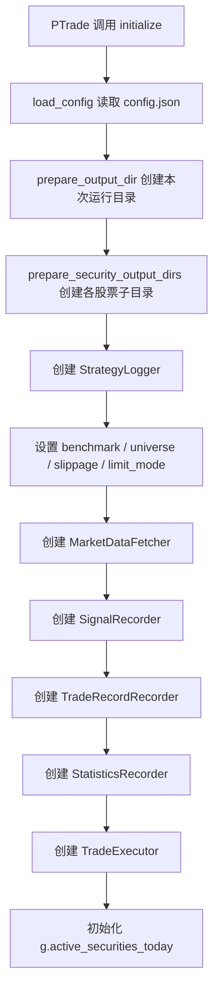
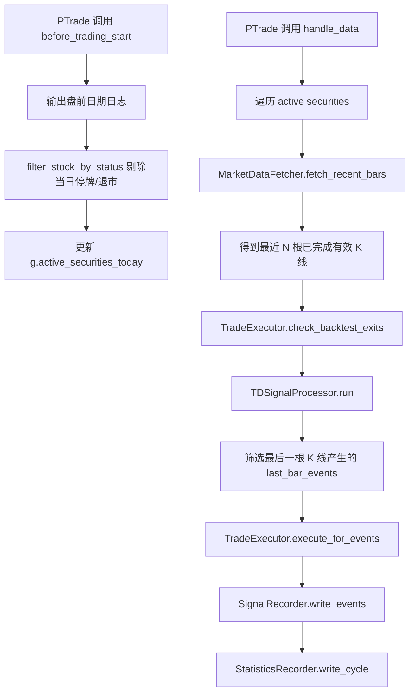
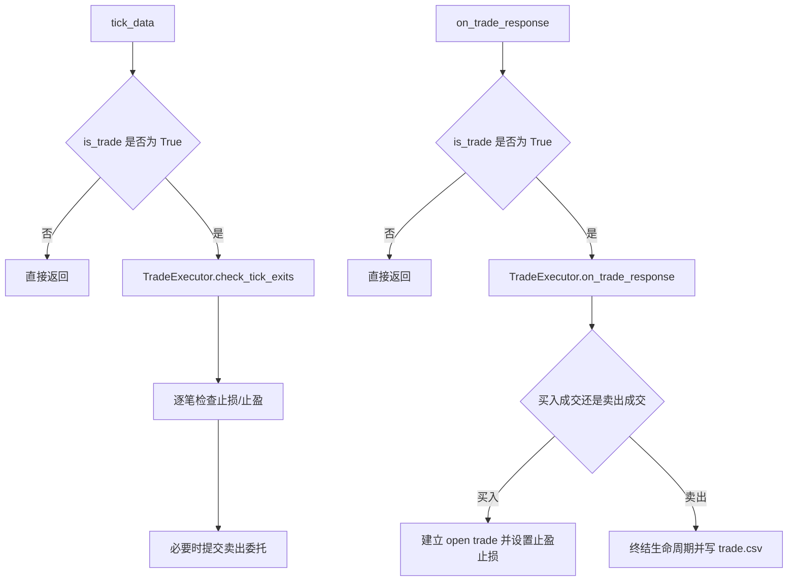
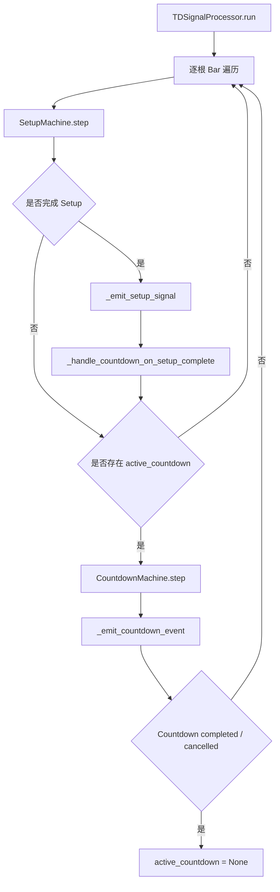
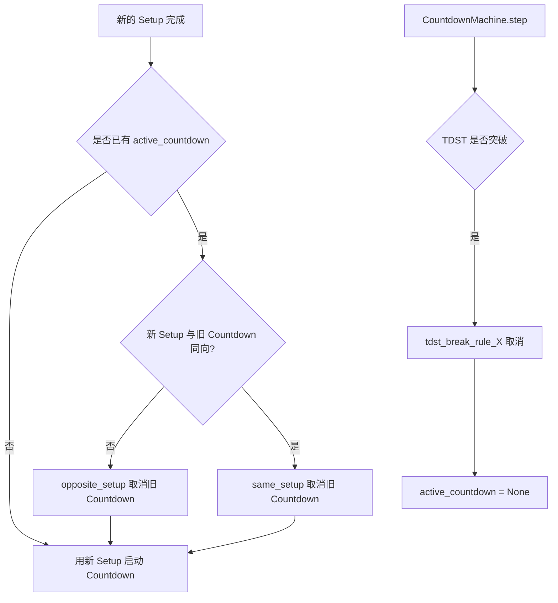
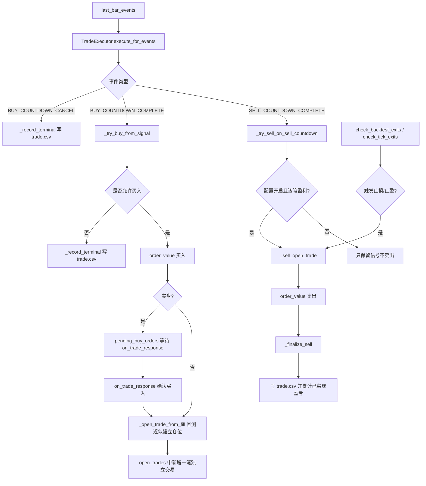
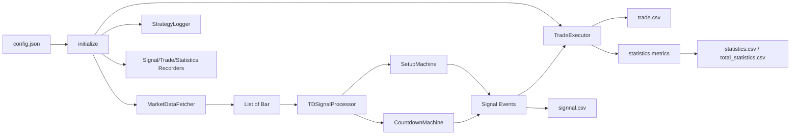

# TD 9-13 Sequential 策略代码设计详解

本文档用于帮助读者完整理解 `strategies/my_strategy/` 下策略代码的整体流程、模块边界、函数职责与调用关系。

重点说明：

1. 主策略文件是 `backtest.py`，运行在 PTrade 回测 / 交易环境中。
2. `config.json` 是唯一策略配置文件，`backtest.py` 启动时强制读取。
3. `tool/` 下是辅助工具脚本，其中 `drawing_tool.py`、`compress_tool.py` 是本地 Linux 环境工具，`get_ashares_tool.py` 是 PTrade 研究环境工具。
4. 本文讲解调用关系时主要关注“谁调用谁、数据如何流动”，不展开每一行实现细节。

## 1. 项目文件角色

```text
strategies/my_strategy/
├── backtest.py                 # PTrade 策略主文件
├── config.json                 # 策略配置
├── 说明.md                     # 面向使用者的参数说明
├── README.md                   # TD 9-13 策略规则说明
├── doc/
│   └── Code_Design.md          # 当前代码设计说明
└── tool/
    ├── drawing_tool.py         # 本地读取输出 CSV 并绘图
    ├── compress_tool.py        # 本地压缩输出目录
    └── get_ashares_tool.py     # PTrade 研究环境导出 A 股列表
```

## 2. `backtest.py` 总体设计

`backtest.py` 是一个单文件策略，但内部按照清晰的分层组织：

| 层级 | 主要对象 | 职责 |
| --- | --- | --- |
| 常量与配置入口 | `CONFIG_REL_PATH`、`_REQUIRED_CONFIG_SECTIONS`、`_REQUIRED_CONFIG_KEYS` | 定义配置文件位置、日期格式、配置 schema |
| 路径与配置层 | `_join_research_path`、`load_config`、`prepare_output_dir` | 读取配置、准备输出目录、适配 PTrade 禁用 `os` 的限制 |
| 日志层 | `StrategyLogger` | 统一输出控制台日志和文件日志 |
| 数据层 | `Bar`、`MarketDataFetcher` | 从 PTrade 获取行情，转换为策略内部 K 线对象 |
| 信号层 | `SetupMachine`、`CountdownMachine`、`TDSignalProcessor` | 执行 TD Setup 与 Countdown 状态机，产出信号事件 |
| 输出层 | `SignalRecorder`、`TradeRecordRecorder`、`StatisticsRecorder` | 输出信号、交易生命周期、统计数据 CSV |
| 交易层 | `TradeExecutor` | 根据信号执行买入、止盈止损、交易生命周期记录 |
| PTrade 钩子层 | `initialize`、`before_trading_start`、`handle_data`、`tick_data`、`on_trade_response`、`after_trading_end` | 连接 PTrade 生命周期与内部模块 |

## 3. 核心运行流程总览

### 3.1 策略启动流程



`initialize` 只做配置、路径、对象构造与 PTrade 设置类 API 调用，不调用 `get_history` 等行情接口，符合 PTrade 生命周期限制。

### 3.2 每日 / 每周期处理流程



`handle_data` 使用 `get_history(..., include=False)`，因此最后一根 K 线是上一根已完成 K 线。日线回测中，这通常是昨日 K 线。交易逻辑以“昨日已确认信号，今日下单”为核心时序。

### 3.3 实盘回调流程



回测环境中 `is_trade()` 通常为 `False`，所以 `tick_data` 和 `on_trade_response` 只是注册但不承担主要逻辑；回测止盈止损由 `handle_data` 内的 `check_backtest_exits` 降级处理。

## 4. 信号状态机调用关系

### 4.1 Setup 与 Countdown 的关系



当前实现中，同一标的在同一时刻只有一个 `active_countdown`。一个 Countdown 一定由一次 Setup 完成触发。Countdown 完成或取消后会被清空；如果没有新的 Setup 完成，就不会继续计数。

### 4.2 Countdown 取消与重启



同向 / 反向 Setup 引发的取消会立刻用新 Setup 启动新的 Countdown。TDST 取消不会自动重启，必须等待后续新的 Setup 完成。

## 5. 交易生命周期调用关系



当前交易层允许同一股票存在多笔未结束仓位。每次 Buy Countdown 完成后，只要资金与配置条件允许，就会新增一笔 `open_trades[security]` 记录。每一笔独立计算止损价、止盈价，并独立终结写入 `trade.csv`。

## 6. 输出目录与文件

每次策略启动后，输出目录由 `prepare_output_dir` 创建，目录位于 `config.json` 同级，按策略启动日期命名，重复时追加 `_1`、`_2` 等后缀。

```text
<config 同级目录>/
└── 2019-04-26/
    ├── strategy.log
    ├── total_statistics.csv
    ├── 000651SZ/
    │   ├── signnal.csv
    │   ├── trade.csv
    │   └── statistics.csv
    └── ...
```

注意：`signnal.csv` 的拼写当前就是代码中的文件名，文档按代码真实行为描述。

## 7. `backtest.py` 顶层函数详解

### 7.1 `_join_research_path(rel_path)`

功能：把相对 PTrade 研究目录的路径转换成完整路径。

设计意图：

- PTrade 环境通过 `get_research_path()` 提供研究目录。
- 本地调试时如果没有该函数，则退化为 `./`。
- 策略中所有配置、日志、CSV 输出路径都基于这个函数拼接。

调用关系：

- `load_config`
- `prepare_output_dir`
- 工具类写文件时通过传入的目录间接依赖它

### 7.2 `_split_parent_rel(rel_path)`

功能：拆分相对路径，返回父目录和文件名。

示例：

```text
TD913_xiongrui/config.json -> (TD913_xiongrui, config.json)
```

设计意图：

- 输出目录需要放在 `config.json` 同级目录下。
- 因此需要从 `CONFIG_REL_PATH` 中解析出父目录。

主要调用者：

- `prepare_output_dir`

### 7.3 `_validate_config_schema(cfg)`

功能：校验配置文件结构。

校验内容：

- 根对象必须是 dict。
- 必须包含 `universe`、`data`、`backtest`、`setup`、`countdown`、`trade`、`statistics`、`log`。
- 各配置段必须包含 `_REQUIRED_CONFIG_KEYS` 中列出的必填字段。
- `universe.securities` 必须是非空 list。

设计意图：

- 策略不再内置默认配置兜底。
- 配置缺失应尽早失败，避免回测结果在错误配置下悄悄生成。

主要调用者：

- `load_config`

### 7.4 `_file_exists(abs_path)`

功能：判断某个文件是否存在。

设计背景：

- PTrade 禁止 `import os`。
- 因此不能使用 `os.path.exists`。
- 这里通过尝试 `open(path, "r")` 判断文件是否存在且可读。

主要调用者：

- `prepare_output_dir`

### 7.5 `load_config(config_rel_path)`

功能：读取并校验 `config.json`。

流程：

1. 用 `_join_research_path` 得到完整路径。
2. 用 `open` 读取 JSON。
3. 用 `_strip_underscore_keys` 去掉注释字段。
4. 用 `_validate_config_schema` 校验结构。
5. 返回策略配置 dict。

设计意图：

- 配置文件必须存在。
- 配置必须完整合法。
- 所有以下划线开头的字段只作为注释/预留说明，不参与策略逻辑。

主要调用者：

- `initialize`

### 7.6 `_strip_underscore_keys(obj)`

功能：递归删除 dict 中所有以 `_` 开头的键。

设计意图：

- `config.json` 中允许写 `_comment`、`_reserved_xxx` 等辅助说明。
- 这些字段不应该进入策略配置判断。

主要调用者：

- `load_config`

### 7.7 `prepare_output_dir(start_date_str, config_rel_path)`

功能：创建本次策略运行的输出目录。

目录规则：

- 输出目录与 `config.json` 同级。
- 目录名是策略启动日期。
- 如果已存在，则尝试 `_1`、`_2`、……。
- 每个目录写入 `.initialized` 标记文件，作为“该目录已被运行占用”的判断依据。

设计背景：

- PTrade 禁用 `os`，目录存在性不能用 `os.path.exists`。
- 因此通过目录内 `.initialized` 文件判断是否已占用。
- 创建目录使用 PTrade 注入的 `create_dir`。

主要调用者：

- `initialize`

### 7.8 `_security_to_filename(security)`

功能：把股票代码转换为适合文件夹/文件名的字符串。

示例：

```text
600519.SS -> 600519SS
000651.SZ -> 000651SZ
```

主要调用者：

- `prepare_security_output_dirs`
- `SignalRecorder`
- `TradeRecordRecorder`
- `StatisticsRecorder`

### 7.9 `prepare_security_output_dirs(output_dir_rel, securities)`

功能：为每只股票创建单独输出目录。

示例：

```text
2019-04-26/
├── 000651SZ/
├── 600519SS/
└── ...
```

设计意图：

- 每只股票的信号、交易、统计文件独立存放。
- 后续绘图工具可以直接按目录发现标的。

主要调用者：

- `initialize`

### 7.10 `_format_dt(dt, fmt=DATETIME_FMT)`

功能：统一格式化日期时间为文本。

默认格式：

```text
YYYY-MM-DD HH:MM:SS
```

设计意图：

- 所有日志和 CSV 中的日期都保持可读字符串。
- 避免不同 PTrade/Pandas 日期类型输出格式不一致。

主要调用者：

- `TradeExecutor`
- `_strategy_start_date_str`
- `before_trading_start`
- `handle_data`

### 7.11 `_strategy_start_date_str(context)`

功能：从 PTrade `context` 中推导策略启动日期。

优先级：

1. `context.blotter.current_dt`
2. `context.current_dt`
3. `get_trading_day(0)`
4. `unknown_start_date`

主要调用者：

- `initialize`

## 8. 日志层：`StrategyLogger`

`StrategyLogger` 封装 PTrade 注入的 `log` 对象，同时把同样的日志写入本次运行目录下的 `strategy.log`。

### 8.1 `__init__(level, verbose_state_transition, verbose_countdown_step)`

功能：创建日志器，记录日志级别和两个详细日志开关。

设计字段：

- `level`：最小输出级别。
- `verbose_state_transition`：是否输出 Setup 状态转移。
- `verbose_countdown_step`：是否输出 Countdown 每次进位。
- `log_file_path`：文件日志路径，初始为 `None`。

### 8.2 `_enabled(level_name)`

功能：判断某级别日志是否应该输出。

调用者：

- `_emit`

### 8.3 `_fmt_kv(kvs)`

功能：把关键字参数格式化为日志尾部的 `key=value` 形式。

示例：

```text
| security=600519.SS count=13
```

调用者：

- `_emit`

### 8.4 `_emit(level_name, message, security, frequency, datetime_, **kvs)`

功能：日志输出核心函数。

职责：

1. 判断级别是否允许输出。
2. 拼接 `[TD][sec=...][freq=...][dt=...]` 前缀。
3. 调用 PTrade `log.info` / `log.warning` / `log.error` 等。
4. 调用 `_append_to_file` 追加写入 `strategy.log`。

### 8.5 `set_log_file(log_file_path)`

功能：绑定文件日志路径。

调用者：

- `initialize`

### 8.6 `_append_to_file(line)`

功能：把日志追加到本地日志文件。

设计意图：

- 文件日志失败不影响策略运行。
- 因为日志系统不能反过来导致交易策略中断。

### 8.7 `debug/info/warning/error`

功能：对外暴露四个常用日志级别。

调用者：

- 策略各层模块。

### 8.8 `state_transition(message, **kw)`

功能：输出 Setup 状态机转移日志。

是否输出取决于：

```text
log.verbose_state_transition
```

### 8.9 `countdown_step(message, **kw)`

功能：输出 Countdown 每次进位日志。

是否输出取决于：

```text
log.verbose_countdown_step
```

## 9. 数据层

## 9.1 `Bar`

`Bar` 是策略内部 K 线对象。它不包含任何策略逻辑，只承载数据。

字段：

| 字段 | 含义 |
| --- | --- |
| `security` | 股票代码 |
| `frequency` | 周期 |
| `datetime` | K 线时间字符串 |
| `open/high/low/close` | OHLC |
| `volume` | 成交量 |
| `amount` | 成交额，可为空 |

### `Bar.__init__`

功能：构造 K 线对象，并把数值字段转为 float。

设计意图：

- 统一来自 PTrade DataFrame 的字段类型。
- 后续信号层只处理 `Bar`，不依赖 DataFrame。

### `Bar.__repr__`

功能：提供调试用字符串表示。

## 9.2 `MarketDataFetcher`

负责从 PTrade 获取行情，并转换为 `Bar` 列表。

### `__init__(frequency, fq, lookback_count, logger)`

功能：记录行情周期、复权方式、回看长度和日志器。

### `fetch_recent_bars(security)`

功能：获取指定标的最近 N 根已完成 K 线。

关键行为：

- 调用 `get_history(..., include=False)`。
- `include=False` 表示不包含当前未完成周期。
- 日线策略下，最后一根 K 线通常是昨日 K 线。
- 过滤 `volume <= 0` 的停牌 K 线。
- 把每行行情转换为 `Bar`。

调用者：

- `handle_data`

输出：

```text
List[Bar]
```

### `_format_datetime(dt)`

功能：把 Pandas/Python 时间对象格式化为统一字符串。

### `is_halt_today(security, query_date_yyyymmdd=None)`

功能：调用 `get_stock_status([security], "HALT", date)` 检查指定日期是否停牌。

调用者：

- `handle_data`

## 10. Setup 状态机：`SetupMachine`

`SetupMachine` 实现 TD Setup 部分。

核心状态：

| 字段 | 含义 |
| --- | --- |
| `sd` | 方向，`1` 买方向，`-1` 卖方向，`0` 无方向 |
| `sc` | Setup 计数，0 到 9 |
| `last_datetime` | 最近处理的 K 线时间 |
| `setup_bars` | 当前 Setup 已收集的 K 线 |

### `__init__(security, frequency, logger)`

功能：初始化状态机。

### `classify(bar_close, prev_4_close)`

功能：根据当前收盘价与四根前收盘价的关系分类输入。

返回值：

| 返回 | 含义 |
| --- | --- |
| `BS` | Buy Setup 输入，`close < close[t-4]` |
| `SS` | Sell Setup 输入，`close > close[t-4]` |
| `EQ` | 相等，重置/中断 |

### `_is_perfect_buy(setup_bars)`

功能：判断买入 Setup 是否完美。

设计依据：

- 第 8 或第 9 根低点低于/等于第 6 与第 7 根低点。

### `_is_perfect_sell(setup_bars)`

功能：判断卖出 Setup 是否完美。

设计依据：

- 第 8 或第 9 根高点高于/等于第 6 与第 7 根高点。

### `step(bar, prev_4_close)`

功能：Setup 状态机主入口。

流程：

1. 检查 K 线时间是否逆序。
2. 调用 `classify` 得到输入类型。
3. 调用 `_transit` 得到新状态。
4. 调用 `_apply_state_action` 更新 `setup_bars`。
5. 必要时返回 Setup 完成事件。

调用者：

- `TDSignalProcessor.run`

### `_transit(state, inp)`

功能：只负责状态转移。

设计特点：

- 每个 q 状态单独分支。
- 每种输入 `BS/SS/EQ` 单独分支。
- 便于对照状态机图阅读。

### `_apply_state_action(bar)`

功能：状态转移完成后，根据新状态维护 `setup_bars` 并决定是否发出 Setup 信号。

输出：

- 未完成时返回 `None`。
- 第 9 根完成时返回 dict，包含：
  - `type`
  - `perfect`
  - `setup_bars`

## 11. Countdown 状态机：`CountdownMachine`

`CountdownMachine` 实现 TD Countdown 部分。每个 Countdown 都绑定一次具体 Setup。

核心字段：

| 字段 | 含义 |
| --- | --- |
| `direction` | 方向，`1` Buy，`-1` Sell |
| `setup_bars` | 触发该 Countdown 的 9 根 Setup K 线 |
| `count` | 当前 Countdown 计数 |
| `bars_at_count` | 每次成功计数对应的 K 线 |
| `completed` | 是否完成 |
| `cancelled` | 是否取消 |
| `setup_info` | 上游 Setup 元信息 |
| `_tdst_threshold` | TDST 取消阈值 |

### `__init__(direction, setup_bars, config_countdown, logger, security, frequency, setup_info=None)`

功能：创建一个与 Setup 绑定的 Countdown 实例。

设计意图：

- 保存 Setup 的 9 根 K 线。
- 预计算 TDST 阈值。
- 保存 `setup_info` 以便后续输出信号和交易记录。

### `_compute_tdst_threshold()`

功能：根据配置的 `tdst_cancel_rule` 计算 TDST 阈值。

规则：

- Buy Countdown 使用 Setup 区间的高侧阈值。
- Sell Countdown 使用 Setup 区间的低侧阈值。

### `_check_tdst_break(bar, prev_close)`

功能：判断当前 K 线是否突破 TDST 阈值。

输出：

- `True`：当前 Countdown 取消。
- `False`：继续判断计数条件。

### `_is_perfect_13(bar_13)`

功能：判断第 13 个计数是否完美。

设计依据：

- Buy：第 13 根 close <= 第 8 个计数日 close。
- Sell：第 13 根 close >= 第 8 个计数日 close。

### `step(bar, prev_2_low, prev_2_high, prev_close)`

功能：Countdown 状态机主入口。

流程：

1. 如果已完成或已取消，直接返回空事件。
2. 先检查 TDST 取消。
3. 判断一般计数条件。
4. 如果满足条件，推进 `count`。
5. count 到 13 时返回完成事件。
6. 如果启用完美 Countdown 且第 13 不完美，则返回 `PLUS_TENTATIVE`。

调用者：

- `TDSignalProcessor.run`

### `cancel_by_setup(reason, trigger_bar)`

功能：由外部新 Setup 强制取消当前 Countdown。

取消原因：

- `opposite_setup`
- `same_setup`

调用者：

- `TDSignalProcessor._handle_countdown_on_setup_complete`

## 12. 信号编排器：`TDSignalProcessor`

`TDSignalProcessor` 是信号层的总协调者。

它内部同时持有：

- 一个 `SetupMachine`
- 一个当前有效的 `active_countdown`

### `__init__(security, frequency, config, logger)`

功能：初始化单标的信号处理器。

注意：

- 每次 `handle_data` 都会重新创建新的 `TDSignalProcessor`。
- 因此信号状态不跨周期缓存，而是通过历史 K 线全量重算得到。

### `run(bars)`

功能：处理一段时间升序的 K 线序列，返回全部事件。

流程：

1. 从第 5 根 K 线开始遍历，确保存在 `t-4`。
2. 每根 K 线先喂给 `SetupMachine.step`。
3. 如果 Setup 完成，则发出 Setup 事件并处理 Countdown 启动/取消。
4. 如果存在 `active_countdown`，则喂给 `CountdownMachine.step`。
5. Countdown 完成或取消后，清空 `active_countdown`。

调用者：

- `handle_data`

### `_emit_setup_signal(setup_signal, bar, events_out)`

功能：把 `SetupMachine` 的内部信号转换为标准事件 dict。

事件字段包含：

- `datetime`
- `security`
- `frequency`
- `category=SETUP`
- `type`
- `direction`
- `perfect`
- `setup_first_dt`
- `setup_last_dt`

### `_handle_countdown_on_setup_complete(setup_signal, bar, events_out)`

功能：当新 Setup 完成时，处理 Countdown 的取消与启动。

逻辑：

1. 如果 Countdown 未启用，直接返回。
2. 如果配置要求完美 Setup 且当前不完美，直接返回。
3. 如果已有 Countdown：
   - 反向 Setup 可取消旧 Countdown。
   - 同向 Setup 可取消旧 Countdown。
4. 如果当前没有 active Countdown，则基于新 Setup 创建新的 `CountdownMachine`。

### `_emit_countdown_event(ev, events_out)`

功能：把 `CountdownMachine` 的事件转换为标准事件 dict。

额外补充的信息包括：

- Setup 完成日期
- Setup 是否完美
- Setup 阶段最高 high
- 每个 Countdown 计数日
- 第 8 个计数日收盘价
- Countdown 阶段最低价 K 线
- 事件 K 线 high/low/close

这些字段后续会被交易层和统计/输出层使用。

### `_lowest_low_bar(bars)`

功能：在一组 K 线中找到最低 low 对应的 K 线。

调用者：

- `_emit_countdown_event`

## 13. 信号输出：`SignalRecorder`

输出路径：

```text
<run_dir>/<SEC>/signnal.csv
```

### `__init__(output_dir_abs, logger, enabled=True)`

功能：记录输出根目录、日志器和开关。

### `_csv_path_for(security)`

功能：返回某个标的的信号 CSV 路径。

### `write_events(events)`

功能：按 `security` 对事件分组，然后分别写入对应股票目录下的 `signnal.csv`。

### `_write_group(security, sec_events)`

功能：写入某只股票的一组事件。

职责：

- 判断是否需要写表头。
- 按 `HEADER_FIELDS` 顺序写行。
- 写入失败时记录错误日志。

### `_need_header(path)`

功能：判断某个 CSV 文件是否需要写表头。

### `_csv_escape(val)`

功能：处理 CSV 字段转义。

设计意图：

- 如果字段中包含逗号、引号、换行，则用双引号包裹。
- 避免 CSV 被错误拆列。

## 14. 交易生命周期输出：`TradeRecordRecorder`

输出路径：

```text
<run_dir>/<SEC>/trade.csv
```

只在生命周期终态写入：

- Buy Countdown 取消。
- Buy Countdown 完成但未买入。
- 买入后卖出。

### `__init__(output_dir_abs, logger, enabled=True)`

功能：记录输出根目录、日志器和开关。

### `_csv_path_for(security)`

功能：返回某个标的的交易生命周期 CSV 路径。

### `record(row)`

功能：写入一条交易生命周期终态记录。

### `_need_header(path)`

功能：判断是否需要写 CSV 表头。

## 15. 统计输出：`StatisticsRecorder`

输出文件：

```text
<run_dir>/<SEC>/statistics.csv
<run_dir>/total_statistics.csv
```

统计周期：

- 每次 `handle_data` 结束时输出一行。

### `__init__(output_dir_abs, logger, securities, initial_capital, enabled=True)`

功能：初始化统计记录器。

重要状态：

| 字段 | 含义 |
| --- | --- |
| `initial_capital` | 策略初始资金 |
| `security_capital` | 当前等于初始总资金，单股票收益率也使用该分母 |
| `_benchmark_base_close_by_security` | 各股票基准收益起点价格 |
| `_peak_nav_by_security` | 各股票净值峰值 |
| `_max_drawdown_by_security` | 各股票最大回撤 |
| `_total_peak_nav` | 总策略净值峰值 |
| `_total_max_drawdown` | 总策略最大回撤 |

### `write_cycle(dt_text, security_metrics, close_by_security)`

功能：写入一个策略周期的全部统计。

流程：

1. 遍历所有股票。
2. 调用 `_make_security_row` 生成单股票统计行。
3. 写入 `<SEC>/statistics.csv`。
4. 汇总已实现盈亏、浮动盈亏、交易次数、盈利次数。
5. 调用 `_make_total_row` 生成总策略统计行。
6. 写入 `total_statistics.csv`。

调用者：

- `handle_data`

### `_make_security_row(dt_text, security, metrics, close_price)`

功能：生成单股票统计行。

统计项：

- 完整交易数量。
- 盈利交易数量。
- 胜率。
- 已实现盈亏。
- 浮动盈亏。
- 最大回撤。
- 策略收益率。
- 基准收益率。
- 策略年化收益率。
- 基准年化收益率。

收益率口径：

```text
strategy_return = (realized_pnl + floating_pnl) / initial_capital
```

### `_make_total_row(dt_text, closed_count, win_count, realized, floating, benchmark_returns)`

功能：生成总策略统计行。

总策略不区分股票代码。

收益率口径：

```text
total_strategy_return = (total_realized_pnl + total_floating_pnl) / initial_capital
```

### `_update_drawdown(security, nav)`

功能：更新并返回单股票最大回撤。

### `_annualize(return_value, periods)`

功能：把周期累计收益转换为年化收益。

公式：

```text
(1 + return) ** (252 / periods) - 1
```

### `_security_csv_path(security)`

功能：返回 `<SEC>/statistics.csv` 路径。

### `_total_csv_path()`

功能：返回 `total_statistics.csv` 路径。

### `_write_row(path, header_fields, row)`

功能：写一行统计 CSV。

### `_need_header(path, header_fields)`

功能：判断统计 CSV 是否需要写表头。

### `_safe_float(x)`

功能：安全转换 float，失败返回 0。

## 16. 交易层：`TradeExecutor`

重要说明：`backtest.py` 中存在两个同名 `TradeExecutor` 类。Python 会以后定义的类覆盖先定义的类。因此真正生效的是 `[7.1] 交易执行层（当前版本）` 下的第二个 `TradeExecutor`。较早的同名类属于历史遗留代码，不会被 `initialize` 实际使用。

### 16.1 当前交易层状态

当前生效的 `TradeExecutor` 管理以下状态：

| 字段 | 含义 |
| --- | --- |
| `open_trades` | 未结束交易，按股票分组，每只股票可有多笔 |
| `closed_trade_pnls` | 已结束交易的盈亏列表，供统计使用 |
| `pending_buy_orders` | 实盘环境下等待成交回报的买入委托 |
| `pending_sell_orders` | 实盘环境下等待成交回报的卖出委托 |
| `_next_trade_id` | 内部交易 ID，用于区分同股票多笔交易 |

### 16.2 `__init__(cfg_trade, logger, trade_recorder=None)`

功能：读取交易配置并初始化交易状态。

关键配置：

- `enabled`
- `buy_fraction_of_portfolio`
- `min_trade_value`
- `min_cash_for_buy`
- `take_profit_on_sell_countdown`
- `stop_loss_enabled`
- `profit_target_r_multiple`
- `stop_loss_range_multiple`
- `require_perfect_setup_for_buy`

### 16.3 `execute_for_events(context, security, last_bar_events)`

功能：处理上一根已完成 K 线产生的交易相关事件。

事件处理：

| 事件 | 行为 |
| --- | --- |
| `BUY_COUNTDOWN_CANCEL` | 写入终态交易记录 |
| `BUY_COUNTDOWN_COMPLETE*` | 尝试买入 |
| `SELL_COUNTDOWN_COMPLETE*` | 根据配置决定是否盈利趋势反转止盈 |

调用者：

- `handle_data`

### 16.4 `check_backtest_exits(context, security, completed_bar)`

功能：回测环境下检查止盈止损。

设计背景：

- 回测环境没有真实 tick 主推。
- 因此用上一根已完成 K 线的 high/low 判断是否触及止盈止损。

调用者：

- `handle_data`

### 16.5 `check_tick_exits(context, tick_data_obj)`

功能：实盘环境下使用 tick 数据检查止盈止损。

调用者：

- `tick_data`

### 16.6 `on_trade_response(context, trade_response)`

功能：处理实盘成交回报。

逻辑：

- 如果成交回报对应买入委托，则建立一笔 open trade。
- 如果成交回报对应卖出委托，则终结对应 open trade 并写 `trade.csv`。

调用者：

- `on_trade_response`

### 16.7 `_try_buy_from_signal(context, security, ev)`

功能：根据 Buy Countdown 完成信号尝试买入。

主要检查：

- 交易层是否启用。
- 是否要求完美 Setup。
- 目标交易金额是否大于最小金额。
- 可用现金是否满足最低要求。
- `order_value` 是否成功返回订单号。

回测环境下：

- 如果下单成功，立即近似建立 open trade。

实盘环境下：

- 记录到 `pending_buy_orders`，等待成交回报。

### 16.8 `_open_trade_from_fill(security, ev, buy_price, buy_qty, buy_date)`

功能：根据成交信息建立一笔 open trade。

职责：

- 生成交易生命周期基础记录。
- 计算止损价和止盈价。
- 写入 `open_trades[security]`。

### 16.9 `_calc_risk_prices(ev, buy_price)`

功能：计算止损价和止盈价。

公式：

```text
raw_stop_loss = countdown_low - (countdown_low_bar_high - countdown_low) * stop_loss_range_multiple
take_profit = buy_price + (buy_price - raw_stop_loss) * profit_target_r_multiple
```

如果 `stop_loss_enabled=False`，不执行止损，但仍基于原始止损价计算止盈价。

### 16.10 `_try_sell_on_sell_countdown(context, security, ev)`

功能：处理 Sell Countdown 完成信号。

行为：

- 默认不卖出。
- 当 `take_profit_on_sell_countdown=True` 时：
  - 遍历当前股票所有 open trade。
  - 对盈利的交易执行趋势反转卖出。
  - 对亏损的交易不卖，继续依赖止损价。

### 16.11 `_submit_sell_order(context, security, trade, fallback_price, sell_reason)`

功能：实盘环境提交卖出委托。

特点：

- 每笔 open trade 单独提交卖出。
- 避免同一笔交易重复提交 pending sell。

### 16.12 `_sell_open_trade(context, security, trade, sell_price, sell_date, sell_reason)`

功能：卖出指定 open trade。

环境差异：

- 实盘：提交委托，等待成交回报。
- 回测：提交 `order_value` 后立即近似终结交易。

### 16.13 `_finalize_sell(security, trade, sell_price, sell_date, sell_reason)`

功能：终结一笔交易生命周期。

职责：

1. 从 `open_trades` 删除该交易。
2. 计算 PnL。
3. 追加到 `closed_trade_pnls`。
4. 写入 `<SEC>/trade.csv`。

### 16.14 `_record_terminal(ev, bought=False, buy_reject_reason="", countdown_status=None)`

功能：记录没有进入买入阶段的终态。

典型场景：

- Buy Countdown 被取消。
- Buy Countdown 完成但未买入。

### 16.15 `_base_trade_record(ev, countdown_status)`

功能：从信号事件构造交易生命周期记录的基础字段。

字段来源：

- Setup 信息。
- Countdown 计数日期。
- Countdown 是否完美。
- Countdown 状态。

### 16.16 `_countdown_status(ev)`

功能：把 Countdown 事件的取消原因转换为统一状态枚举。

示例：

| 输入 reason | 输出 |
| --- | --- |
| `tdst_break_rule_4` | `CANCEL_BY_TDST_RULE_4` |
| `opposite_setup` | `CANCEL_BY_OPPOSITE_SETUP` |
| `same_setup` | `CANCEL_BY_SAME_SETUP` |

### 16.17 `_open_trade_list(security)`

功能：返回某只股票当前未结束交易列表。

### 16.18 `_trade_is_open(security, trade)`

功能：判断某笔交易是否仍在 open trades 中。

### 16.19 `_remove_open_trade(security, trade)`

功能：从 open trades 中删除某笔交易。

### 16.20 `_has_pending_sell_for_trade(trade)`

功能：判断某笔交易是否已经有等待成交的卖出委托。

### 16.21 `_trade_value(trade, fallback_price)`

功能：估算指定交易的卖出金额。

### 16.22 `get_statistics_metrics(security, current_price)`

功能：向 `StatisticsRecorder` 提供某只股票的统计基础数据。

返回：

- 已完成交易数量。
- 盈利交易数量。
- 已实现盈亏。
- 浮动盈亏。

### 16.23 `_portfolio_snapshot(context)`

功能：读取账户总资产和可用现金。

设计特点：

- 兼容不同 PTrade 字段命名。
- 读取失败时用多重 fallback。
- 返回 debug 信息，便于排查现金读取异常。

### 16.24 `_get_position_detail(security)`

功能：读取某只股票当前持仓数量、市值和价格。

### 16.25 `_first_attr_float(obj, names)`

功能：按字段名列表依次读取第一个有效正数。

### 16.26 `_current_dt(context)`

功能：从 context 获取当前时间。

### 16.27 `_safe_float(x)`

功能：安全转换 float。

### 16.28 `_boolish(x)`

功能：兼容布尔值和字符串形式布尔值。

### 16.29 `_read_any(obj, names)`

功能：从 dict 或对象中读取多个候选字段中的第一个。

用途：

- 解析成交回报对象。
- 解析 tick 数据对象。

### 16.30 `_extract_tick_price(tick_data_obj, security)`

功能：从 tick_data 回调对象中提取指定股票的最新价格。

### 16.31 `_is_live_trade()`

功能：调用 PTrade `is_trade()` 判断是否实盘环境。

## 17. PTrade 生命周期钩子

### 17.1 `initialize(context)`

功能：策略启动入口。

调用顺序：

1. `load_config`
2. `prepare_output_dir`
3. `StrategyLogger`
4. `prepare_security_output_dirs`
5. `set_benchmark`
6. `set_universe`
7. `set_slippage`
8. `set_limit_mode`
9. `MarketDataFetcher`
10. `SignalRecorder`
11. `TradeRecordRecorder`
12. `StatisticsRecorder`
13. `TradeExecutor`

### 17.2 `before_trading_start(context, data)`

功能：每日盘前处理。

职责：

- 输出盘前日期日志。
- 调用 `filter_stock_by_status` 剔除当日停牌/退市标的。
- 更新 `g.active_securities_today`。

### 17.3 `handle_data(context, data)`

功能：策略每周期主处理入口。

完整流程：

1. 初始化本周期事件列表、统计容器。
2. 遍历 `g.active_securities_today`。
3. 调用 `MarketDataFetcher.is_halt_today` 二次确认停牌。
4. 调用 `fetch_recent_bars` 获取历史 K 线。
5. 调用 `TradeExecutor.check_backtest_exits` 处理回测止盈止损。
6. 创建 `TDSignalProcessor`。
7. 调用 `processor.run(bars)` 获取全部历史事件。
8. 只筛选最后一根 K 线事件作为本周期新信号。
9. 调用 `TradeExecutor.execute_for_events` 处理交易。
10. 汇总并调用 `SignalRecorder.write_events`。
11. 调用 `StatisticsRecorder.write_cycle` 输出统计。

### 17.4 `tick_data(context, data)`

功能：实盘 tick 主推回调。

行为：

- 非实盘环境直接返回。
- 实盘环境调用 `TradeExecutor.check_tick_exits`。

### 17.5 `on_trade_response(context, trade_response)`

功能：实盘成交回报。

行为：

- 非实盘环境直接返回。
- 实盘环境调用 `TradeExecutor.on_trade_response`。

### 17.6 `after_trading_end(context, data)`

功能：盘后占位钩子。

当前行为：

- 输出 debug 日志。

## 18. 工具脚本设计

## 18.1 `tool/drawing_tool.py`

该脚本在本地 Linux / macOS 环境运行，不依赖 PTrade。它读取策略输出目录中的统计 CSV 并生成图表。

### `parse_args()`

功能：解析命令行参数，允许用户指定目标输出目录。

### `script_dir()`

功能：返回脚本所在目录。

### `parse_datetime(value)`

功能：把 CSV 中的日期字符串转换为 `datetime`。

### `parse_float(value)`

功能：安全转换浮点数。

### `load_statistics_csv(path)`

功能：读取 `statistics.csv` 或 `total_statistics.csv`。

输出：

```text
List[Dict[str, object]]
```

### `discover_stock_statistics(target_dir)`

功能：遍历目标目录下的股票子目录，发现其中的 `statistics.csv`。

### `column_series(rows, column)`

功能：从统计数据中取出某一列的时间序列。

### `setup_date_axis(ax)`

功能：设置图表日期坐标轴格式和网格。

### `save_figure(fig, path)`

功能：保存图表 PNG。

### `plot_line(ax, rows, column, label, linewidth=1.8)`

功能：在指定坐标轴上绘制某一列时间序列。

### `plot_stock_overview(stock, rows, stock_dir)`

功能：为单只股票生成综合统计图。

图中包含：

- Win Rate
- Strategy Return
- Benchmark Return
- Strategy Annualized Return
- Benchmark Annualized Return

### `plot_combined_win_rate(stock_rows, target_dir)`

功能：把所有股票胜率画在同一张图中。

### `load_total_benchmark(target_dir)`

功能：读取 `total_statistics.csv`，用于总基准收益率。

### `plot_combined_profitability(stock_rows, target_dir, total_rows)`

功能：生成所有股票策略收益率合并图，并叠加总基准收益率。

### `main()`

功能：脚本入口。

流程：

1. 解析参数。
2. 定位目标目录。
3. 发现各股票统计文件。
4. 生成每个股票的 overview 图。
5. 生成合并胜率图。
6. 生成合并收益率图。

## 18.2 `tool/compress_tool.py`

用于把输出目录压缩成 `.tar.gz` 文件。

### `main()`

功能：

1. 定位脚本所在目录。
2. 根据 `target_name` 找到目标文件夹。
3. 检查目标目录是否存在。
4. 检查目标压缩包是否已经存在，避免覆盖。
5. 使用 `tarfile` 生成压缩包。

设计意图：

- 方便把 PTrade 输出文件夹打包传输或归档。

## 18.3 `tool/get_ashares_tool.py`

该脚本运行在 PTrade 研究环境，用于导出 A 股股票代码列表。

### `_join_research_path(rel_path)`

功能：拼接 PTrade 研究目录路径。

### `_log_info(message)`

功能：兼容 PTrade `log.info` 和本地 `print`。

### `export_ashares()`

功能：

1. 调用 `get_Ashares()` 或 `get_Ashares(QUERY_DATE)`。
2. 不过滤停牌。
3. 去重并排序。
4. 根据配置决定输出纯 list 或 metadata 包装对象。
5. 写入 JSON 文件。

## 19. 主要数据流总结



## 20. 关键设计原则

### 20.1 数据层与信号层解耦

`MarketDataFetcher` 只负责把 PTrade 行情转换为 `Bar`。`SetupMachine`、`CountdownMachine`、`TDSignalProcessor` 只接收 `Bar`，不关心行情来自哪里。

### 20.2 每周期全量重算信号

策略不缓存信号状态。每次 `handle_data` 都重新拉取最近 N 根 K 线并完整运行状态机，再取最后一根 K 线产生的事件作为当前周期新信号。

### 20.3 交易状态单独维护

信号状态不跨周期缓存，但交易状态必须跨周期维护，因此由 `TradeExecutor.open_trades`、`closed_trade_pnls` 等字段维护。

### 20.4 输出文件与业务逻辑分离

信号、交易、统计分别由不同 Recorder 负责。交易层只构造记录，真正写 CSV 交给 Recorder。

### 20.5 兼容 PTrade 限制

策略文件避免使用 `os`、`sys` 等 PTrade 禁用模块。目录创建使用 `create_dir`，文件存在判断使用 `open` 尝试。

### 20.6 回测与实盘降级分离

实盘：

- 用 `on_trade_response` 确认成交。
- 用 `tick_data` 追踪止盈止损。

回测：

- `order_value` 成功后近似确认成交。
- 用下一周期已完成 K 线 high/low 判断止盈止损。

## 21. 阅读代码建议

如果读者想快速理解代码，建议按以下顺序阅读：

1. 文件开头模块说明和配置常量。
2. `initialize`，理解对象如何创建。
3. `handle_data`，理解主循环如何运行。
4. `TDSignalProcessor.run`，理解信号如何产生。
5. `SetupMachine.step` 与 `CountdownMachine.step`，理解状态机细节。
6. `TradeExecutor.execute_for_events`，理解信号如何触发交易。
7. `TradeExecutor.check_backtest_exits` 与 `check_tick_exits`，理解止盈止损。
8. 三个 Recorder，理解输出文件如何生成。

