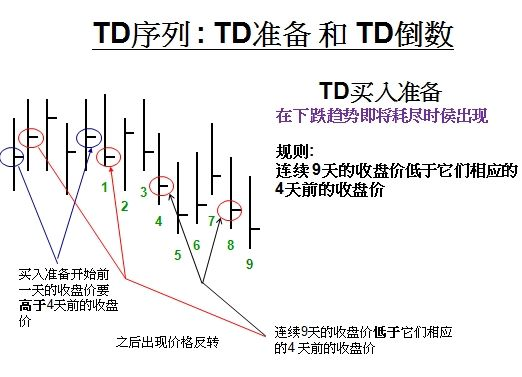
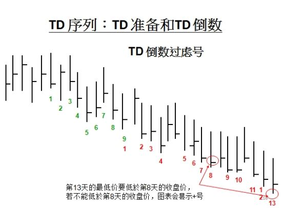

# 迪马克的TD序列

迪马克指标由Thomas R DeMark 创建，已经有30年的历史。他的交易系统包含上百个指标，其中应用最广泛的是TD序列。该指标使用包含“准备”和“倒数”两部分指标的价格比较过程，该指标用于识别市场趋势或盘整过程中的潜在转折点。

Demark Sequential包含三个主要部分：[**Set up**](#setuptd结构),[**Intersection**](#intersectiontd交叉) 和 [**Count down**](#countdowntd计数),下面均以 *买入信号* 为例进行说明，卖出信号则相反。


### Setup(TD结构):
要求有九个连续交易日的收盘价，每一个都低于其相对应的四个交易日前的收盘价。

- 首先，要出现熊市价格反转，或称之为上涨转下跌。为了形成熊市价格反转，要求至少有六根K线，其中**第五根K线的收盘价比第一根K线的收盘价高**，第六根K线的收盘价，比第二根K线的收盘价低，那么就形成了熊市价格反转。这第六根K线，同时也是所谓的TD买入结构的第一根K线。  
- 其次，当连续出现九根K线，并且这些K线的收盘价都比各自前面的第四根K线的收盘价低时，我们就说，形成了TD买入结构。必须是连续九根K线。如果出现中断，就必须重新开始构建。也就是重新寻找熊市价格反转，以及其后的TD买入结构。  
- TD买入结构并不限定只有九根K线，只要满足上述条件，可以一直延续。但countdown从第九根完成后就可以开始计算了。书中提到的TD买入结构最多有十八根K线。虽然结构期间超过9天的程度并不影响TD序列计数，但这对于 TD 结构趋势(TDST)的解释与运用都很重要，因为这经常可以决定价格趋势的持续性这对于结构随后是否会再循环将有重大影响。 
- 结构完成之前，如果有某个收盘价等于先期第四天的收盘价，取消结构重新来过。即需要**严格**小于或大于。  
```python
# Buy Setup Condition
  # Price Flip(价格反转):
  BAR[t-1].Close >= BAR[t-5].Close
  # Setup从t开始计数，要求至少连续 9 根
  BAR[t].Close < BAR[t-4].Close
```

**Setup Perfection(完美Setup)** ：  
- 第8**或**第9个交易日的最低价低于第6**和**第7个交易日的最低价。  
```python
# Buy Setup Perfection Condition
( BAR[8].Low < BAR[6].Low and BAR[8].Low < BAR[7].Low )
or
( BAR[9].Low < BAR[6].Low and BAR[9].Low < BAR[7].Low )
```

**Setup Qualifierl（结构滤网）**：
- 在可能的短期底(顶) 部应该留意第9天的最低价(最高价)低(高)于第6天的最低价(最高价)。  
- 如果第9天没有发生这种价格形态，通常在随后两天之中或第三天的开盘，价格通常会穿越第6天的最低价（最高价）。

虽然结构滤网有助于结构阶段的运作，但并**不是常用的技巧**。如果交易者决定专注于 TD 结构的研究、TDST(TD 趋势线)或 TD 序列的某些层面，则结构滤网就显得很重要了。请注意，如果准备采用 TD 序列和计数，就**不应该**由于缺少前述的两种交易形态而**取消或延后结构**，因为结构滤网仅是让交易者单独根据结构而寻找精确的进场点。另外，有些情况下，如果某个结构的收盘价看起来不能穿越至先前反向结构的真实高价之上或真实低价之下 (也就是说不符合 TDSTITD 趋势线的突破)，结构滤网能够延后结构时效，籍此取得原本不存在的理想进场点。换言之，引进滤网结构之后，可以延迟结构直到相关的条件满足为止，而不会因为连续价格关系中断而丧失交易机会。

<a id="note1"></a>
> 注：  
>TD买入结构的第一根K线的最高价，也就是TD买入结构趋势阻力线，简称 ***趋势阻力线***。  
>TD卖出结构的第一根K线的最低价，就是TD卖出结构趋势支撑线，简称 ***趋势支撑线***。  



### Intersection(TD交叉):

交叉的条件:  
- 买进结构第8天、第9天或结构完成之后的某一天，其最高价必须高于先前第三个交易日至结构第1天的某个高价。  
- 卖出结构第8天、第9天或结构完成之后的某天，其最低价必须低于先前第三个交易日至结构第1天的某个低价。  
```python
# Buy Intersection Condition
BAR[t].High > Min(BAR[Setup[1]].High, BAR[Setup[2]].High, ..., BAR[t-3].High)
```

如果交叉发生于结构的第8天或者第9天，Countdown由结构的第9天算起，如果交叉发生于结构完成之后，则必须延后到交叉发生的当天开始计数。

交叉的条件是防范在狂跌或飙涨的行情中过早进场建仓。说极端一些就是为了防止股票暂停交易，资不抵债以至申请破产而退市，同时德马克还提出个股需要引用交叉的条件，但其类似金融期货、指数或商品交易等市场，显然不会发生并购或破产的事件，所以不需要考虑这方面的问题。


### Countdown(TD计数): 
首个Set up完成并满足交叉后开始计数，每当某日收盘价低于其两天前的最低价时计数增加1 （可以不连续），直到计数增加到13。

- 当TD买入结构形成之后，就开始进行TD买入计数。
- 当TD买入结构之后的K线（包括构成TD买入结构的第九根K线），满足收盘价小于等于它前面第二根K线（注：并非TD买入计数里的第二根K线，而是当前K线向前数第二根K线）的最低价时，就将它的计数加1。TD买入计数的最大值是13。
- TD买入计数可以是不连续的，也就是当某些K线不满足计数条件时，计数暂时中断。当再次遇到满足计数条件的K线时，继续前面的计数。  
- [完美countdown](#perfectcountdown)条件一般是必要的。  
```python
# Buy Countdown Condition
BAR[t].Close < BAR[t-2].Low
```

取消计数：
- 以下五选一（以Buy Countdown为例，Sell Countdown相反）：
  1. 有一根k线的最高价高于Setup中最高的收盘价（最保守也最容易发生）
  2. 有一根k线的最高价高于Setup中最高的最高价
  3. 有一根k线的收盘价高于Setup中最高的收盘价
  4. 有一根k线的收盘价高于Setup中最高的最高价
  5. 有一根k线的收盘价高于Setup中最高的真实高价（最积极，德马克建议采用此条件）
- 在TD计数过程中，出现一个相反的Set up，则取消计数。  
- 在TD计数过程中，如果出现K线的[实际最低价](#note2 "当前K线的最低价与其前一根K线的收盘价两者之间较低的价格")，高于之前的TD买入结构的 [趋势阻力线](#note1 "TD买入结构的第一根K线的最高价") 时，则取消计数。  
- 如果出现新的同方向的TD结构，则有可能形成两个TD买入计数嵌套的情况。其中，有四种情况需要特殊处理：
  - 如果**TD买入结构2**的收盘区间在**TD买入结构1**的真实波幅之内，并且**TD买入结构2**的价格极值也在**TD买入结构1**的真实波幅之内，那么继续买入计数1，不会发生Recycle，保留原计数。  
  - 如果[**TD买入结构2**](#note2)的[真实波幅](#note2 "实际最高价 - 实际最低价")大于等于[**TD买入结构1**](#note2)的真实波幅，但是又不超过其1.618倍，则触发[Recycle](#note2)。  
  - 如果**TD买入结构2**的真实波幅超过**TD买入结构1**的真实波幅的1.618倍，那么**TD买入结构2**视为市场波动异常，忽略[Recycle](#note2)，保留原TD买入计数。  
  - 如果**TD买入结构2**未触发Recycle，并延伸到**18根**K线，那么原countdown仍会被[Recycle](#note2)。如果原countdown在延续到18根K线前完成，则计数13处将会被替换为字符“R”，表示循环计数，同时说明下跌趋势非常强列。


**TD Termination Count(TD终结计数)** ：
为了保持计数的弹性，德马克偶尔也会引进 TD 终结计数 ，他仅适用于计数的最后n天(一般是第13天)，规定：  
- 买进计数最后一天的收盘价、开盘价或盘中低价低于先前第二个交易日的低价;  
- 卖出计数最后一天的收盘价、开盘价或盘中高价高于先前第二个交易日的高价。  
TD 终结计数中的变数n也可以被替换为其他值。

**Countdown Qualifier（计数滤网）** ：
为了防范、避免不利价格形态与关系影响 TD 序列计数的理想进场点，至少必须引进 TD 序列计数滤网，借以筛选低风险的买进与卖山计数。但是计数滤网的条件越严格，信号发生的频率就会越低，再循环的可能性越高;更重要的是，如此可能造成过度的最佳化，导致不切实际的市场条件与预期。当然，可以引进许多其他的组合和指标来提升技术的效率，以降低计数13处的交易风险。但是，德马克建议这类认为的滤网应该尽可能保持单纯，不要因此污染技术程序与 TD 序列，好像某些人希望透过药物减肥，却不愿意节食与运动。  

<a id="perfectcountdown"></a>

- 德马克建议的 **标准计数滤网（完美Countdown）** 是:  
  - 买进计数第13天的收盘价必须低于或等于**计数第8天**的收盘价。  
  - 卖出计数第13天的收盘价必须高于或等于计数第8天的收盘价。  

- 同时德马克为了提高计数完成的可能性，认为至少应该将前述的标准滤网取代为**宽松条件**:  
  - 买进计数第13天的低价必须低于或等于计数第8天的收盘价。  
  - 卖出计数第13天的高价必须高于或等于计数第8天的收盘价。  

- 其他**可能采用**的滤网关系还包括:  
  - 买进计数第8天的收盘价必须低于或等于计数第5天的收盘价。  
  - 买进计数第5天的收盘价必须低于或等于计数第3天的收盘价。  
  - (卖出计数的情况则相反)。  


<a id="note2"></a>
> 注：  
> ***实际最低价*** :指当前K线的最低价与其前一根K线的收盘价两者之间较低的价格。  
> ***实际最高价*** :指当前K线的最高价与其前一根K线的收盘价两者之间较高的价格。  
> 连续两个TD买入结构，前一个称为 ***TD买入结构1***；后一个称为 ***TD买入结构2***。  
> TD买入结构的***真实波幅*** = 实际最高价 - 实际最低价  
> 使用[完美countdown](#perfectcountdown)时，当TD买入计数达到12时，如果第13根K线只满足一般计数条件，但是不满足完美countdown的条件，那么这根K线就不能计数为13，在显示时只显示一个“+”。
> ***Recycle*** 意味着TD买入计数重新开始。其核心逻辑是：如果出现新的同方向更强的TD结构，则以新结构为准，如果不够强，则保留原计数，如果过于极端，也保留原结构。  



### TDST（TD Setup Trend，TD 结构趋势）：

在计数完成之前的任何时候，如果某天的收盘价高于买进结构的最高真实高价(TDST-TD 阳力线)则取消现役的买进结构。同理，如果某天的收盘价低于于卖出结构的最低真实低价(TDST-TD 支撞线)则取消现役的卖出结构。

另外，如果目前的卖出结构完成之前，某天的收盘价突破先前买进结构的 TD 阻力线，这通常代表趋热向上反转的讯号，目前的上升趋热很可能继续发展到卖出计数完成，但价格突破之后必须立即出现跟进的涨势。同理，如果目前的买进结构完成之前，某天的收盘价突破先前卖出结构的 TD 支撑线，这通常代表趋势向下反转的讯号，目前的下降趋势很可能继续发展到买进计数完成，但价格突破之后必须立即出现跟进的跌势。

另一方面，如果卖出结构结构与计数完成后，随后买进结构的所有收盘价都没有触及最近卖出结构TDST-TD 支撑线，这通常代表目前的回档走热完成之后，将恢复原先的上升趋势。同理，如果买进结构结构与计数完成后，随后卖出结构的所有收盘价都没有触及最近买进结构 TDST-TD 阻力线，这通常代表目前的反弹走势完成之后，将恢复原先的下降趋势。换言之，目前的走势代表多头市场的回档，或代表空头市场中的反弹。

同时还需要考虑 TDST 的两种无效突破: 

1. TDST 突破之后，三个交易日之内没有出现跟进的走势，换言之，三天之内的高价(低价)没有穿越 TDST 突破日的高价(低价)。

2. TDST 向上突破日隔天的开盘向下跳空，或 TDST 向下突破日隔天的开盘向上跳空，而且该跳空缺口没有在当天被回补。可以从 TDST 中衍生出的一种比较有效的预测方法，尝试在价格耗尽区域建立仓位。

换言之，在强势中卖出，在弱势中买进。这种非传统的方法的程序很单纯，首先确认 TDST 水准，然后当价格接近这些水准时，假定当时的收盘价不能有效突破:万一发生突破，假定该突破不能得到后续走势的确认。乍看之下似乎很复杂，但其中的观念很容易理解，执行上也很单纯。具体来讲，在结构的第一天到第四天之间，最容易产生买进结构的最高真实高价或卖出结构的最高真实低价，你可以预先知道这些 TDST 参考水准，心理上预作准备。随后，当价格接近参考水准时，交易者可以设定进场点，预先评估仓位的风险程度。这种方法的优点之一，是可以预先构思价格到达该水准的种种情节，然后进行逆势操作。一般来说，交易者都可以预先辨识这些参考水准:当结构发生时，如果交易时段一-一天、分钟、小时或任何交易时段一-的盘中价格穿越参考价格，可以建立逆势部位，预期收盘价不能穿越 TDST 水准。可是要务必设定停损，防范收盘价突破 TDST 水准，而且次一个交易时段的开盘确认有效突破(此处和随后涉及 TD 关键滤网ITDCritical Qualifier] 正在编写.....)。换言之，这种方法的基本构思是:收盘价的 TDST 水准代表下栏的支撑与上档的压力，盘中突破代表弱势买进与强势卖出的机会。重复强调以此，这种方法不同丁前述 TDST的顺势交易运用，比较类似于 TD 序列的低风险价格进场方式。总之，TDST 是希望在先前 TD 序列结构的格频谱中辨识关键水准，一旦该关键水准被穿越，代表趋势可能发生变动。如果收盘价穿越，而且随后发生跟进的走势，这代表趋势变动的警讯。趋势反转的确认也是如此，首先收盘价必须穿越 TDST 水准，随后的开盘价必须提供确认。

> 个人简述总结：通过震荡行情进行举例。TDST可以理解为震荡区间的上下界。如果某次触及边界后的回调没有触及另一条边界，则认为震荡行情结束，趋势可能发生变动。TDST在TD序列的策略中没有太多使用，仅用于取消Setup。


### 补充
1、为了确保连续九个收盘价的结构条件能够对应极端的高价或者低价，还应该评估较低层次的TD 序列关系，观察当时是否也完成较低层次的 TD 序列计数。换言之，较高层次的结构是界定整体市况但短期的计数将决定精确的执行时间。举例来说，如果日线图显示九天的结构，而一分钟或者五分钟的走势图中同时显示计数的完成，这代表较理想的进场点。从某个角度来讲，这类似于利用高层次的 TD 线来判断长期的价格目标，但采用低次层次的 TD 线来设定进场点，确保短期的 TD 线突破讯号与长期的 TD线价格目标相互吻合。

2、当结构完成后，如果交易者不愿意或懒得等待 TD 序列计数，则可以套用 TD 线技巧，在反弹或回档的修正走势中建立部位。TD 序列结构完成之后的 TD 线突破，代表低风险的潜在进场点，但必须采用TD 线滤网 (TD Line Qualifiers),或至少有一个振荡指标 (TD REI、TD 德马克I或 Il、TD 多元指标、TD ROCI或 I)同时出现超买或者超卖的读数。引进类似组合的指标，它们同时确认低风险的潜在机会，就可以发展一套保守的交易方法。


## 参考文献
- [DeMark T R. The New Science of Technical Analysis[M]. New York: John Wiley & Sons, 1994.]()
- [Perl J. DeMark Indicators[M]. Hoboken, NJ: Bloomberg Press, 2008.](https://books.google.co.jp/books?id=JylJASNwSqEC&printsec=frontcover&redir_esc=y#v=onepage&q&f=false)

# --------------------------------以下未整理--------------------------------


买入点：较为激进的买入点是计数一完成就进入市场。第13个计数日常常是趋势的反转点。较为保守的买入点是等待count down完成后出现反转的信号，即某日的最低价不低于其4个交易日之前的收盘价。（完美的Count Down在第13个计数日就满足了这一反转信号


止损点：一个成功的Set up和Count down完成后仍然有10%到30%的概率出现反转失败，止损点的设立很重要。首先找到Count Down阶段位置最低的一个price bar，以此price bar的最低价减去该日最高价（或前日收盘价，取其中较高一个）和最低价的差价，则此价格为止损点价格。

## 二、TD序列的使用

1. TD买入结构的使用

（1）买入条件
1）TD买入结构的第八根K线或者第九根K线，或者其随其后的某根K线的最低价，小于等于第六根K线和第七根K线的最低价。
2）TD买入结构内的任何一根K线的收盘价，都要在之前的TD卖出结构趋势支撑线之上。
3）TD买入结构的第九根K线，要非常靠近之前的TD卖出结构趋势支撑线

（2）期望值
1）TD买入结构的实际最高价
注：TD买入结构的实际最高价，指TD买入结构中所有K线的实际最高价中的最大值。

（3）止损价位
1)找到TD买入结构的实际最低价所对应的K线；
注：TD买入结构的实际最低价，指TD买入结构中所有K线的实际最低价中的最小值。
2）将该K线的实际最低价减去其真实波幅，就得到止损价位。
注：真实波幅=|最高价-最低价|与|最高价-昨收|以及|昨收-最低价|三者之间的最大值。

（4）建议

TD买入结构的第九根K线的收盘价，满足其与目标价为的价差，是其与止损位的价差的1.5倍以上时，才进行交易。

2. TD买入计数的使用

（1）买入

1）在计数13这根K线的收盘价入场（积极策略），或者
2）在计数13之后，出现熊市价格反转时入场（保守策略），或者
3）出现TD伪装买入信号时买入，或者
. 当前K线的收盘价小于前一根K线的收盘价
. 当前K线的收盘价大于当前K线的开盘价
. 当前K线的最低价小于之前第二根K线的最低价

4）出现TD马跳买入信号时买入，或者
.当前K线的开盘价，必须小于前一根K线的开盘价和收盘价
.随后的市场价格应该大于前一根K线的开盘价和收盘价

5）出现TD马胜买入信号时买入，或者
.当前K线必须包含于前一根K线之内，即它的开盘价与收盘价区间，在前一根K线的开盘价和收盘价区间内
.当前K线的收盘价必须大于前一根K线的收盘价

6）出现TD开盘买入信号时买入，或者
.当前K线的开盘价小于前一根K线的最低价
.随后的市场价格应该大于前一根K线的最低价

7）出现TD陷阱买入信号时买入
.当前K线的开盘价，在前一根K线的区间内（指开盘价与收盘价形成的区间）
.随后的市场价格必须向上突破前一根K线的区间

（2）止损价位

1）找到TD计数的实际最低价所对应的K线
2）计算该K线的实际最高价与实际最低价之差
3）从该K线的实际最低价中减去上述差值，即得到止损价位

## 三、TD序列的有关问题

1、如何确认TD买入计数的止损价位被触发？
假设K线X跌破止损价位，那么如下四个条件满足，则止损价位被触发：
（1）K线X的收盘价低于止损价位
（2）K线X-1的收盘价大于K线X-2的收盘价
（3）K线X+1的是低开
（4）K线X+1的最低价比开盘价低一个交易单位
这是迪马克建议的止损触发，实际交易中，最好是跌破止损价位就离场，而不要坐等其他条件成立。

2、TD序列是如何发现的？迪马克没有解释，但是从TD序列的构成来看，它与一周交易五天，斐波纳契数字8,13都有关联，可能这也是原创者的出发点之一吧。虽然很重要的数字九并不在其列。注：TD序列的问题并不都来自书。


