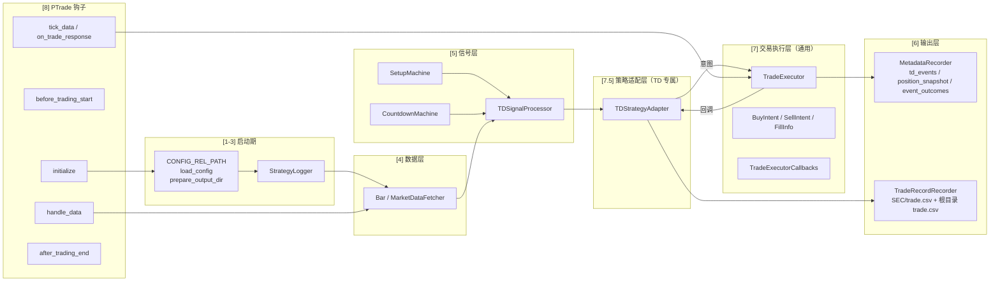
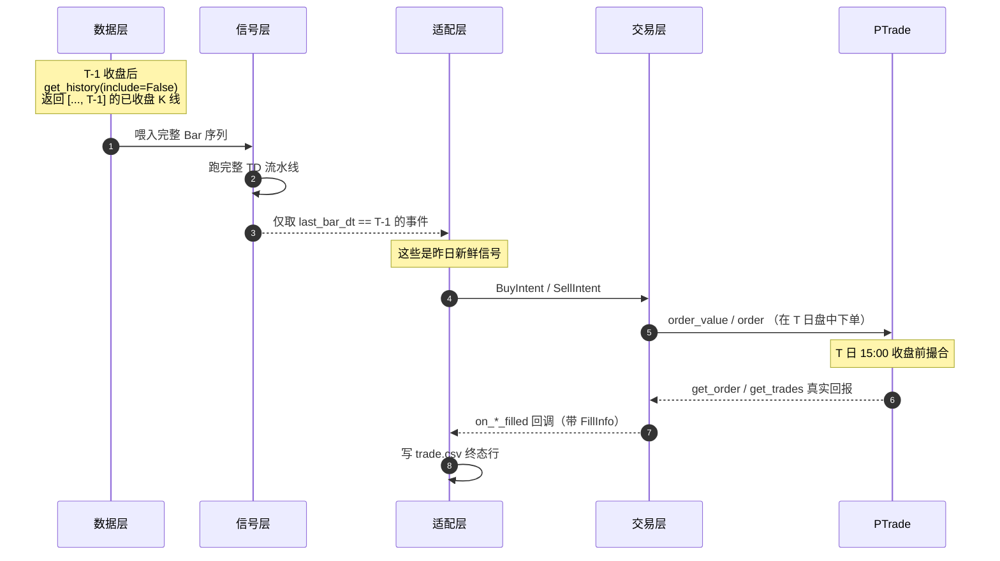
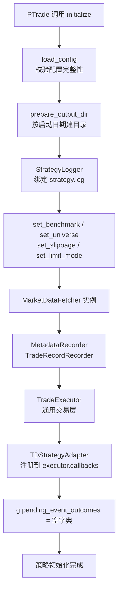
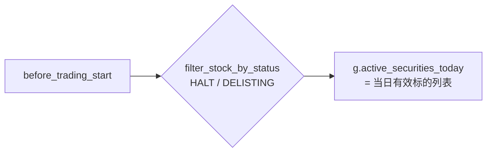
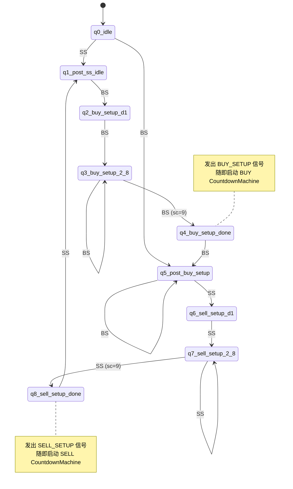
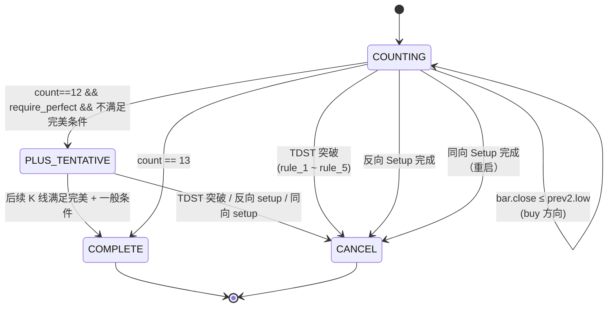
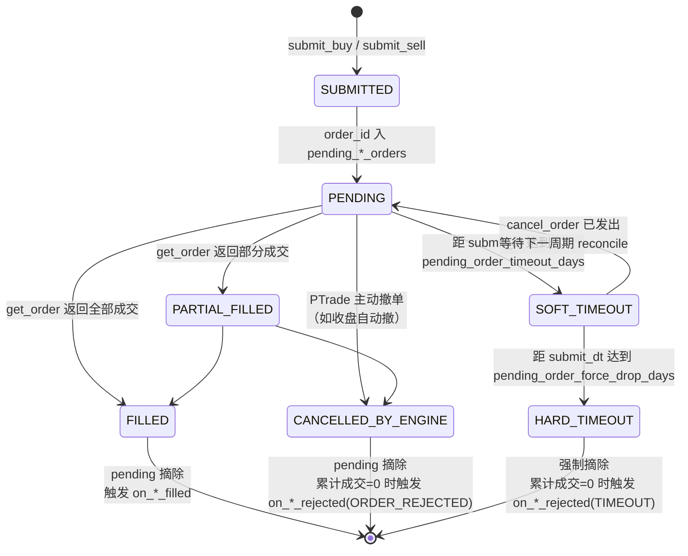
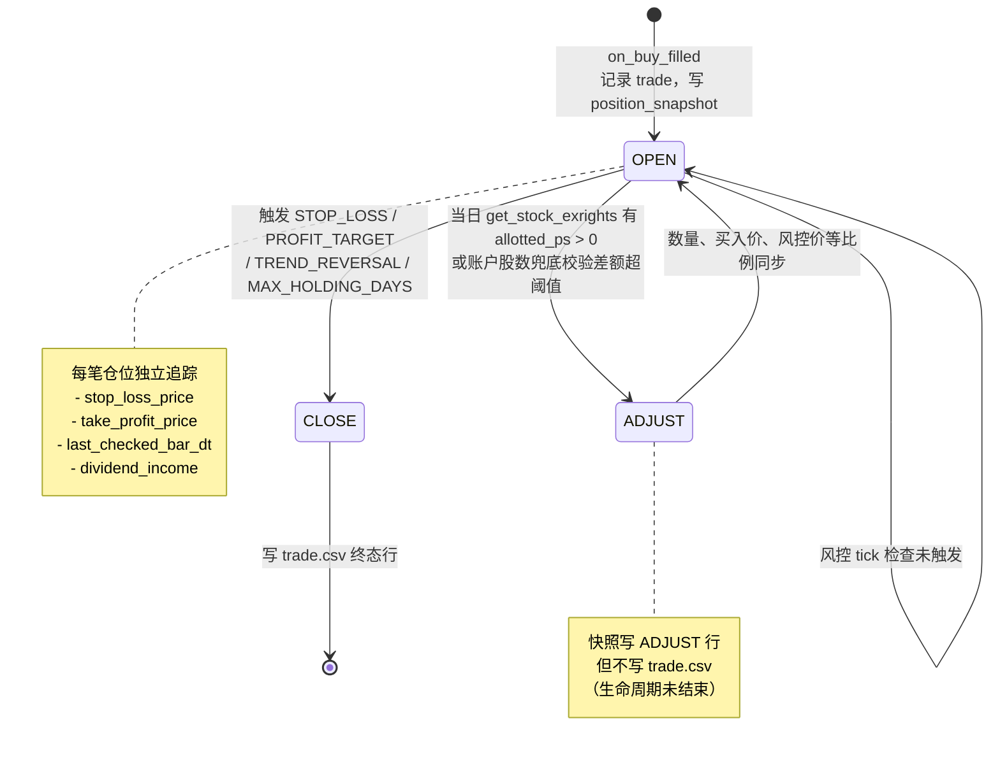

# TD 9-13 Sequential 策略 · 需求分析与设计文档

> 本文聚焦"**为什么这么做**"和"**各模块如何联动**"。
> 参数字典、CSV 字段字典、配置取值约束请查阅同级 [`说明.md`](说明.md)。
> TD 算法本身的判定规则查阅 [`README.md`](README.md)。

---

## 目录

- [一、需求背景与设计目标](#一需求背景与设计目标)
- [二、核心设计原则与约定](#二核心设计原则与约定)
- [三、模块分层与职责](#三模块分层与职责)
- [四、关键不变量（系统约定）](#四关键不变量系统约定)
- [五、完整事件流程](#五完整事件流程)
  - [5.1 启动流程](#51-启动流程initialize)
  - [5.2 每日盘前](#52-每日盘前before_trading_start)
  - [5.3 单周期 handle_data 主流程](#53-单周期-handle_data-主流程)
  - [5.4 信号生命周期：Setup → Countdown → 终态](#54-信号生命周期setup--countdown--终态)
  - [5.5 订单生命周期：意图 → 挂单 → 成交 → 终结](#55-订单生命周期意图--挂单--成交--终结)
  - [5.6 仓位生命周期：OPEN → ADJUST → CLOSE](#56-仓位生命周期open--adjust--close)
  - [5.7 实盘 vs 回测差异](#57-实盘-vs-回测差异)
- [六、风险与异常处理矩阵](#六风险与异常处理矩阵)
- [七、当前设计的健壮性评估](#七当前设计的健壮性评估)
  - [7.1 设计优势](#71-设计优势)
  - [7.2 已知边界与改进方向](#72-已知边界与改进方向)
- [八、扩展指引](#八扩展指引)

---

## 一、需求背景与设计目标

### 1.1 业务问题

本策略服务于 **TD 9-13 Sequential 策略的论文级有效性研究**，核心诉求有三：

1. **信号正确**：完全按 README 中 TD 9-13 算法定义计算 Setup / Countdown / TDST 取消 / 完美判定，不能因为优化或工程妥协引入信号偏差。
2. **交易可复盘**：每一笔从 Setup 完成到平仓的完整生命周期都要能在输出文件中回溯，**且与 PTrade 引擎的成交流水逐笔对账一致**——这是论文回测可信度的底线。
3. **元数据可论证**：除交易结果外，还要输出"事件 → 后续 5/20/60/120 个交易日的方向收益、MFE、MAE"等元数据，供论文做事件研究、分层分析、单股适用性分析。

### 1.2 三类典型用户场景

| 场景 | 关注点 | 输出依赖 |
| --- | --- | --- |
| 策略开发者复盘 | 某次买入/卖出为什么发生、在什么价位、盈亏多少 | `trade.csv`、`strategy.log`、`position_snapshot.csv` |
| 论文事件研究 | TD 13 完成后 N 日内市场如何反应 | `td_events.csv`、`event_outcomes.csv` |
| 实盘运维 | 是否有仓位与账户脱钩、是否有挂单卡住未处理 | `position_snapshot.csv`、`reconcile_position_tool.py`、超时日志 |

### 1.3 设计目标（按优先级）

1. **正确性 ≥ 健壮性 ≥ 性能 ≥ 工程优雅**。
   信号判定与交易记账必须 100% 准确；运行时遇到任何 PTrade 接口异常都不应中断主循环。
2. **PTrade 与 SimTradeLab 双环境兼容**。
   生产环境为 PTrade，论文实验需要在 SimTradeLab 大规模批量回测——同一份代码必须在两套引擎上行为一致。
3. **可移植到其他信号体系**。
   交易执行 / 风控 / 对账 / 除权处理这些通用逻辑应该和具体信号体系（TD 9-13）解耦，未来研究均线、布林带、其他择时模型时可以直接复用。
4. **单文件部署**。
   PTrade 沙盒不允许 `import os`，也不便于多文件管理——除 `config.json` 外所有逻辑必须在 `backtest.py` 一个文件里。

---

## 二、核心设计原则与约定

| 原则 | 体现 |
| --- | --- |
| **不再使用持久化缓存** | 采用 README 推荐的"前复权 + 每日全量重算"，避免动态复权带来的累积误差。每天 `handle_data` 都重新构造一个 `TDSignalProcessor` 从 0 开始跑完所有历史 |
| **不在策略内做重统计** | 周期级胜率 / 收益 / 回撤 / 夏普全部交给离线工具计算，避免主循环里 `for security in 5500:` 时 CPU 爆掉 |
| **一切以引擎真实回报为准** | 不再用快照差、滑点公式、止损价倒推成交价；全部走 `get_order(order_id)` / `get_trades(security)` 真实回报。**PTrade 与 SimTradeLab 字段映射有差异**：<br>• PTrade `get_order` 返回 `list[Order]`，关键字段 `filled / amount / limit / status / entrust_no / dt`，**不含 commission / business_price**；<br>• PTrade `get_trades()` 返回 `dict{order_id: list[list]}`，按位置 `[1]=委托号 / [4]=数量 / [5]=价格 / [6]=金额`；<br>• SimTradeLab 走字段名 `business_amount / business_price / business_balance / commission`。<br>策略 `_fetch_order_state` 与 `_aggregate_trades_for_order` 同时兼容两种结构 |
| **手续费由策略按同一份费率自算** | PTrade Python API 不暴露 commission，`initialize` 同时 `set_commission(commission_ratio, min_commission)` 给引擎，并把同一对参数传给 `TradeExecutor`，由 `_estimate_commission` 按 `commission + 经手费(万分之0.487) + 印花税(千分之1，仅卖出)` 公式自算，确保 `trade.csv` 与 PTrade 引擎扣款逐笔一致 |
| **PTrade 接口分钩点严格遵循** | `get_history` / `filter_stock_by_status` 等只能在指定生命周期钩子内调用（详见 [PTrade API 限制](https://ptrade-fz.i618.com.cn:7766/hub/help/api)），策略代码绝不在禁止的钩子里调用 |
| **沙盒兼容** | 不 `import os` / `import sys`；目录创建用 PTrade 注入的 `create_dir`；文件存在性判定用 `open()` 试探 |
| **配置必须显式** | `config.json` 必填、合法、所有顶层段都不可缺。不再用内置默认值兜底——避免"看起来跑成功了实则走错配置" |

---

## 三、模块分层与职责



### 3.1 各层一句话职责

| 层 | 关键类 / 函数 | 职责 |
| --- | --- | --- |
| **路径 / 配置 / 输出目录** | `CONFIG_REL_PATH` / `load_config` / `prepare_output_dir` | 配置必填校验、按启动日期创建目录（防覆盖） |
| **日志层** | `StrategyLogger` | 控制台 + 文件双写；按级别筛选；为状态机转移、Countdown 进位提供 verbose 开关 |
| **数据层** | `Bar` / `MarketDataFetcher` | `get_history(include=False)` 拉已收盘 K 线；过滤停牌（`volume<=0`） |
| **信号层** | `SetupMachine` / `CountdownMachine` / `TDSignalProcessor` | 纯计算无副作用；输入 Bar 序列、输出事件列表 |
| **元数据输出** | `MetadataRecorder` | 写 `td_events.csv` / `position_snapshot.csv` / `event_outcomes.csv` |
| **交易输出** | `TradeRecordRecorder` | 仅在生命周期终态写 `<SEC>/trade.csv` 和根目录 `trade.csv` |
| **交易层（通用）** | `TradeExecutor` | **完全不感知 TD 概念**。只接受 `BuyIntent` / `SellIntent`、用 PTrade 真实回报落账、追踪止损止盈、处理除权送股 / 分红、超时摘单 |
| **策略适配层** | `TDStrategyAdapter` | TD 信号 ↔ 通用意图的桥梁，独占 `trade.csv` 写入；持有 TD 特有风控参数（`stop_loss_range_multiple` 等） |
| **策略钩子** | `initialize / before_trading_start / handle_data / tick_data / on_trade_response / after_trading_end` | 在 PTrade 允许的接口范围内编排上述模块 |

### 3.2 通讯契约

| 契约 | 流向 | 关键字段 |
| --- | --- | --- |
| `BuyIntent` | Adapter → Executor | `security` / `target_value` / `decision_dt` / `fallback_price` / `metadata{td_event}` |
| `SellIntent` | Adapter → Executor | `security` / `trade` / `sell_reason` / `fallback_price` / `metadata{td_event}` |
| `FillInfo` | Executor → Adapter | `order_id` / `quantity` / `price` / `commission` / `fill_dt` |
| `TradeExecutorCallbacks` | Executor → Adapter | `on_buy_filled / on_buy_rejected / on_sell_filled / on_sell_rejected / on_position_adjusted` |

> Executor 永远只读写 `trade["_strategy_metadata"]` 字段中的内容是 `dict`，不解析其结构；Adapter 把所有 TD 上下文塞在这里。

---

## 四、关键不变量（系统约定）

> 这些是策略正确性的底线，任何修改都不能破坏。

### 4.1 时序约定（信号 vs 下单）



**关键不变量**：

1. 信号永远只在**已收盘 K 线**上发出（`include=False`），不会出现"用今天未完成的 K 线"误算。
2. 下单永远在**信号产生的下一根 K 线**进行（"昨日信号 → 今日入场"）。
3. PTrade 真实成交结果落账后，Adapter 才写 `trade.csv` 终态行——避免回测中预估的 PnL 与引擎流水不一致。

### 4.2 状态机一致性

| 不变量 | 含义 |
| --- | --- |
| **每只标的同一时刻最多一个 active CountdownMachine** | 不同方向的 Countdown 不会同时存在；同向新 Setup 完成时旧 Countdown 立刻 cancel |
| **每天每只标的全量重建 TDSignalProcessor** | 状态机不持久化、不 carry over，Bug 不会"传染"到下一周期 |
| **Bar 序列不允许时间倒序** | `SetupMachine.step` 检查 `bar.datetime <= self.last_datetime` 直接报错 |
| **停牌日不参与计数** | volume<=0 在数据层就被丢弃；Setup / Countdown 看到的是连续的有效成交日 |

### 4.3 交易记账边界

| 不变量 | 含义 |
| --- | --- |
| **trade.csv 只在 Adapter 写** | Executor 不知道 TD 字段长什么样；所有 trade.csv 行必由 Adapter 通过回调拼装 |
| **position_snapshot.csv 只在 Executor 写** | 通用快照，不含 TD 字段；OPEN/CLOSE/ADJUST 三种 event |
| **trade.csv 只在生命周期终态写一行** | Buy Countdown 取消、Buy Countdown 完成但未买入、买入后卖出（含部分平仓） |
| **`buy_price`/`sell_price` 永远是 PTrade `business_price`** | 不写入止损价 / 止盈价 / 收盘价等任何"理论价" |
| **`buy_date`/`sell_date` 永远是 PTrade `business_time`** | 不写入信号日期、不写入下单提交时间 |
| **`pnl = price_pnl + dividend_income - 买入手续费分摊 - sell_commission`** | 与 PTrade 净资产变化逐笔对账 |

### 4.4 仓位独立性

> **同一标的可同时持有多笔交易，每笔独立追踪止损 / 止盈 / 持仓天数 / 分红归属。**

* 每笔 trade 有唯一 `_trade_id`；
* 止损价根据各自买入时的 Countdown 阶段最低价 K 线算出，互不相同；
* 除权送股发生时，每笔都按相同 ratio 同步数量与风控价格；
* 现金分红按各笔当时的剩余数量比例分摊。

---

## 五、完整事件流程

### 5.1 启动流程（`initialize`）



**约定**：
* 任何配置缺失或非法立刻抛异常中止策略，不允许策略以"半正确状态"启动。
* 输出目录命名 = `<启动日期>` 或 `<启动日期>_N`（递增），永远不覆盖历史。
* `g.trade_executor` 与 `g.trade_adapter` 双向绑定通过 `executor.set_callbacks(adapter)` 完成。

### 5.2 每日盘前（`before_trading_start`）

仅做一件事：**剔除当日停牌 / 退市标的**。



* `filter_stock_by_status` 仅可在 `before_trading_start` 内调用。
* 调用失败时**保守保留全部标的**（避免错误 abort），由 `handle_data` 内的 `is_halt_today` 二次复核。

### 5.3 单周期 `handle_data` 主流程

> 这是整个策略**最核心的循环**，也是健壮性最关键的部分。

```mermaid
flowchart TB
    Start[周期开始] --> Reconcile1["(0) reconcile_pending_orders<br/>把上周期未结算的成交落账"]
    Reconcile1 --> Loop{遍历当日有效标的}

    Loop --> Halt[is_halt_today 二次复核]
    Halt -->|停牌| Loop
    Halt -->|未停牌| Fetch[fetch_recent_bars<br/>get_history(include=False)]
    Fetch --> Insufficient{len bars < min_required_bars}
    Insufficient -->|是| Loop
    Insufficient -->|否| WindowOutcome[更新 pending_event_outcomes<br/>窗口成熟时落账 event_outcomes.csv]

    WindowOutcome --> Dividend["accrue_dividends<br/>当日 bonus_ps > 0 → 累计税后分红"]
    Dividend --> AdjustPos["reconcile_position_adjustments<br/>当日 allotted_ps > 0 → 同步股数 / 风控价"]
    AdjustPos --> ExitCheck["check_backtest_exits<br/>用上一根 K 的 high/low 触发止盈止损"]

    ExitCheck --> Sig[TDSignalProcessor.run<br/>跑完整 Bar 序列]
    Sig --> Filter[筛出 last_bar_dt == 昨日 的事件]
    Filter --> Enrich[补充 pre20_avg_amount/return/volatility]
    Enrich --> AdaptEx[trade_adapter.execute_for_events]
    AdaptEx --> Loop

    Loop -->|遍历完成| WriteEv[recorder.write_events<br/>td_events.csv]
    WriteEv --> Reconcile2["(7) reconcile_pending_orders 再次<br/>捕获本周期同步撮合的订单"]
    Reconcile2 --> End[周期结束]
```

#### 关键执行顺序的设计依据

| 顺序 | 为什么这么排 |
| --- | --- |
| **(0) 落账先于一切** | 上周期的 sell 可能此时刚成交，先落账 trade.csv 才能让 `check_backtest_exits` 看到正确的 `open_trades` |
| **分红 / 送股 → 风控触发 → 信号** | 风控用的 `buy_quantity` / `stop_loss_price` 必须是除权后的最新值；信号本身不受持仓影响所以放最后 |
| **(7) 周期末再 reconcile** | SimTradeLab 同步撮合下，本周期发起的 buy 在本周期就成交完毕——不再 reconcile 一次就要等到下周期才能写 trade.csv |

### 5.4 信号生命周期：Setup → Countdown → 终态



#### Countdown 分支



#### Setup → Countdown → Trade 的完整生命周期对应

| 生命周期阶段 | 触发事件 | trade.csv 是否写行 |
| --- | --- | --- |
| Setup 完成 | `BUY_SETUP` / `BUY_SETUP_PERFECT` | 否 |
| Countdown 进行中 | `BUY_COUNTDOWN_PROGRESS` | 否 |
| Countdown 暂记 + | `BUY_COUNTDOWN_PLUS_TENTATIVE` | 否 |
| Countdown 完成 → 拒单 | `on_buy_rejected` 触发 | 是（`bought=False`，含 reject_reason） |
| Countdown 完成 → 成交 → 平仓 | `on_sell_filled` 触发 | 是（`bought=True`，含完整成交字段） |
| Countdown 取消 | `BUY_COUNTDOWN_CANCEL` | 是（`bought=False`，含 `countdown_status`） |

> 一个生命周期对应 trade.csv 的**至多一行**，但若发生**部分平仓**，每次成交回报都会触发一次 `on_sell_filled` 写一行。

### 5.5 订单生命周期：意图 → 挂单 → 成交 → 终结



#### 拒单原因枚举

| 拒单原因 | 触发场景 | 来源层 |
| --- | --- | --- |
| `TRADE_DISABLED` | 配置 `trade.enabled=false` | TradeExecutor |
| `INSUFFICIENT_CASH` | `available_cash < min_cash_for_buy` | TradeExecutor |
| `MIN_TRADE_VALUE` | `target_value < min_trade_value` | TradeExecutor |
| `ORDER_REJECTED` | `order_value` / `order` 返回空订单号；或终态时累计成交=0 | TradeExecutor |
| `ORDER_ERROR` | `order_value` / `order` 抛异常 | TradeExecutor |
| `TIMEOUT` | 硬超时强制摘除 | TradeExecutor |
| `NON_PERFECT_SETUP` | `require_perfect_setup_for_buy=true` 且 `setup_perfect=false` | TDStrategyAdapter |

### 5.6 仓位生命周期：OPEN → ADJUST → CLOSE



#### 分红与送股的区别

| 维度 | 现金分红 | 送股 / 转增 |
| --- | --- | --- |
| 数据来源 | `get_stock_exrights` 的 `bonus_ps` | `get_stock_exrights` 的 `allotted_ps` |
| 改变股数 | 否 | 是（`qty *= (1 + allotted_ps)`） |
| 改变止损 / 止盈 | 否 | 是（按 ratio 等比例下调） |
| 影响 PnL | 累计到 `dividend_income`，平仓时计入 `pnl` | 不直接影响 PnL（总价值守恒） |
| 兜底机制 | 无（接口缺失则不计） | **账户持仓差额兜底**：账户股数 vs 内部累计差额 > 0.1% 时按比例同步并 WARNING |

### 5.7 实盘 vs 回测差异

| 维度 | 回测（SimTradeLab） | 实盘（PTrade） |
| --- | --- | --- |
| 风控触发 | `check_backtest_exits` 用上一根已完成 K 线的 `high/low` | `check_tick_exits` 在 `tick_data` 中逐 tick 比较 |
| 订单状态 | 通常同步成交，单周期内即可 reconcile | 异步成交，可能跨周期 |
| 成交回报 | 周期末 `reconcile_pending_orders` 主动轮询 | `on_trade_response` 回调主动触发 reconcile |
| 撤单 | `cancel_order(order_obj)` 走 SimTradeLab blotter | `cancel_order(order_id_str)` 走 PTrade |
| `is_trade()` | 返回 `False` | 返回 `True` |
| 路径基址 | `LOCAL_CONFIG_FALLBACK_PATHS` 本地相对路径 | `get_research_path()` + 相对路径 |

> 关键设计：**两条路径的写入逻辑完全一致**——都通过 `reconcile_pending_orders` → `_settle_pending_*` → `_open_trade_from_fill` / `_finalize_sell` → `on_*_filled` 回调。
> 这保证了"同一份策略代码、同一份配置，PTrade 和 SimTradeLab 输出的 trade.csv 应该字段级对齐"。

---

## 六、风险与异常处理矩阵

| 异常 / 边界 | 触发条件 | 当前处理 |
| --- | --- | --- |
| 配置文件缺失 / 非法 | `config.json` 不存在 / 缺字段 / 类型错误 | `initialize` 直接抛异常中止 |
| `get_history` 返回空数据 | 数据接口异常 | WARNING 日志，跳过该标的当周期 |
| K 线时间逆序 | 数据源乱序 | `SetupMachine.step` ERROR 日志，跳过该 bar |
| K 线数量不足 | `len(bars) < min_required_bars` | DEBUG 跳过，不写 td_events |
| `filter_stock_by_status` 调用失败 | PTrade 接口异常 | WARNING 日志，保留全部标的（不停止） |
| `is_halt_today` 调用失败 | 接口异常 | 保守返回 `False`（不视为停牌） |
| `order_value` 抛异常 | 接口异常 | `BUY_REJECT_ORDER_ERROR` |
| `order_value` 返回空订单号 | 引擎拒单 | `BUY_REJECT_ORDER_REJECTED` |
| 跨日订单未成交 | get_order 始终非终态 | 软超时主动 `cancel_order` → 硬超时强制摘除 |
| 部分成交 | filled_qty < total_amount | 每周期把"新增成交"写入 trade.csv，pending 累计游标确保不重复 |
| 除权送股接口缺失 | `get_stock_exrights` 抛异常 | DEBUG 日志，`get_share_adjustment_ratio` 返回 1.0 → 走账户兜底 |
| 账户股数兜底差额异常 | `account_qty / internal_qty > 1.0` 且差额 > 0.1% | WARNING 日志 + ADJUST 同步 |
| `_strategy_metadata` 缺失 | trade 对象在异常路径下被读取 | adapter `on_sell_filled` 用 `dict.get` 安全读取，缺失字段写空 |
| 回调抛异常 | adapter 实现 bug | `_safe_callback` 捕获并 ERROR 日志，不传染到交易层 |
| 沙盒禁用 `os` | PTrade 环境 | 不 `import os`；目录用 `create_dir` + `.initialized` 标记文件 |
| 同名输出目录 | 当日重复启动 | 自动追加 `_1`、`_2` 直到不冲突 |

---

## 七、当前设计的健壮性评估

### 7.1 设计优势

| 优势 | 体现 | 收益 |
| --- | --- | --- |
| **关注点分离彻底** | 8 层架构 + Adapter 解耦 | 信号体系换 EMA / 布林带时只需新写 Adapter，交易层零修改 |
| **PnL 与引擎对齐** | 完全依赖 `business_price` / `business_amount` / `commission` | trade.csv 与 PTrade 流水可逐笔对账，论文回测可信度有保障 |
| **三层停牌防护** | 盘前过滤 + 盘中复核 + 历史清洗 | 不会因为停牌日干扰 TD 计数序列，也不会向停牌标的下单 |
| **多笔仓位独立** | 每笔 `_trade_id` + 独立止损 / 止盈 / 持仓天数 | 同一标的在不同时点买入的仓位有不同风控价，互不影响 |
| **送股 + 兜底校验双保险** | `get_stock_exrights` 主路径 + 账户股数差额兜底 | 即使接口缺失也能避免账户残留送股仓位 |
| **超时保护两阶段** | 软超时 cancel + 硬超时 force-drop | 不会因为引擎卡死让卖单永久阻塞后续止损 |
| **元数据驱动论文分析** | `td_events.csv` + `event_outcomes.csv` + `position_snapshot.csv` | 离线工具可独立做事件研究、分层分析、单股适用性分析 |
| **回测/实盘行为同源** | 两条路径走同一份 `reconcile_pending_orders` | 回测出的 trade.csv 与实盘 PTrade 流水可直接对比 |
| **不持久化任何状态** | 每天全量重算 | Bug 不会在运行间累积，重启即重建 |

### 7.2 已知边界与改进方向

下面四项是经过代码审查后识别出的**潜在脆弱点**，每项都标注了影响范围与建议修复方向。

#### 7.2.1 跨周期分批成交会创建多个 `open_trade`

**位置**：`TradeExecutor._settle_pending_buy`

**现状**：
```python
if new_filled > 0:
    ...
    self._open_trade_from_fill(intent, avg_price, int(new_filled), fill_dt, ...)
```
若 PTrade 把同一笔 `order_value` 跨多个周期成交（例如周期 1 成交 1000 股、周期 2 成交 500 股），策略会创建**两个独立的 open_trade**，trade.csv 会出现两行同 `setup_completed_at` 的开仓行。

**影响**：
* `trade.csv` 行数与"决策意图数"不一致（一笔买入意图变成两行）；
* `position_snapshot.csv` 多一行 OPEN；
* 各自止损 / 止盈基于各自 fill price 独立追踪——策略行为反而是**正确**的（每段成交风控独立），但可读性差。

**建议**：在 `_settle_pending_buy` 中按 `order_id` 检查 open_trades，已存在则**累加**`buy_quantity` 并按"加权平均价"更新 `buy_price`，而不是新开 trade。 trade.csv 是否要拆分多行，留给配置项决定。

#### 7.2.2 `last_checked_bar_dt` 字符串比较依赖统一格式

**位置**：`TradeExecutor.check_backtest_exits`

**现状**：
```python
if trade.get("last_checked_bar_dt") and bar_dt <= trade.get("last_checked_bar_dt"):
    continue
```
两边都假设是 `'YYYY-MM-DD HH:MM:SS'` 字符串。若 PTrade 某版本回报的 `business_time` 不带时分秒（仅 `'YYYY-MM-DD'`），字符串比较结果会失常。

**影响**：极端情况下刚开仓的 trade 可能在同一根 K 上立刻被止盈止损。

**建议**：用 `_parse_dt` 统一转成 `datetime` 对象比较，或在 `_settle_pending_buy` 中强制 `_format_dt(state["fill_dt"])` 后再赋值给 `last_checked_bar_dt`（当前已这样做，但缺一道断言）。

#### 7.2.3 `tick_data` 中没有主动 reconcile

**位置**：`tick_data` → `check_tick_exits`

**现状**：实盘逐 tick 检查止损止盈时不调 `reconcile_pending_orders`，完全依赖 `on_trade_response` 回调。

**影响**：若某些 PTrade 版本对某类委托不推 `on_trade_response`（如撤单事件），实盘成交回报会延后到下一个 tick 时被 `check_tick_exits` 间接触发……不，**实际上不会**——因为 `check_tick_exits` 没主动 reconcile。这意味着实盘下一个止损止盈触发周期可能会因为前一笔 sell 还在 pending 而被 `_has_pending_sell_for_trade` 跳过。

**建议**：在 `check_tick_exits` 开头加一次轻量 `reconcile_pending_orders(context)`，或在 `_has_pending_sell_for_trade` 命中时主动尝试 reconcile 一次该 order_id。

#### 7.2.4 软超时 `cancel_order` 失败后不再重试

**位置**：`TradeExecutor._cancel_timeout_pending`

**现状**：
```python
ok = self._try_cancel_order(order_id)
pending["timeout_cancel_attempted"] = True   # 不论成功与否
```
撤单失败时仍标记 `attempted=True`，软超时阶段就此结束，只能等硬超时强制摘除。

**影响**：极端情况下硬超时窗口（默认 30 - 5 = 25 个自然日）内卖单会一直阻塞同一笔仓位的止损。

**建议**：撤单失败时**只**打 WARNING、不标记 `attempted`，下个周期继续重试，直到成功或硬超时。

#### 7.2.5 (轻微) `pending_event_outcomes` 内存只有自然清理

**位置**：`_update_pending_event_outcomes`

**现状**：事件落 `pending_event_outcomes` 后，需要等所有 4 个窗口（5/20/60/120）都成熟才被丢弃；若行情数据 lookback 已无法覆盖事件日，事件会保守丢弃。

**影响**：5500 标的级回测下，每只股票每年触发数十个事件 → 累计 ~200K 个 dict 挂在内存里，但终态会自然清理。**实测内存占用约 100MB 量级，可接受**。

**建议**：当前设计 OK，不必动。

---

## 八、扩展指引

### 8.1 替换为其他信号体系

只需实现一个新 Adapter：

```python
class MyNewAdapter(TradeExecutorCallbacks):
    def __init__(self, executor, trade_recorder, cfg, logger):
        self.executor = executor
        ...
        executor.set_callbacks(self)

    def execute_for_events(self, context, security, events):
        for ev in events:
            if 满足买入条件:
                self.executor.submit_buy(context, BuyIntent(...))

    def on_buy_filled(self, intent, trade, fill):
        # 计算自己的 stop_loss / take_profit
        trade["stop_loss_price"] = ...
        trade["_strategy_metadata"] = {...}

    def on_sell_filled(self, intent, trade, fill, pnl_breakdown):
        # 写自己的 trade.csv
        ...
```

`TradeExecutor` 的所有公开 API（`submit_buy / submit_sell / reconcile_pending_orders / check_backtest_exits / check_tick_exits / accrue_dividends / reconcile_position_adjustments / on_trade_response / set_callbacks`）都和 TD 完全无关。

### 8.2 README 中预留但未实现的功能

| 功能 | 配置位 | 接入点 |
| --- | --- | --- |
| Intersection（交叉滤网） | `intersection.enabled` | `TDSignalProcessor._handle_countdown_on_setup_complete` 中加预检 |
| Combo Countdown | `countdown.type="combo"` | 新增 `ComboCountdownMachine`，由 `TDSignalProcessor` 按 `type` 分派 |
| Recycle / Termination Count | `_reserved_recycle` / `_reserved_termination` | 同上，独立的状态机 |
| 完美 Setup 多种放宽形式 | 暂未配置 | `SetupMachine._is_perfect_buy` / `_is_perfect_sell` 加分支 |

### 8.3 输出格式扩展

* **新增 `trade.csv` 字段**：在 `TradeRecordRecorder.HEADER_FIELDS` 加列 → 在 `TDStrategyAdapter._base_lifecycle_row` 拼装 → 旧 CSV 无需迁移（`_need_header` 会按首行判断）。
* **新增 `position_snapshot.csv` 字段**：在 `MetadataRecorder.POSITION_HEADER_FIELDS` 加列 → 在 `TradeExecutor._record_position_snapshot` 拼装。
* **新增 event 类型**：在 `TDSignalProcessor._emit_*` 中产生 → `_should_track_event_outcome` 判定是否纳入事件研究 → 自动会被 `event_outcomes.csv` 跟踪。

---

## 附：阅读建议

| 想要…… | 建议先读 |
| --- | --- |
| 理解为什么这么设计 | 本文档 §一、§二、§四 |
| 配置某个参数 | `说明.md` §三 |
| 看某个 CSV 字段含义 | `说明.md` §四 |
| 了解 TD 算法本身 | `README.md` |
| 离线分析 / 论文图表 | `tool/README_thesis_analysis.md` |
| 实盘对账问题排查 | 本文档 §六、§7.2 + `tool/reconcile_position_tool.py` |
